# Face Generation
In this project, you'll use generative adversarial networks to generate new images of faces.
### Get the Data
You'll be using two datasets in this project:
- MNIST
- CelebA

Since the celebA dataset is complex and you're doing GANs in a project for the first time, we want you to test your neural network on MNIST before CelebA.  Running the GANs on MNIST will allow you to see how well your model trains sooner.

If you're using [FloydHub](https://www.floydhub.com/), set `data_dir` to "/input" and use the [FloydHub data ID](http://docs.floydhub.com/home/using_datasets/) "R5KrjnANiKVhLWAkpXhNBe".


```python
data_dir = './data'

# FloydHub - Use with data ID "R5KrjnANiKVhLWAkpXhNBe"
#data_dir = '/input'


"""
DON'T MODIFY ANYTHING IN THIS CELL
"""
import helper

helper.download_extract('mnist', data_dir)
helper.download_extract('celeba', data_dir)
```

    Found mnist Data
    Found celeba Data


## Explore the Data
### MNIST
As you're aware, the [MNIST](http://yann.lecun.com/exdb/mnist/) dataset contains images of handwritten digits. You can view the first number of examples by changing `show_n_images`. 


```python
show_n_images = 25

"""
DON'T MODIFY ANYTHING IN THIS CELL
"""
%matplotlib inline
import os
from glob import glob
from matplotlib import pyplot

mnist_images = helper.get_batch(glob(os.path.join(data_dir, 'mnist/*.jpg'))[:show_n_images], 28, 28, 'L')
pyplot.imshow(helper.images_square_grid(mnist_images, 'L'), cmap='gray')
```


    <matplotlib.image.AxesImage at 0x7fc14fb684a8>


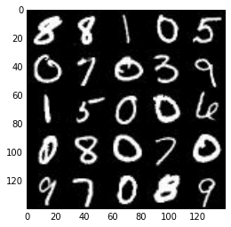


### CelebA
The [CelebFaces Attributes Dataset (CelebA)](http://mmlab.ie.cuhk.edu.hk/projects/CelebA.html) dataset contains over 200,000 celebrity images with annotations.  Since you're going to be generating faces, you won't need the annotations.  You can view the first number of examples by changing `show_n_images`.


```python
show_n_images = 25

"""
DON'T MODIFY ANYTHING IN THIS CELL
"""
mnist_images = helper.get_batch(glob(os.path.join(data_dir, 'img_align_celeba/*.jpg'))[:show_n_images], 28, 28, 'RGB')
pyplot.imshow(helper.images_square_grid(mnist_images, 'RGB'))
```


    <matplotlib.image.AxesImage at 0x7fc1356f63c8>


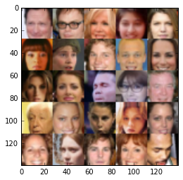


## Preprocess the Data
Since the project's main focus is on building the GANs, we'll preprocess the data for you.  The values of the MNIST and CelebA dataset will be in the range of -0.5 to 0.5 of 28x28 dimensional images.  The CelebA images will be cropped to remove parts of the image that don't include a face, then resized down to 28x28.

The MNIST images are black and white images with a single [color channel](https://en.wikipedia.org/wiki/Channel_(digital_image%29) while the CelebA images have [3 color channels (RGB color channel)](https://en.wikipedia.org/wiki/Channel_(digital_image%29#RGB_Images).
## Build the Neural Network
You'll build the components necessary to build a GANs by implementing the following functions below:
- `model_inputs`
- `discriminator`
- `generator`
- `model_loss`
- `model_opt`
- `train`

### Check the Version of TensorFlow and Access to GPU
This will check to make sure you have the correct version of TensorFlow and access to a GPU


```python
"""
DON'T MODIFY ANYTHING IN THIS CELL
"""
from distutils.version import LooseVersion
import warnings
import tensorflow as tf

# Check TensorFlow Version
assert LooseVersion(tf.__version__) >= LooseVersion('1.0'), 'Please use TensorFlow version 1.0 or newer.  You are using {}'.format(tf.__version__)
print('TensorFlow Version: {}'.format(tf.__version__))

# Check for a GPU
if not tf.test.gpu_device_name():
    warnings.warn('No GPU found. Please use a GPU to train your neural network.')
else:
    print('Default GPU Device: {}'.format(tf.test.gpu_device_name()))
```

    TensorFlow Version: 1.0.0
    Default GPU Device: /gpu:0


### Input
Implement the `model_inputs` function to create TF Placeholders for the Neural Network. It should create the following placeholders:
- Real input images placeholder with rank 4 using `image_width`, `image_height`, and `image_channels`.
- Z input placeholder with rank 2 using `z_dim`.
- Learning rate placeholder with rank 0.

Return the placeholders in the following the tuple (tensor of real input images, tensor of z data)


```python
import problem_unittests as tests

def model_inputs(image_width, image_height, image_channels, z_dim):
    """
    Create the model inputs
    :param image_width: The input image width
    :param image_height: The input image height
    :param image_channels: The number of image channels
    :param z_dim: The dimension of Z
    :return: Tuple of (tensor of real input images, tensor of z data, learning rate)
    """
    # TODO: Implement Function
    real_size = (image_width, image_height, image_channels)
    inputs_real = tf.placeholder(tf.float32, (None,*real_size), name='input_real')
    inputs_z = tf.placeholder(tf.float32, (None, z_dim), name='input_z')
    learning_rate_placeholder = tf.placeholder(tf.float32, None, name='learning_rate')
    
    return inputs_real, inputs_z, learning_rate_placeholder


"""
DON'T MODIFY ANYTHING IN THIS CELL THAT IS BELOW THIS LINE
"""
tests.test_model_inputs(model_inputs)
```

    Tests Passed


### Discriminator
Implement `discriminator` to create a discriminator neural network that discriminates on `images`.  This function should be able to reuse the variabes in the neural network.  Use [`tf.variable_scope`](https://www.tensorflow.org/api_docs/python/tf/variable_scope) with a scope name of "discriminator" to allow the variables to be reused.  The function should return a tuple of (tensor output of the generator, tensor logits of the generator).


```python
def leaky_relu(data, alpha=0.01):
     return tf.maximum(alpha*data, data)
```


```python
def discriminator(images, reuse=False):
    """
    Create the discriminator network
    :param image: Tensor of input image(s)
    :param reuse: Boolean if the weights should be reused
    :return: Tuple of (tensor output of the discriminator, tensor logits of the discriminator)
    """
    # TODO: Implement Function
    keep_probability = 0.8 # for dropout
    
    with tf.variable_scope('discriminator', reuse=reuse):
        # input dim is 28 x 28 x num channels (1 for mnist, 3 for faces)
        x1 = tf.layers.conv2d(images,64,5,strides=2, padding='same')
        relu1 = leaky_relu(x1)
        # 14x14x64 
        
        # (after 1st review to try to improve performance) - using dropout with 50% 
        # after batch normalization
        # ref: "CDk denotes a a Convolution-BatchNormDropout-ReLU layer with a dropout rate of 50%"
        # from paper: "Image-to-Image translation with Conditional Adversarial Networks"
        # (guesstimate: skipping dropout in first layer, assuming it might have somewhat similar 
        #  negative effects as batch_normalization() in first layer for gans?)
        # found the paper through https://github.com/soumith/ganhacks
        
        # (after 1st review input) adding additional layer to improve performance.
        # keep same dimensions - strides=1 and padding is same gives zero padding 
        # and keeps dimensions.
        # useful resource: http://cs231n.github.io/convolutional-networks/#layerpat
        x1b = tf.layers.conv2d(relu1,64,5,strides=1, padding='same')
        bn1b = tf.layers.batch_normalization(x1b,training=True)
        dropout1b = tf.nn.dropout(bn1b, keep_probability)
        relu1b = leaky_relu(dropout1b)
        # 14x14x64
        
        x2 = tf.layers.conv2d(relu1b, 2*64, 5, strides=2, padding='same')
        bn2 = tf.layers.batch_normalization(x2, training=True)
        dropout2 = tf.nn.dropout(bn2, keep_probability)
        relu2 = leaky_relu(dropout2)
        # 7x7x128
        
        # same dimension as previous layer, stride=1 (after review input)
        x2b = tf.layers.conv2d(relu2, 2*64, 5, strides=1, padding='same')
        bn2b = tf.layers.batch_normalization(x2b, training=True)
        dropout2b = tf.nn.dropout(bn2b, keep_probability)
        relu2b = leaky_relu(dropout2b)
        # 7x7x128
        
        # flatten
        flat = tf.reshape(relu2b, (-1,7*7*128))
        
        # TODO: Could perhaps try out 1x1 convolutions instead of fully connected (dense) here
        logits = tf.layers.dense(flat, 1)
        out = tf.sigmoid(logits)
    

    return (out, logits)


"""
DON'T MODIFY ANYTHING IN THIS CELL THAT IS BELOW THIS LINE
"""
tests.test_discriminator(discriminator, tf)
```

    Tests Passed


### Generator
Implement `generator` to generate an image using `z`. This function should be able to reuse the variabes in the neural network.  Use [`tf.variable_scope`](https://www.tensorflow.org/api_docs/python/tf/variable_scope) with a scope name of "generator" to allow the variables to be reused. The function should return the generated 28 x 28 x `out_channel_dim` images.


```python
def generator(z, out_channel_dim,is_train=True):
    """
    Create the generator network
    :param z: Input z
    :param out_channel_dim: The number of channels in the output image
    :param is_train: Boolean if generator is being used for training
    :return: The tensor output of the generator
    """
    
    keep_probability=0.5 # after 1st review, adding dropout, see discriminator
    
    # TODO: Implement Function
    with tf.variable_scope('generator', reuse=not is_train):
        dense1 = tf.layers.dense(z, 7*7*512)
        reshaped1 = tf.reshape(dense1, (-1,7,7,512))
        bn1 = tf.layers.batch_normalization(reshaped1, training=is_train) 
        relu1 = leaky_relu(bn1)
        # 7x7x512
        
        # after 1st review, strides=1 to keep shape and get more params to train on to
        # perhaps improve generation
        conv1b = tf.layers.conv2d_transpose(relu1, 512, 5, strides=1,padding='same')
        bn1b = tf.layers.batch_normalization(conv1b, training=is_train)
        dropout1b = tf.nn.dropout(bn1b, keep_probability)
        relu1b = leaky_relu(dropout1b)
        # 7x7x512
        
        conv2 = tf.layers.conv2d_transpose(relu1b, 256, 5, strides=2,padding='same')
        bn2 = tf.layers.batch_normalization(conv2, training=is_train)
        dropout2 = tf.nn.dropout(bn2, keep_probability)
        relu2 = leaky_relu(dropout2)
        # 14x14x256
        
        # (after 1st review input) - additional layer to get better generator performance
        # keep dimensions, with strides=1 and padding = 'same' (zero padding)
        # (could perhaps also look into 1x1 convolutions)
        conv2b = tf.layers.conv2d_transpose(relu2, 256, 5, strides=1, padding='same')
        bn2b = tf.layers.batch_normalization(conv2b, training=is_train)
        dropout2b = tf.nn.dropout(bn2b,keep_probability)
        relu2b = leaky_relu(dropout2b)
                                            
        # out_channel_dim is 1 for mnist and 3 for faces, i.e. color dim
        logits = tf.layers.conv2d_transpose(relu2, out_channel_dim,5, 
                                            strides=2,padding='same' )
        
        
        # 28x28x output_dim
        out = tf.tanh(logits)
                
    
    return out


"""
DON'T MODIFY ANYTHING IN THIS CELL THAT IS BELOW THIS LINE
"""
tests.test_generator(generator, tf)
```

    Tests Passed


### Loss
Implement `model_loss` to build the GANs for training and calculate the loss.  The function should return a tuple of (discriminator loss, generator loss).  Use the following functions you implemented:
- `discriminator(images, reuse=False)`
- `generator(z, out_channel_dim, is_train=True)`


```python
def model_loss(input_real, input_z, out_channel_dim):
    """
    Get the loss for the discriminator and generator
    :param input_real: Images from the real dataset
    :param input_z: Z input
    :param out_channel_dim: The number of channels in the output image
    :return: A tuple of (discriminator loss, generator loss)
    """
    # TODO: Implement Function
    g_model = generator(input_z, out_channel_dim)
    d_model_real, d_logits_real = discriminator(input_real)
    d_model_fake, d_logits_fake = discriminator(g_model, reuse=True)
    
    # after 1st review, trying to improve generation with 1-sided smoothing
    # from paper "Improved Techniques for training GANs" (Salimans 2016)
    
    smoothing = 0.1
    
    d_loss_real = tf.reduce_mean(
        tf.nn.sigmoid_cross_entropy_with_logits(logits=d_logits_real,
                                               labels = tf.ones_like(d_model_real)*(1-smoothing)))
    d_loss_fake = tf.reduce_mean(
        tf.nn.sigmoid_cross_entropy_with_logits(logits=d_logits_fake,
                                               labels = tf.zeros_like(d_model_fake)))
    
    g_loss = tf.reduce_mean(
        tf.nn.sigmoid_cross_entropy_with_logits(logits=d_logits_fake,
                                               labels = tf.ones_like(d_model_fake)))
    
    d_loss = d_loss_real + d_loss_fake
    
    return d_loss, g_loss


"""
DON'T MODIFY ANYTHING IN THIS CELL THAT IS BELOW THIS LINE
"""
tests.test_model_loss(model_loss)
```

    Tests Passed


### Optimization
Implement `model_opt` to create the optimization operations for the GANs. Use [`tf.trainable_variables`](https://www.tensorflow.org/api_docs/python/tf/trainable_variables) to get all the trainable variables.  Filter the variables with names that are in the discriminator and generator scope names.  The function should return a tuple of (discriminator training operation, generator training operation).


```python
def model_opt(d_loss, g_loss, learning_rate, beta1):
    """
    Get optimization operations
    :param d_loss: Discriminator loss Tensor
    :param g_loss: Generator loss Tensor
    :param learning_rate: Learning Rate Placeholder
    :param beta1: The exponential decay rate for the 1st moment in the optimizer
    :return: A tuple of (discriminator training operation, generator training operation)
    """
    # TODO: Implement Function
    t_vars = tf.trainable_variables()
    d_vars = [var for var in t_vars if var.name.startswith('discriminator')]
    g_vars = [var for var in t_vars if var.name.startswith('generator')]

    # Optimize
    with tf.control_dependencies(tf.get_collection(tf.GraphKeys.UPDATE_OPS,scope='discriminator')):
        d_train_opt = tf.train.AdamOptimizer(learning_rate=learning_rate, beta1=beta1).minimize(d_loss, var_list=d_vars)
       
    with tf.control_dependencies(tf.get_collection(tf.GraphKeys.UPDATE_OPS, scope='generator')):
        g_train_opt = tf.train.AdamOptimizer(learning_rate=learning_rate, beta1=beta1).minimize(g_loss, var_list=g_vars)

    return d_train_opt, g_train_opt

"""
DON'T MODIFY ANYTHING IN THIS CELL THAT IS BELOW THIS LINE
"""
tests.test_model_opt(model_opt, tf)
```

    Tests Passed


## Neural Network Training
### Show Output
Use this function to show the current output of the generator during training. It will help you determine how well the GANs is training.


```python
"""
DON'T MODIFY ANYTHING IN THIS CELL
"""
import numpy as np

def show_generator_output(sess, n_images, input_z, out_channel_dim, image_mode):
    """
    Show example output for the generator
    :param sess: TensorFlow session
    :param n_images: Number of Images to display
    :param input_z: Input Z Tensor
    :param out_channel_dim: The number of channels in the output image
    :param image_mode: The mode to use for images ("RGB" or "L")
    """
    cmap = None if image_mode == 'RGB' else 'gray'
    z_dim = input_z.get_shape().as_list()[-1]
    example_z = np.random.uniform(-1, 1, size=[n_images, z_dim])

    samples = sess.run(
        generator(input_z, out_channel_dim, False),
        feed_dict={input_z: example_z})

    images_grid = helper.images_square_grid(samples, image_mode)
    pyplot.imshow(images_grid, cmap=cmap)
    pyplot.show()
```

### Train
Implement `train` to build and train the GANs.  Use the following functions you implemented:
- `model_inputs(image_width, image_height, image_channels, z_dim)`
- `model_loss(input_real, input_z, out_channel_dim)`
- `model_opt(d_loss, g_loss, learning_rate, beta1)`

Use the `show_generator_output` to show `generator` output while you train. Running `show_generator_output` for every batch will drastically increase training time and increase the size of the notebook.  It's recommended to print the `generator` output every 100 batches.


```python
def train(epoch_count, batch_size, z_dim, learning_rate, beta1, 
          get_batches, data_shape, data_image_mode, show_every=100, 
          print_every=10, n_images=16):
    """
    Train the GAN
    :param epoch_count: Number of epochs
    :param batch_size: Batch Size
    :param z_dim: Z dimension
    :param learning_rate: Learning Rate
    :param beta1: The exponential decay rate for the 1st moment in the optimizer
    :param get_batches: Function to get batches
    :param data_shape: Shape of the data
    :param data_image_mode: The image mode to use for images ("RGB" or "L")
    """
    # TODO: Build Model
    
    
    print(z_dim)
    print(data_shape)
    (num_images, image_width, image_height, image_channels) = data_shape
    
    input_real, input_z, learning_rate_placeholder = model_inputs(image_width, image_height, image_channels, z_dim)
    
    print("TYPE input_z:", type(input_z))
    # out_channel_dim = image_channels
    d_loss, g_loss = model_loss(input_real, input_z, image_channels)
    
    # TODO: learning_rate init? 
    d_opt, g_opt = model_opt(d_loss, g_loss, learning_rate, beta1)
    
    saver = tf.train.Saver() # TODO: perhaps only generator variables 
    samples, losses = [], []
    
    steps = 0
    
    with tf.Session() as sess:
        sess.run(tf.global_variables_initializer())
        
        for epoch_i in range(epoch_count):
            for batch_images in get_batches(batch_size):      
                steps += 1
                # TODO: Train Model
                #print("b", batch_images.shape)
                
                # input data batches has values from -0.5 to 0.5 => scale to -1 to 1
                batch_images *= 2.0
                
                # sample random noise for G
                batch_z = np.random.uniform(-1,1,size=(batch_size, z_dim))
            
                # run discriminator and generator optimizers
                _ = sess.run(d_opt, feed_dict={input_real:batch_images,
                                              input_z:batch_z,
                                              learning_rate_placeholder:learning_rate})
                _ = sess.run(g_opt, feed_dict={input_real:batch_images,
                                              input_z:batch_z,
                                              learning_rate_placeholder:learning_rate})
                
                if steps % print_every == 0:
                    # get losses and print them out
                    train_loss_d = sess.run(d_loss, {input_real:batch_images,
                                              input_z:batch_z,
                                              learning_rate_placeholder:learning_rate})
                    train_loss_g = g_loss.eval({input_real:batch_images,
                                              input_z:batch_z,
                                              learning_rate_placeholder:learning_rate})
                    print("Epoch {}/{}...".format(epoch_i+1, epoch_count),
                          "Discriminator Loss: {:.4f}...".format(train_loss_d),
                          "Generator Loss: {:.4f}".format(train_loss_g))    
                    # Save losses to view after training
                    losses.append((train_loss_d, train_loss_g)) 
            
                if steps % show_every  == 0:
                    print(type(batch_z))
                    show_generator_output(sess, n_images=n_images,
                                         input_z=input_z, out_channel_dim=image_channels,
                                         image_mode=data_image_mode)

    # save training generator samples
    with open('train_samples_pkl','wb') as fh:
        import pickle as pkl
        pkl.dump(samples,fh)
```

### MNIST
Test your GANs architecture on MNIST.  After 2 epochs, the GANs should be able to generate images that look like handwritten digits.  Make sure the loss of the generator is lower than the loss of the discriminator or close to 0.


```python
batch_size = 128
z_dim = 100
learning_rate = 0.0002
beta1 = 0.5


"""
DON'T MODIFY ANYTHING IN THIS CELL THAT IS BELOW THIS LINE
"""
epochs = 10

mnist_dataset = helper.Dataset('mnist', glob(os.path.join(data_dir, 'mnist/*.jpg')))
with tf.Graph().as_default():
    train(epochs, batch_size, z_dim, learning_rate, beta1, mnist_dataset.get_batches,
          mnist_dataset.shape, mnist_dataset.image_mode)
```

    100
    (60000, 28, 28, 1)
    TYPE input_z: <class 'tensorflow.python.framework.ops.Tensor'>
    Epoch 1/10... Discriminator Loss: 1.7857... Generator Loss: 0.4502
    Epoch 1/10... Discriminator Loss: 0.9644... Generator Loss: 1.4778
    Epoch 1/10... Discriminator Loss: 0.7873... Generator Loss: 1.4719
    Epoch 1/10... Discriminator Loss: 0.4631... Generator Loss: 4.0671
    Epoch 1/10... Discriminator Loss: 0.4735... Generator Loss: 3.1534
    Epoch 1/10... Discriminator Loss: 0.7241... Generator Loss: 1.8552
    Epoch 1/10... Discriminator Loss: 0.4386... Generator Loss: 3.6769
    Epoch 1/10... Discriminator Loss: 0.5425... Generator Loss: 2.9746
    Epoch 1/10... Discriminator Loss: 0.4643... Generator Loss: 4.4702
    Epoch 1/10... Discriminator Loss: 0.4124... Generator Loss: 4.1970
    <class 'numpy.ndarray'>


    Epoch 1/10... Discriminator Loss: 0.4269... Generator Loss: 4.0783
    Epoch 1/10... Discriminator Loss: 0.4109... Generator Loss: 4.1745
    Epoch 1/10... Discriminator Loss: 0.7084... Generator Loss: 3.5350
    Epoch 1/10... Discriminator Loss: 0.4775... Generator Loss: 3.3955
    Epoch 1/10... Discriminator Loss: 0.4628... Generator Loss: 3.1426
    Epoch 1/10... Discriminator Loss: 1.2038... Generator Loss: 0.8935
    Epoch 1/10... Discriminator Loss: 0.8792... Generator Loss: 1.5462
    Epoch 1/10... Discriminator Loss: 0.7932... Generator Loss: 2.8421
    Epoch 1/10... Discriminator Loss: 0.7636... Generator Loss: 2.2550
    Epoch 1/10... Discriminator Loss: 1.0260... Generator Loss: 1.2591
    <class 'numpy.ndarray'>


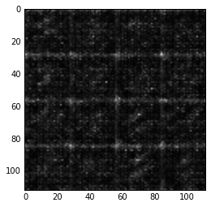


    Epoch 1/10... Discriminator Loss: 0.7202... Generator Loss: 4.5735
    Epoch 1/10... Discriminator Loss: 0.9133... Generator Loss: 4.3565
    Epoch 1/10... Discriminator Loss: 1.4294... Generator Loss: 5.3426
    Epoch 1/10... Discriminator Loss: 0.7976... Generator Loss: 1.8544
    Epoch 1/10... Discriminator Loss: 0.7345... Generator Loss: 1.8437
    Epoch 1/10... Discriminator Loss: 0.8898... Generator Loss: 1.5871
    Epoch 1/10... Discriminator Loss: 0.8486... Generator Loss: 1.6676
    Epoch 1/10... Discriminator Loss: 0.8012... Generator Loss: 2.0166
    Epoch 1/10... Discriminator Loss: 0.9473... Generator Loss: 1.3511
    Epoch 1/10... Discriminator Loss: 0.8993... Generator Loss: 2.6258
    <class 'numpy.ndarray'>


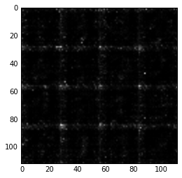


    Epoch 1/10... Discriminator Loss: 0.7702... Generator Loss: 2.1085
    Epoch 1/10... Discriminator Loss: 0.9374... Generator Loss: 2.1491
    Epoch 1/10... Discriminator Loss: 1.0094... Generator Loss: 2.1374
    Epoch 1/10... Discriminator Loss: 0.8995... Generator Loss: 1.6783
    Epoch 1/10... Discriminator Loss: 1.2125... Generator Loss: 1.0667
    Epoch 1/10... Discriminator Loss: 1.0375... Generator Loss: 1.6843
    Epoch 1/10... Discriminator Loss: 1.1023... Generator Loss: 1.7753
    Epoch 1/10... Discriminator Loss: 1.1299... Generator Loss: 1.2673
    Epoch 1/10... Discriminator Loss: 1.4135... Generator Loss: 0.7583
    Epoch 1/10... Discriminator Loss: 1.0558... Generator Loss: 1.4366
    <class 'numpy.ndarray'>


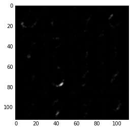


    Epoch 1/10... Discriminator Loss: 0.9827... Generator Loss: 1.7256
    Epoch 1/10... Discriminator Loss: 1.2550... Generator Loss: 0.9043
    Epoch 1/10... Discriminator Loss: 1.0247... Generator Loss: 1.2223
    Epoch 1/10... Discriminator Loss: 1.1106... Generator Loss: 2.1252
    Epoch 1/10... Discriminator Loss: 1.0787... Generator Loss: 0.9904
    Epoch 1/10... Discriminator Loss: 1.0703... Generator Loss: 1.3071
    Epoch 2/10... Discriminator Loss: 0.9537... Generator Loss: 2.0911
    Epoch 2/10... Discriminator Loss: 1.4266... Generator Loss: 2.5404
    Epoch 2/10... Discriminator Loss: 1.0133... Generator Loss: 1.4595
    Epoch 2/10... Discriminator Loss: 0.9524... Generator Loss: 1.6762
    <class 'numpy.ndarray'>


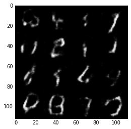


    Epoch 2/10... Discriminator Loss: 1.0628... Generator Loss: 2.3487
    Epoch 2/10... Discriminator Loss: 1.1100... Generator Loss: 1.1467
    Epoch 2/10... Discriminator Loss: 1.2276... Generator Loss: 2.1780
    Epoch 2/10... Discriminator Loss: 1.0786... Generator Loss: 1.0445
    Epoch 2/10... Discriminator Loss: 1.0664... Generator Loss: 1.9545
    Epoch 2/10... Discriminator Loss: 1.2904... Generator Loss: 0.7796
    Epoch 2/10... Discriminator Loss: 1.0498... Generator Loss: 1.1563
    Epoch 2/10... Discriminator Loss: 1.3568... Generator Loss: 0.6990
    Epoch 2/10... Discriminator Loss: 0.9691... Generator Loss: 1.0725
    Epoch 2/10... Discriminator Loss: 1.2304... Generator Loss: 2.5989
    <class 'numpy.ndarray'>


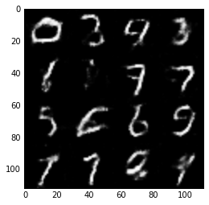


    Epoch 2/10... Discriminator Loss: 0.9914... Generator Loss: 1.3369
    Epoch 2/10... Discriminator Loss: 1.1685... Generator Loss: 0.9213
    Epoch 2/10... Discriminator Loss: 1.1624... Generator Loss: 2.3909
    Epoch 2/10... Discriminator Loss: 0.9756... Generator Loss: 1.5997
    Epoch 2/10... Discriminator Loss: 1.0274... Generator Loss: 1.0354
    Epoch 2/10... Discriminator Loss: 1.0297... Generator Loss: 1.9508
    Epoch 2/10... Discriminator Loss: 0.9894... Generator Loss: 1.8083
    Epoch 2/10... Discriminator Loss: 1.0482... Generator Loss: 1.1597
    Epoch 2/10... Discriminator Loss: 0.9517... Generator Loss: 1.3205
    Epoch 2/10... Discriminator Loss: 0.9563... Generator Loss: 1.0488
    <class 'numpy.ndarray'>


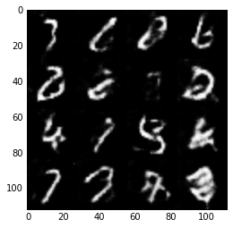


    Epoch 2/10... Discriminator Loss: 1.0110... Generator Loss: 1.6426
    Epoch 2/10... Discriminator Loss: 0.8786... Generator Loss: 1.5022
    Epoch 2/10... Discriminator Loss: 1.0147... Generator Loss: 2.1148
    Epoch 2/10... Discriminator Loss: 1.0884... Generator Loss: 0.9974
    Epoch 2/10... Discriminator Loss: 0.9927... Generator Loss: 1.2056
    Epoch 2/10... Discriminator Loss: 0.9719... Generator Loss: 1.1450
    Epoch 2/10... Discriminator Loss: 0.9448... Generator Loss: 1.1613
    Epoch 2/10... Discriminator Loss: 1.2748... Generator Loss: 0.7282
    Epoch 2/10... Discriminator Loss: 0.9113... Generator Loss: 1.7644
    Epoch 2/10... Discriminator Loss: 0.8627... Generator Loss: 1.3516
    <class 'numpy.ndarray'>


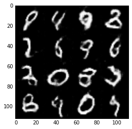


    Epoch 2/10... Discriminator Loss: 1.0461... Generator Loss: 1.0145
    Epoch 2/10... Discriminator Loss: 1.0025... Generator Loss: 1.1247
    Epoch 2/10... Discriminator Loss: 0.8699... Generator Loss: 1.2452
    Epoch 2/10... Discriminator Loss: 0.9420... Generator Loss: 1.5132
    Epoch 2/10... Discriminator Loss: 0.9082... Generator Loss: 1.4605
    Epoch 2/10... Discriminator Loss: 0.8991... Generator Loss: 2.2923
    Epoch 2/10... Discriminator Loss: 0.8202... Generator Loss: 1.5177
    Epoch 2/10... Discriminator Loss: 1.5546... Generator Loss: 3.2802
    Epoch 2/10... Discriminator Loss: 0.9827... Generator Loss: 1.2030
    Epoch 2/10... Discriminator Loss: 0.8517... Generator Loss: 1.8538
    <class 'numpy.ndarray'>


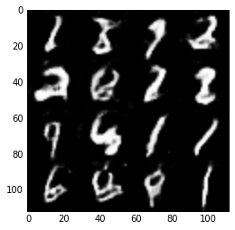


    Epoch 2/10... Discriminator Loss: 0.9919... Generator Loss: 1.1900
    Epoch 2/10... Discriminator Loss: 0.8737... Generator Loss: 1.3245
    Epoch 2/10... Discriminator Loss: 0.8434... Generator Loss: 2.0557
    Epoch 3/10... Discriminator Loss: 0.8978... Generator Loss: 1.7363
    Epoch 3/10... Discriminator Loss: 0.9763... Generator Loss: 2.3827
    Epoch 3/10... Discriminator Loss: 0.8479... Generator Loss: 1.7689
    Epoch 3/10... Discriminator Loss: 0.8549... Generator Loss: 1.7116
    Epoch 3/10... Discriminator Loss: 1.0537... Generator Loss: 2.8533
    Epoch 3/10... Discriminator Loss: 1.0755... Generator Loss: 2.5206
    Epoch 3/10... Discriminator Loss: 0.8189... Generator Loss: 1.9394
    <class 'numpy.ndarray'>


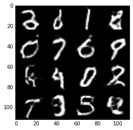


    Epoch 3/10... Discriminator Loss: 0.8443... Generator Loss: 1.5352
    Epoch 3/10... Discriminator Loss: 0.9050... Generator Loss: 1.8461
    Epoch 3/10... Discriminator Loss: 1.3518... Generator Loss: 0.5894
    Epoch 3/10... Discriminator Loss: 1.0382... Generator Loss: 1.1260
    Epoch 3/10... Discriminator Loss: 0.7987... Generator Loss: 1.6448
    Epoch 3/10... Discriminator Loss: 0.9211... Generator Loss: 2.0654
    Epoch 3/10... Discriminator Loss: 0.8722... Generator Loss: 2.1494
    Epoch 3/10... Discriminator Loss: 0.7943... Generator Loss: 2.0200
    Epoch 3/10... Discriminator Loss: 1.2173... Generator Loss: 0.7977
    Epoch 3/10... Discriminator Loss: 0.7827... Generator Loss: 1.4296
    <class 'numpy.ndarray'>


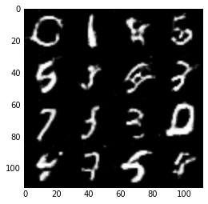


    Epoch 3/10... Discriminator Loss: 0.7677... Generator Loss: 1.5801
    Epoch 3/10... Discriminator Loss: 0.9680... Generator Loss: 2.4600
    Epoch 3/10... Discriminator Loss: 0.8474... Generator Loss: 1.4909
    Epoch 3/10... Discriminator Loss: 0.8364... Generator Loss: 1.4597
    Epoch 3/10... Discriminator Loss: 0.8031... Generator Loss: 1.5726
    Epoch 3/10... Discriminator Loss: 0.9109... Generator Loss: 1.4504
    Epoch 3/10... Discriminator Loss: 0.8113... Generator Loss: 1.5011
    Epoch 3/10... Discriminator Loss: 0.6945... Generator Loss: 1.9220
    Epoch 3/10... Discriminator Loss: 0.8737... Generator Loss: 2.3812
    Epoch 3/10... Discriminator Loss: 0.7386... Generator Loss: 1.8167
    <class 'numpy.ndarray'>


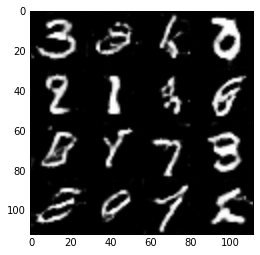


    Epoch 3/10... Discriminator Loss: 0.7727... Generator Loss: 2.5824
    Epoch 3/10... Discriminator Loss: 1.0861... Generator Loss: 1.0296
    Epoch 3/10... Discriminator Loss: 0.8368... Generator Loss: 1.4569
    Epoch 3/10... Discriminator Loss: 0.8782... Generator Loss: 1.3561
    Epoch 3/10... Discriminator Loss: 0.7125... Generator Loss: 2.0271
    Epoch 3/10... Discriminator Loss: 0.6887... Generator Loss: 2.2688
    Epoch 3/10... Discriminator Loss: 0.7843... Generator Loss: 1.4917
    Epoch 3/10... Discriminator Loss: 1.0534... Generator Loss: 1.9349
    Epoch 3/10... Discriminator Loss: 0.7249... Generator Loss: 1.9226
    Epoch 3/10... Discriminator Loss: 0.7595... Generator Loss: 1.8335
    <class 'numpy.ndarray'>


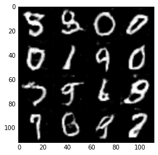


    Epoch 3/10... Discriminator Loss: 0.8834... Generator Loss: 1.4816
    Epoch 3/10... Discriminator Loss: 0.7071... Generator Loss: 1.5830
    Epoch 3/10... Discriminator Loss: 0.8121... Generator Loss: 1.4901
    Epoch 3/10... Discriminator Loss: 0.8021... Generator Loss: 1.4879
    Epoch 3/10... Discriminator Loss: 1.4575... Generator Loss: 3.7286
    Epoch 3/10... Discriminator Loss: 0.9187... Generator Loss: 1.3201
    Epoch 3/10... Discriminator Loss: 0.7381... Generator Loss: 1.8723
    Epoch 3/10... Discriminator Loss: 0.7254... Generator Loss: 1.9411
    Epoch 3/10... Discriminator Loss: 0.7598... Generator Loss: 2.5848
    Epoch 3/10... Discriminator Loss: 0.6208... Generator Loss: 2.0574
    <class 'numpy.ndarray'>


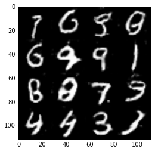


    Epoch 4/10... Discriminator Loss: 1.4426... Generator Loss: 0.5693
    Epoch 4/10... Discriminator Loss: 0.6531... Generator Loss: 2.4106
    Epoch 4/10... Discriminator Loss: 0.7059... Generator Loss: 1.8651
    Epoch 4/10... Discriminator Loss: 0.6426... Generator Loss: 1.5393
    Epoch 4/10... Discriminator Loss: 2.6885... Generator Loss: 4.6151
    Epoch 4/10... Discriminator Loss: 0.8971... Generator Loss: 1.6635
    Epoch 4/10... Discriminator Loss: 0.7858... Generator Loss: 2.1746
    Epoch 4/10... Discriminator Loss: 0.7523... Generator Loss: 1.3337
    Epoch 4/10... Discriminator Loss: 0.7271... Generator Loss: 1.8644
    Epoch 4/10... Discriminator Loss: 0.6313... Generator Loss: 2.4873
    <class 'numpy.ndarray'>


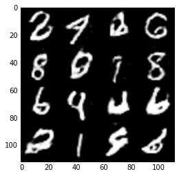


    Epoch 4/10... Discriminator Loss: 0.6004... Generator Loss: 2.3379
    Epoch 4/10... Discriminator Loss: 0.6650... Generator Loss: 2.3039
    Epoch 4/10... Discriminator Loss: 0.6512... Generator Loss: 2.4034
    Epoch 4/10... Discriminator Loss: 1.2123... Generator Loss: 3.0590
    Epoch 4/10... Discriminator Loss: 0.7548... Generator Loss: 1.7841
    Epoch 4/10... Discriminator Loss: 0.5832... Generator Loss: 2.1196
    Epoch 4/10... Discriminator Loss: 0.7485... Generator Loss: 1.6994
    Epoch 4/10... Discriminator Loss: 0.8029... Generator Loss: 2.7781
    Epoch 4/10... Discriminator Loss: 0.5821... Generator Loss: 1.9816
    Epoch 4/10... Discriminator Loss: 0.6888... Generator Loss: 1.6655
    <class 'numpy.ndarray'>


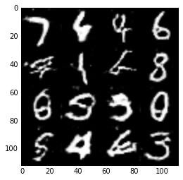


    Epoch 4/10... Discriminator Loss: 0.6748... Generator Loss: 1.5574
    Epoch 4/10... Discriminator Loss: 0.6755... Generator Loss: 1.8607
    Epoch 4/10... Discriminator Loss: 0.9808... Generator Loss: 1.0409
    Epoch 4/10... Discriminator Loss: 0.8201... Generator Loss: 1.5167
    Epoch 4/10... Discriminator Loss: 0.6748... Generator Loss: 2.5508
    Epoch 4/10... Discriminator Loss: 0.5958... Generator Loss: 2.4094
    Epoch 4/10... Discriminator Loss: 0.6376... Generator Loss: 2.8105
    Epoch 4/10... Discriminator Loss: 0.5827... Generator Loss: 2.6347
    Epoch 4/10... Discriminator Loss: 0.5386... Generator Loss: 2.4036
    Epoch 4/10... Discriminator Loss: 1.1071... Generator Loss: 1.7607
    <class 'numpy.ndarray'>


    Epoch 4/10... Discriminator Loss: 0.6635... Generator Loss: 1.8316
    Epoch 4/10... Discriminator Loss: 0.5937... Generator Loss: 3.3338
    Epoch 4/10... Discriminator Loss: 0.5992... Generator Loss: 2.6529
    Epoch 4/10... Discriminator Loss: 0.6081... Generator Loss: 2.3409
    Epoch 4/10... Discriminator Loss: 0.6339... Generator Loss: 3.0011
    Epoch 4/10... Discriminator Loss: 0.8694... Generator Loss: 2.7654
    Epoch 4/10... Discriminator Loss: 0.5273... Generator Loss: 2.3395
    Epoch 4/10... Discriminator Loss: 0.5901... Generator Loss: 2.9449
    Epoch 4/10... Discriminator Loss: 0.5821... Generator Loss: 2.5905
    Epoch 4/10... Discriminator Loss: 0.6847... Generator Loss: 1.6490
    <class 'numpy.ndarray'>


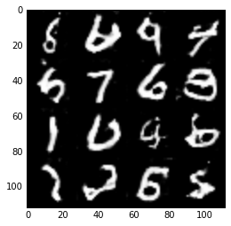


    Epoch 4/10... Discriminator Loss: 0.5331... Generator Loss: 2.3994
    Epoch 4/10... Discriminator Loss: 2.9110... Generator Loss: 5.5421
    Epoch 4/10... Discriminator Loss: 0.8482... Generator Loss: 1.4156
    Epoch 4/10... Discriminator Loss: 0.6505... Generator Loss: 2.9814
    Epoch 4/10... Discriminator Loss: 0.6236... Generator Loss: 2.3673
    Epoch 4/10... Discriminator Loss: 0.5919... Generator Loss: 2.4253
    Epoch 4/10... Discriminator Loss: 0.6924... Generator Loss: 1.6887
    Epoch 5/10... Discriminator Loss: 0.5892... Generator Loss: 2.0097
    Epoch 5/10... Discriminator Loss: 0.6014... Generator Loss: 2.1924
    Epoch 5/10... Discriminator Loss: 2.0111... Generator Loss: 4.8386
    <class 'numpy.ndarray'>


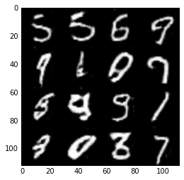


    Epoch 5/10... Discriminator Loss: 1.1590... Generator Loss: 0.8845
    Epoch 5/10... Discriminator Loss: 0.5890... Generator Loss: 1.9165
    Epoch 5/10... Discriminator Loss: 0.5456... Generator Loss: 2.2839
    Epoch 5/10... Discriminator Loss: 0.5644... Generator Loss: 2.5770
    Epoch 5/10... Discriminator Loss: 0.7042... Generator Loss: 1.4857
    Epoch 5/10... Discriminator Loss: 0.6249... Generator Loss: 2.1134
    Epoch 5/10... Discriminator Loss: 0.6308... Generator Loss: 2.0031
    Epoch 5/10... Discriminator Loss: 0.6897... Generator Loss: 4.1597
    Epoch 5/10... Discriminator Loss: 0.5825... Generator Loss: 3.3269
    Epoch 5/10... Discriminator Loss: 0.6853... Generator Loss: 3.5465
    <class 'numpy.ndarray'>


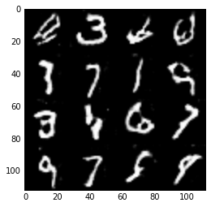


    Epoch 5/10... Discriminator Loss: 0.5017... Generator Loss: 2.5265
    Epoch 5/10... Discriminator Loss: 0.5930... Generator Loss: 2.2981
    Epoch 5/10... Discriminator Loss: 0.5656... Generator Loss: 2.2333
    Epoch 5/10... Discriminator Loss: 0.5121... Generator Loss: 2.4055
    Epoch 5/10... Discriminator Loss: 0.5791... Generator Loss: 3.1373
    Epoch 5/10... Discriminator Loss: 0.5056... Generator Loss: 2.8872
    Epoch 5/10... Discriminator Loss: 0.5126... Generator Loss: 2.4136
    Epoch 5/10... Discriminator Loss: 0.5342... Generator Loss: 3.0466
    Epoch 5/10... Discriminator Loss: 0.5196... Generator Loss: 2.6062
    Epoch 5/10... Discriminator Loss: 0.7127... Generator Loss: 1.6017
    <class 'numpy.ndarray'>


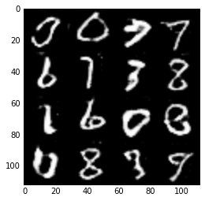


    Epoch 5/10... Discriminator Loss: 0.4574... Generator Loss: 3.1521
    Epoch 5/10... Discriminator Loss: 2.7442... Generator Loss: 0.2110
    Epoch 5/10... Discriminator Loss: 0.6132... Generator Loss: 2.3172
    Epoch 5/10... Discriminator Loss: 0.5651... Generator Loss: 2.7184
    Epoch 5/10... Discriminator Loss: 0.5455... Generator Loss: 2.5662
    Epoch 5/10... Discriminator Loss: 0.4929... Generator Loss: 3.1011
    Epoch 5/10... Discriminator Loss: 0.5088... Generator Loss: 2.9460
    Epoch 5/10... Discriminator Loss: 0.6725... Generator Loss: 1.9570
    Epoch 5/10... Discriminator Loss: 0.6205... Generator Loss: 2.1781
    Epoch 5/10... Discriminator Loss: 0.5493... Generator Loss: 2.2103
    <class 'numpy.ndarray'>


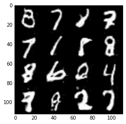


    Epoch 5/10... Discriminator Loss: 0.5479... Generator Loss: 3.5669
    Epoch 5/10... Discriminator Loss: 0.5076... Generator Loss: 2.7035
    Epoch 5/10... Discriminator Loss: 0.4752... Generator Loss: 2.9274
    Epoch 5/10... Discriminator Loss: 0.4819... Generator Loss: 2.6243
    Epoch 5/10... Discriminator Loss: 0.5408... Generator Loss: 2.8112
    Epoch 5/10... Discriminator Loss: 0.6742... Generator Loss: 1.6788
    Epoch 5/10... Discriminator Loss: 0.5141... Generator Loss: 3.1502
    Epoch 5/10... Discriminator Loss: 0.5274... Generator Loss: 2.3671
    Epoch 5/10... Discriminator Loss: 0.5255... Generator Loss: 2.5218
    Epoch 5/10... Discriminator Loss: 0.5232... Generator Loss: 2.7628
    <class 'numpy.ndarray'>


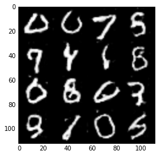


    Epoch 5/10... Discriminator Loss: 0.5758... Generator Loss: 2.9520
    Epoch 5/10... Discriminator Loss: 0.5096... Generator Loss: 2.7036
    Epoch 5/10... Discriminator Loss: 0.7433... Generator Loss: 1.3659
    Epoch 5/10... Discriminator Loss: 0.8832... Generator Loss: 2.1970
    Epoch 6/10... Discriminator Loss: 0.5926... Generator Loss: 2.2662
    Epoch 6/10... Discriminator Loss: 0.4768... Generator Loss: 2.5523
    Epoch 6/10... Discriminator Loss: 0.4820... Generator Loss: 2.9933
    Epoch 6/10... Discriminator Loss: 0.5080... Generator Loss: 3.2017
    Epoch 6/10... Discriminator Loss: 0.5517... Generator Loss: 4.4439
    Epoch 6/10... Discriminator Loss: 0.6020... Generator Loss: 2.0361
    <class 'numpy.ndarray'>


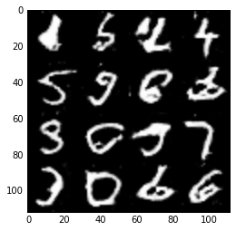


    Epoch 6/10... Discriminator Loss: 0.5322... Generator Loss: 2.3310
    Epoch 6/10... Discriminator Loss: 0.4411... Generator Loss: 3.1679
    Epoch 6/10... Discriminator Loss: 0.4746... Generator Loss: 3.0870
    Epoch 6/10... Discriminator Loss: 0.4512... Generator Loss: 3.7568
    Epoch 6/10... Discriminator Loss: 0.6374... Generator Loss: 3.7411
    Epoch 6/10... Discriminator Loss: 0.6300... Generator Loss: 3.5570
    Epoch 6/10... Discriminator Loss: 0.5121... Generator Loss: 2.7307
    Epoch 6/10... Discriminator Loss: 0.4681... Generator Loss: 2.9418
    Epoch 6/10... Discriminator Loss: 0.4478... Generator Loss: 3.1446
    Epoch 6/10... Discriminator Loss: 0.8867... Generator Loss: 1.9875
    <class 'numpy.ndarray'>


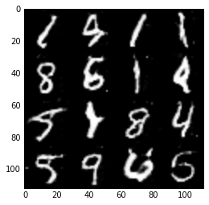


    Epoch 6/10... Discriminator Loss: 0.5794... Generator Loss: 2.8722
    Epoch 6/10... Discriminator Loss: 0.5345... Generator Loss: 2.1063
    Epoch 6/10... Discriminator Loss: 0.4498... Generator Loss: 3.5491
    Epoch 6/10... Discriminator Loss: 0.9004... Generator Loss: 3.3889
    Epoch 6/10... Discriminator Loss: 0.5892... Generator Loss: 2.1337
    Epoch 6/10... Discriminator Loss: 0.5213... Generator Loss: 2.4444
    Epoch 6/10... Discriminator Loss: 0.4509... Generator Loss: 3.2834
    Epoch 6/10... Discriminator Loss: 0.4664... Generator Loss: 2.9754
    Epoch 6/10... Discriminator Loss: 0.5794... Generator Loss: 1.7915
    Epoch 6/10... Discriminator Loss: 0.4595... Generator Loss: 2.9780
    <class 'numpy.ndarray'>


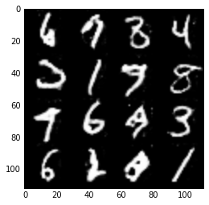


    Epoch 6/10... Discriminator Loss: 1.4207... Generator Loss: 5.2729
    Epoch 6/10... Discriminator Loss: 0.6592... Generator Loss: 2.1058
    Epoch 6/10... Discriminator Loss: 0.5062... Generator Loss: 2.8977
    Epoch 6/10... Discriminator Loss: 0.5556... Generator Loss: 2.2420
    Epoch 6/10... Discriminator Loss: 0.4503... Generator Loss: 3.3092
    Epoch 6/10... Discriminator Loss: 0.4468... Generator Loss: 3.2609
    Epoch 6/10... Discriminator Loss: 0.7068... Generator Loss: 1.7036
    Epoch 6/10... Discriminator Loss: 0.5074... Generator Loss: 4.1297
    Epoch 6/10... Discriminator Loss: 0.5211... Generator Loss: 2.8984
    Epoch 6/10... Discriminator Loss: 0.4521... Generator Loss: 2.7994
    <class 'numpy.ndarray'>


    Epoch 6/10... Discriminator Loss: 0.4842... Generator Loss: 3.1725
    Epoch 6/10... Discriminator Loss: 0.7295... Generator Loss: 5.0774
    Epoch 6/10... Discriminator Loss: 0.4562... Generator Loss: 2.8420
    Epoch 6/10... Discriminator Loss: 0.4800... Generator Loss: 3.3095
    Epoch 6/10... Discriminator Loss: 0.9256... Generator Loss: 1.7063
    Epoch 6/10... Discriminator Loss: 0.6259... Generator Loss: 1.9669
    Epoch 6/10... Discriminator Loss: 0.4785... Generator Loss: 3.1954
    Epoch 6/10... Discriminator Loss: 0.4480... Generator Loss: 3.1603
    Epoch 6/10... Discriminator Loss: 0.4430... Generator Loss: 2.8817
    Epoch 6/10... Discriminator Loss: 0.4621... Generator Loss: 2.9203
    <class 'numpy.ndarray'>


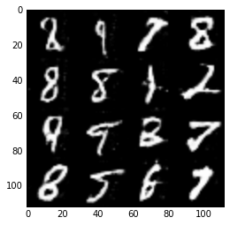


    Epoch 7/10... Discriminator Loss: 0.4584... Generator Loss: 3.8957
    Epoch 7/10... Discriminator Loss: 0.4401... Generator Loss: 3.4280
    Epoch 7/10... Discriminator Loss: 1.0899... Generator Loss: 1.0730
    Epoch 7/10... Discriminator Loss: 0.7705... Generator Loss: 1.5056
    Epoch 7/10... Discriminator Loss: 0.4716... Generator Loss: 3.6803
    Epoch 7/10... Discriminator Loss: 0.5482... Generator Loss: 2.2761
    Epoch 7/10... Discriminator Loss: 0.4727... Generator Loss: 3.6655
    Epoch 7/10... Discriminator Loss: 0.4483... Generator Loss: 3.5286
    Epoch 7/10... Discriminator Loss: 0.4287... Generator Loss: 3.2520
    Epoch 7/10... Discriminator Loss: 0.7362... Generator Loss: 1.1752
    <class 'numpy.ndarray'>


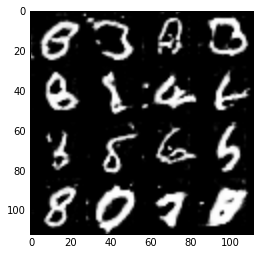


    Epoch 7/10... Discriminator Loss: 0.5311... Generator Loss: 2.5450
    Epoch 7/10... Discriminator Loss: 0.4574... Generator Loss: 3.1100
    Epoch 7/10... Discriminator Loss: 0.4155... Generator Loss: 3.3854
    Epoch 7/10... Discriminator Loss: 0.4354... Generator Loss: 2.9987
    Epoch 7/10... Discriminator Loss: 0.4301... Generator Loss: 3.1895
    Epoch 7/10... Discriminator Loss: 0.4586... Generator Loss: 3.1458
    Epoch 7/10... Discriminator Loss: 0.4527... Generator Loss: 3.8506
    Epoch 7/10... Discriminator Loss: 0.5768... Generator Loss: 2.1506
    Epoch 7/10... Discriminator Loss: 0.4575... Generator Loss: 3.0982
    Epoch 7/10... Discriminator Loss: 0.4576... Generator Loss: 3.8341
    <class 'numpy.ndarray'>


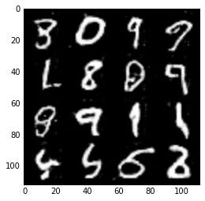


    Epoch 7/10... Discriminator Loss: 0.6502... Generator Loss: 5.4531
    Epoch 7/10... Discriminator Loss: 0.5237... Generator Loss: 2.5373
    Epoch 7/10... Discriminator Loss: 0.4646... Generator Loss: 4.2551
    Epoch 7/10... Discriminator Loss: 0.4309... Generator Loss: 3.7147
    Epoch 7/10... Discriminator Loss: 0.4297... Generator Loss: 4.2414
    Epoch 7/10... Discriminator Loss: 0.8786... Generator Loss: 2.3749
    Epoch 7/10... Discriminator Loss: 0.5834... Generator Loss: 2.6267
    Epoch 7/10... Discriminator Loss: 0.5517... Generator Loss: 2.2785
    Epoch 7/10... Discriminator Loss: 0.5064... Generator Loss: 2.4730
    Epoch 7/10... Discriminator Loss: 0.8093... Generator Loss: 1.5656
    <class 'numpy.ndarray'>


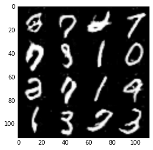


    Epoch 7/10... Discriminator Loss: 0.4418... Generator Loss: 3.3787
    Epoch 7/10... Discriminator Loss: 0.4543... Generator Loss: 3.6479
    Epoch 7/10... Discriminator Loss: 0.4472... Generator Loss: 3.1409
    Epoch 7/10... Discriminator Loss: 0.5392... Generator Loss: 2.4642
    Epoch 7/10... Discriminator Loss: 0.4965... Generator Loss: 2.6673
    Epoch 7/10... Discriminator Loss: 0.4123... Generator Loss: 3.4146
    Epoch 7/10... Discriminator Loss: 0.4208... Generator Loss: 3.9472
    Epoch 7/10... Discriminator Loss: 0.4096... Generator Loss: 3.3839
    Epoch 7/10... Discriminator Loss: 0.5172... Generator Loss: 2.4463
    Epoch 7/10... Discriminator Loss: 0.4450... Generator Loss: 3.3667
    <class 'numpy.ndarray'>


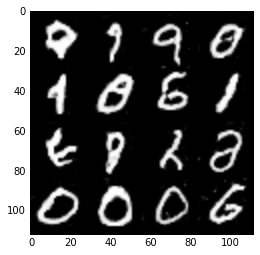


    Epoch 7/10... Discriminator Loss: 0.3986... Generator Loss: 4.1467
    Epoch 7/10... Discriminator Loss: 0.5256... Generator Loss: 5.0294
    Epoch 7/10... Discriminator Loss: 0.4139... Generator Loss: 5.1984
    Epoch 7/10... Discriminator Loss: 0.4404... Generator Loss: 3.0081
    Epoch 7/10... Discriminator Loss: 4.4224... Generator Loss: 6.4505
    Epoch 7/10... Discriminator Loss: 0.5711... Generator Loss: 2.6145
    Epoch 7/10... Discriminator Loss: 0.4495... Generator Loss: 2.9012
    Epoch 8/10... Discriminator Loss: 0.4747... Generator Loss: 3.9373
    Epoch 8/10... Discriminator Loss: 0.4272... Generator Loss: 3.6538
    Epoch 8/10... Discriminator Loss: 0.4306... Generator Loss: 3.5757
    <class 'numpy.ndarray'>


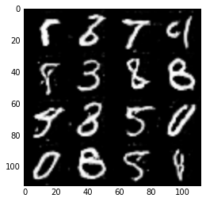


    Epoch 8/10... Discriminator Loss: 0.4685... Generator Loss: 3.5341
    Epoch 8/10... Discriminator Loss: 0.4480... Generator Loss: 4.0503
    Epoch 8/10... Discriminator Loss: 0.4173... Generator Loss: 4.0670
    Epoch 8/10... Discriminator Loss: 0.4106... Generator Loss: 3.3231
    Epoch 8/10... Discriminator Loss: 0.4385... Generator Loss: 3.8276
    Epoch 8/10... Discriminator Loss: 0.4179... Generator Loss: 3.6972
    Epoch 8/10... Discriminator Loss: 1.2137... Generator Loss: 1.9281
    Epoch 8/10... Discriminator Loss: 0.7359... Generator Loss: 1.9123
    Epoch 8/10... Discriminator Loss: 0.5536... Generator Loss: 3.6465
    Epoch 8/10... Discriminator Loss: 0.5074... Generator Loss: 3.7870
    <class 'numpy.ndarray'>


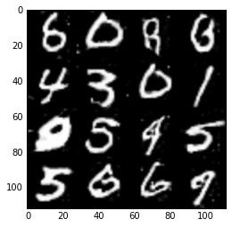


    Epoch 8/10... Discriminator Loss: 0.5057... Generator Loss: 4.3318
    Epoch 8/10... Discriminator Loss: 0.4629... Generator Loss: 3.3795
    Epoch 8/10... Discriminator Loss: 0.4646... Generator Loss: 3.1941
    Epoch 8/10... Discriminator Loss: 0.4246... Generator Loss: 3.4595
    Epoch 8/10... Discriminator Loss: 0.4194... Generator Loss: 4.2384
    Epoch 8/10... Discriminator Loss: 0.7756... Generator Loss: 4.1714
    Epoch 8/10... Discriminator Loss: 0.4814... Generator Loss: 2.7620
    Epoch 8/10... Discriminator Loss: 0.4834... Generator Loss: 2.3898
    Epoch 8/10... Discriminator Loss: 0.4588... Generator Loss: 3.6921
    Epoch 8/10... Discriminator Loss: 0.4407... Generator Loss: 3.0059
    <class 'numpy.ndarray'>


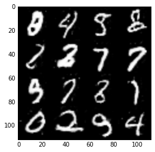


    Epoch 8/10... Discriminator Loss: 0.4184... Generator Loss: 3.3702
    Epoch 8/10... Discriminator Loss: 0.4089... Generator Loss: 5.0815
    Epoch 8/10... Discriminator Loss: 0.3987... Generator Loss: 3.9475
    Epoch 8/10... Discriminator Loss: 0.4068... Generator Loss: 3.6055
    Epoch 8/10... Discriminator Loss: 0.4248... Generator Loss: 3.5863
    Epoch 8/10... Discriminator Loss: 0.4363... Generator Loss: 3.7199
    Epoch 8/10... Discriminator Loss: 0.4672... Generator Loss: 2.9235
    Epoch 8/10... Discriminator Loss: 0.5011... Generator Loss: 2.2668
    Epoch 8/10... Discriminator Loss: 0.4407... Generator Loss: 4.0035
    Epoch 8/10... Discriminator Loss: 0.4256... Generator Loss: 3.8645
    <class 'numpy.ndarray'>


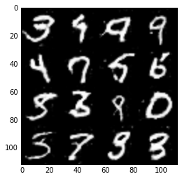


    Epoch 8/10... Discriminator Loss: 0.4063... Generator Loss: 4.0839
    Epoch 8/10... Discriminator Loss: 0.4501... Generator Loss: 5.3963
    Epoch 8/10... Discriminator Loss: 0.3893... Generator Loss: 4.0108
    Epoch 8/10... Discriminator Loss: 0.4382... Generator Loss: 3.4366
    Epoch 8/10... Discriminator Loss: 0.3922... Generator Loss: 4.1251
    Epoch 8/10... Discriminator Loss: 0.5977... Generator Loss: 4.8820
    Epoch 8/10... Discriminator Loss: 0.5076... Generator Loss: 3.3420
    Epoch 8/10... Discriminator Loss: 0.4493... Generator Loss: 3.1299
    Epoch 8/10... Discriminator Loss: 0.5757... Generator Loss: 1.9851
    Epoch 8/10... Discriminator Loss: 0.3984... Generator Loss: 3.3745
    <class 'numpy.ndarray'>


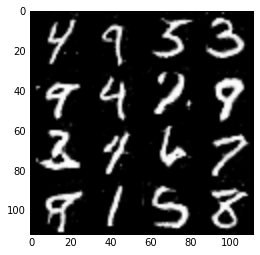


    Epoch 8/10... Discriminator Loss: 0.4273... Generator Loss: 4.9922
    Epoch 8/10... Discriminator Loss: 0.4103... Generator Loss: 3.9016
    Epoch 8/10... Discriminator Loss: 0.6229... Generator Loss: 2.1465
    Epoch 8/10... Discriminator Loss: 0.8089... Generator Loss: 3.8899
    Epoch 9/10... Discriminator Loss: 0.4865... Generator Loss: 2.0729
    Epoch 9/10... Discriminator Loss: 0.4098... Generator Loss: 3.4169
    Epoch 9/10... Discriminator Loss: 0.4394... Generator Loss: 3.7284
    Epoch 9/10... Discriminator Loss: 0.3921... Generator Loss: 3.8841
    Epoch 9/10... Discriminator Loss: 0.5356... Generator Loss: 2.9632
    Epoch 9/10... Discriminator Loss: 0.4707... Generator Loss: 2.4618
    <class 'numpy.ndarray'>


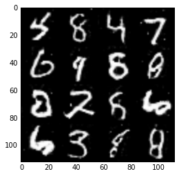


    Epoch 9/10... Discriminator Loss: 0.4381... Generator Loss: 3.7338
    Epoch 9/10... Discriminator Loss: 0.4433... Generator Loss: 3.3307
    Epoch 9/10... Discriminator Loss: 0.5096... Generator Loss: 2.9556
    Epoch 9/10... Discriminator Loss: 0.4761... Generator Loss: 2.4561
    Epoch 9/10... Discriminator Loss: 0.6974... Generator Loss: 1.9804
    Epoch 9/10... Discriminator Loss: 0.4224... Generator Loss: 3.2720
    Epoch 9/10... Discriminator Loss: 0.5316... Generator Loss: 2.7233
    Epoch 9/10... Discriminator Loss: 0.4213... Generator Loss: 3.1641
    Epoch 9/10... Discriminator Loss: 0.4258... Generator Loss: 3.6745
    Epoch 9/10... Discriminator Loss: 0.6385... Generator Loss: 1.9915
    <class 'numpy.ndarray'>


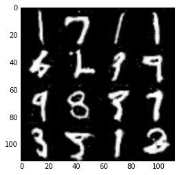


    Epoch 9/10... Discriminator Loss: 0.4246... Generator Loss: 3.5730
    Epoch 9/10... Discriminator Loss: 2.5184... Generator Loss: 4.7163
    Epoch 9/10... Discriminator Loss: 0.5258... Generator Loss: 3.2345
    Epoch 9/10... Discriminator Loss: 0.5911... Generator Loss: 2.1919
    Epoch 9/10... Discriminator Loss: 0.4289... Generator Loss: 3.8723
    Epoch 9/10... Discriminator Loss: 0.4881... Generator Loss: 2.8357
    Epoch 9/10... Discriminator Loss: 0.9396... Generator Loss: 1.3184
    Epoch 9/10... Discriminator Loss: 0.4071... Generator Loss: 3.9494
    Epoch 9/10... Discriminator Loss: 0.4078... Generator Loss: 3.2834
    Epoch 9/10... Discriminator Loss: 0.4180... Generator Loss: 3.8344
    <class 'numpy.ndarray'>


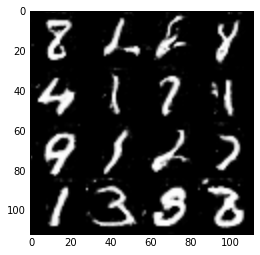


    Epoch 9/10... Discriminator Loss: 0.4295... Generator Loss: 4.9645
    Epoch 9/10... Discriminator Loss: 0.5402... Generator Loss: 2.6144
    Epoch 9/10... Discriminator Loss: 0.3966... Generator Loss: 4.0082
    Epoch 9/10... Discriminator Loss: 0.5289... Generator Loss: 2.1801
    Epoch 9/10... Discriminator Loss: 0.4029... Generator Loss: 3.3001
    Epoch 9/10... Discriminator Loss: 0.4072... Generator Loss: 3.8302
    Epoch 9/10... Discriminator Loss: 0.4328... Generator Loss: 3.5350
    Epoch 9/10... Discriminator Loss: 0.5800... Generator Loss: 2.2609
    Epoch 9/10... Discriminator Loss: 1.0497... Generator Loss: 0.9856
    Epoch 9/10... Discriminator Loss: 0.4518... Generator Loss: 3.2676
    <class 'numpy.ndarray'>


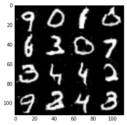


    Epoch 9/10... Discriminator Loss: 0.4129... Generator Loss: 4.2612
    Epoch 9/10... Discriminator Loss: 0.4003... Generator Loss: 3.8583
    Epoch 9/10... Discriminator Loss: 0.4689... Generator Loss: 3.0322
    Epoch 9/10... Discriminator Loss: 0.4813... Generator Loss: 2.5855
    Epoch 9/10... Discriminator Loss: 0.3954... Generator Loss: 3.7112
    Epoch 9/10... Discriminator Loss: 0.4540... Generator Loss: 4.2274
    Epoch 9/10... Discriminator Loss: 0.4156... Generator Loss: 3.3506
    Epoch 9/10... Discriminator Loss: 0.6480... Generator Loss: 3.4061
    Epoch 9/10... Discriminator Loss: 0.3926... Generator Loss: 4.1628
    Epoch 9/10... Discriminator Loss: 0.4374... Generator Loss: 3.8418
    <class 'numpy.ndarray'>


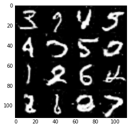


    Epoch 9/10... Discriminator Loss: 0.6736... Generator Loss: 1.9280
    Epoch 10/10... Discriminator Loss: 0.3990... Generator Loss: 4.4545
    Epoch 10/10... Discriminator Loss: 0.4000... Generator Loss: 4.1872
    Epoch 10/10... Discriminator Loss: 0.3830... Generator Loss: 5.1093
    Epoch 10/10... Discriminator Loss: 1.3875... Generator Loss: 0.9718
    Epoch 10/10... Discriminator Loss: 1.2075... Generator Loss: 1.3340
    Epoch 10/10... Discriminator Loss: 1.0777... Generator Loss: 2.0191
    Epoch 10/10... Discriminator Loss: 0.7662... Generator Loss: 1.3881
    Epoch 10/10... Discriminator Loss: 0.5263... Generator Loss: 2.4092
    Epoch 10/10... Discriminator Loss: 0.4344... Generator Loss: 2.6736
    <class 'numpy.ndarray'>


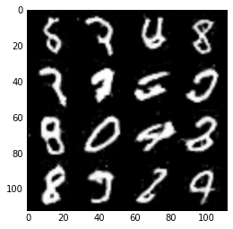


    Epoch 10/10... Discriminator Loss: 0.4425... Generator Loss: 3.9955
    Epoch 10/10... Discriminator Loss: 0.4199... Generator Loss: 4.0142
    Epoch 10/10... Discriminator Loss: 0.3856... Generator Loss: 4.0121
    Epoch 10/10... Discriminator Loss: 0.4563... Generator Loss: 3.8572
    Epoch 10/10... Discriminator Loss: 0.4168... Generator Loss: 3.1528
    Epoch 10/10... Discriminator Loss: 0.5064... Generator Loss: 2.4105
    Epoch 10/10... Discriminator Loss: 0.6178... Generator Loss: 1.6474
    Epoch 10/10... Discriminator Loss: 0.4141... Generator Loss: 2.5876
    Epoch 10/10... Discriminator Loss: 0.7884... Generator Loss: 1.7117
    Epoch 10/10... Discriminator Loss: 0.5993... Generator Loss: 2.3561
    <class 'numpy.ndarray'>


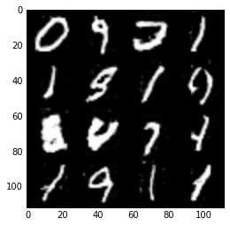


    Epoch 10/10... Discriminator Loss: 0.4424... Generator Loss: 3.5413
    Epoch 10/10... Discriminator Loss: 0.4323... Generator Loss: 3.3002
    Epoch 10/10... Discriminator Loss: 0.4204... Generator Loss: 3.2037
    Epoch 10/10... Discriminator Loss: 0.4146... Generator Loss: 4.2876
    Epoch 10/10... Discriminator Loss: 0.3965... Generator Loss: 4.2047
    Epoch 10/10... Discriminator Loss: 0.3795... Generator Loss: 3.6741
    Epoch 10/10... Discriminator Loss: 0.4025... Generator Loss: 2.7975
    Epoch 10/10... Discriminator Loss: 0.4241... Generator Loss: 3.4339
    Epoch 10/10... Discriminator Loss: 0.4358... Generator Loss: 2.9341
    Epoch 10/10... Discriminator Loss: 0.3947... Generator Loss: 3.7470
    <class 'numpy.ndarray'>


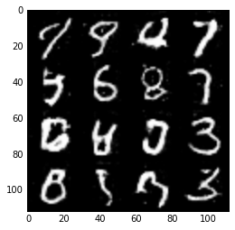


    Epoch 10/10... Discriminator Loss: 1.7033... Generator Loss: 0.4503
    Epoch 10/10... Discriminator Loss: 0.4235... Generator Loss: 3.2125
    Epoch 10/10... Discriminator Loss: 0.4107... Generator Loss: 2.8436
    Epoch 10/10... Discriminator Loss: 0.4008... Generator Loss: 4.0201
    Epoch 10/10... Discriminator Loss: 0.4085... Generator Loss: 3.1248
    Epoch 10/10... Discriminator Loss: 0.3934... Generator Loss: 4.1271
    Epoch 10/10... Discriminator Loss: 0.4161... Generator Loss: 3.6876
    Epoch 10/10... Discriminator Loss: 0.4380... Generator Loss: 2.9470
    Epoch 10/10... Discriminator Loss: 0.3908... Generator Loss: 4.0015
    Epoch 10/10... Discriminator Loss: 0.3970... Generator Loss: 4.1515
    <class 'numpy.ndarray'>


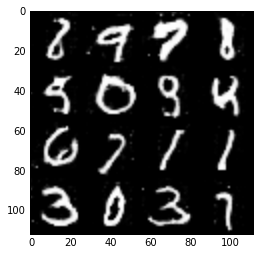


    Epoch 10/10... Discriminator Loss: 0.4240... Generator Loss: 4.6034
    Epoch 10/10... Discriminator Loss: 0.6022... Generator Loss: 1.9414
    Epoch 10/10... Discriminator Loss: 0.6033... Generator Loss: 3.0580
    Epoch 10/10... Discriminator Loss: 0.4458... Generator Loss: 2.7627
    Epoch 10/10... Discriminator Loss: 0.4576... Generator Loss: 2.6726
    Epoch 10/10... Discriminator Loss: 0.4610... Generator Loss: 2.7493
    Epoch 10/10... Discriminator Loss: 0.5831... Generator Loss: 2.5923
    Epoch 10/10... Discriminator Loss: 0.4456... Generator Loss: 3.6815


### CelebA
Run your GANs on CelebA.  It will take around 20 minutes on the average GPU to run one epoch.  You can run the whole epoch or stop when it starts to generate realistic faces.


```python
batch_size = 128
z_dim = 100
learning_rate = 0.0002
beta1 = 0.5


"""
DON'T MODIFY ANYTHING IN THIS CELL THAT IS BELOW THIS LINE
"""
epochs = 10

celeba_dataset = helper.Dataset('celeba', glob(os.path.join(data_dir, 'img_align_celeba/*.jpg')))
with tf.Graph().as_default():
    train(epochs, batch_size, z_dim, learning_rate, beta1, celeba_dataset.get_batches,
          celeba_dataset.shape, celeba_dataset.image_mode)
```

    100
    (202599, 28, 28, 3)
    TYPE input_z: <class 'tensorflow.python.framework.ops.Tensor'>
    Epoch 1/10... Discriminator Loss: 0.6541... Generator Loss: 1.9731
    Epoch 1/10... Discriminator Loss: 0.5541... Generator Loss: 2.6327
    Epoch 1/10... Discriminator Loss: 0.4826... Generator Loss: 3.1824
    Epoch 1/10... Discriminator Loss: 0.4684... Generator Loss: 3.6953
    Epoch 1/10... Discriminator Loss: 0.5236... Generator Loss: 2.9292
    Epoch 1/10... Discriminator Loss: 0.9928... Generator Loss: 1.2732
    Epoch 1/10... Discriminator Loss: 0.5257... Generator Loss: 2.9233
    Epoch 1/10... Discriminator Loss: 0.4398... Generator Loss: 4.1845
    Epoch 1/10... Discriminator Loss: 0.4377... Generator Loss: 3.8443
    Epoch 1/10... Discriminator Loss: 0.4213... Generator Loss: 4.0256
    <class 'numpy.ndarray'>


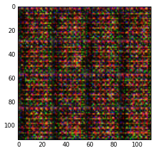


    Epoch 1/10... Discriminator Loss: 0.9513... Generator Loss: 1.1369
    Epoch 1/10... Discriminator Loss: 0.5470... Generator Loss: 2.6531
    Epoch 1/10... Discriminator Loss: 0.4255... Generator Loss: 3.8012
    Epoch 1/10... Discriminator Loss: 0.3935... Generator Loss: 4.2323
    Epoch 1/10... Discriminator Loss: 0.3948... Generator Loss: 4.2362
    Epoch 1/10... Discriminator Loss: 0.4074... Generator Loss: 4.2604
    Epoch 1/10... Discriminator Loss: 0.3958... Generator Loss: 4.0241
    Epoch 1/10... Discriminator Loss: 0.3752... Generator Loss: 4.4039
    Epoch 1/10... Discriminator Loss: 0.3756... Generator Loss: 4.2675
    Epoch 1/10... Discriminator Loss: 0.3620... Generator Loss: 5.1063
    <class 'numpy.ndarray'>


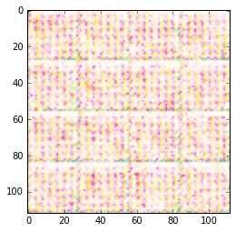


    Epoch 1/10... Discriminator Loss: 0.3587... Generator Loss: 5.2418
    Epoch 1/10... Discriminator Loss: 0.3770... Generator Loss: 4.4526
    Epoch 1/10... Discriminator Loss: 0.4609... Generator Loss: 2.9416
    Epoch 1/10... Discriminator Loss: 0.6854... Generator Loss: 9.2820
    Epoch 1/10... Discriminator Loss: 0.4796... Generator Loss: 3.2665
    Epoch 1/10... Discriminator Loss: 0.4091... Generator Loss: 3.8530
    Epoch 1/10... Discriminator Loss: 0.4071... Generator Loss: 4.0135
    Epoch 1/10... Discriminator Loss: 0.5777... Generator Loss: 2.0219
    Epoch 1/10... Discriminator Loss: 0.4875... Generator Loss: 3.1435
    Epoch 1/10... Discriminator Loss: 0.5089... Generator Loss: 3.3975
    <class 'numpy.ndarray'>


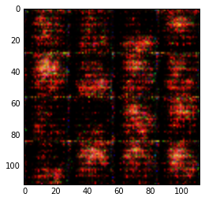


    Epoch 1/10... Discriminator Loss: 0.6607... Generator Loss: 1.7769
    Epoch 1/10... Discriminator Loss: 0.4991... Generator Loss: 2.6650
    Epoch 1/10... Discriminator Loss: 1.0040... Generator Loss: 3.6060
    Epoch 1/10... Discriminator Loss: 0.9298... Generator Loss: 1.1826
    Epoch 1/10... Discriminator Loss: 0.7106... Generator Loss: 1.6078
    Epoch 1/10... Discriminator Loss: 0.7644... Generator Loss: 3.2786
    Epoch 1/10... Discriminator Loss: 2.0388... Generator Loss: 0.3747
    Epoch 1/10... Discriminator Loss: 0.7890... Generator Loss: 1.6816
    Epoch 1/10... Discriminator Loss: 0.7391... Generator Loss: 1.7885
    Epoch 1/10... Discriminator Loss: 1.0072... Generator Loss: 1.3732
    <class 'numpy.ndarray'>


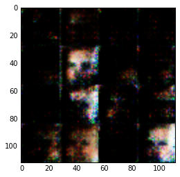


    Epoch 1/10... Discriminator Loss: 0.6891... Generator Loss: 1.9162
    Epoch 1/10... Discriminator Loss: 0.5622... Generator Loss: 3.5199
    Epoch 1/10... Discriminator Loss: 0.5125... Generator Loss: 4.5742
    Epoch 1/10... Discriminator Loss: 0.9070... Generator Loss: 3.4561
    Epoch 1/10... Discriminator Loss: 0.8254... Generator Loss: 1.8699
    Epoch 1/10... Discriminator Loss: 1.3568... Generator Loss: 0.6081
    Epoch 1/10... Discriminator Loss: 0.7972... Generator Loss: 1.4095
    Epoch 1/10... Discriminator Loss: 0.8526... Generator Loss: 1.4038
    Epoch 1/10... Discriminator Loss: 0.6913... Generator Loss: 2.7616
    Epoch 1/10... Discriminator Loss: 1.6235... Generator Loss: 0.4969
    <class 'numpy.ndarray'>


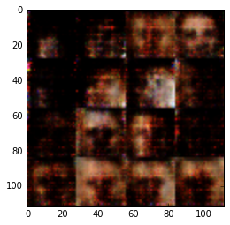


    Epoch 1/10... Discriminator Loss: 0.8593... Generator Loss: 1.6481
    Epoch 1/10... Discriminator Loss: 1.2266... Generator Loss: 3.9231
    Epoch 1/10... Discriminator Loss: 0.5803... Generator Loss: 2.3027
    Epoch 1/10... Discriminator Loss: 0.6609... Generator Loss: 3.0402
    Epoch 1/10... Discriminator Loss: 0.9099... Generator Loss: 1.5164
    Epoch 1/10... Discriminator Loss: 0.6834... Generator Loss: 1.7469
    Epoch 1/10... Discriminator Loss: 0.9373... Generator Loss: 1.4370
    Epoch 1/10... Discriminator Loss: 0.8315... Generator Loss: 1.7257
    Epoch 1/10... Discriminator Loss: 1.1186... Generator Loss: 2.7511
    Epoch 1/10... Discriminator Loss: 1.3537... Generator Loss: 2.6091
    <class 'numpy.ndarray'>


    Epoch 1/10... Discriminator Loss: 0.7644... Generator Loss: 1.6161
    Epoch 1/10... Discriminator Loss: 1.2585... Generator Loss: 0.7083
    Epoch 1/10... Discriminator Loss: 1.2607... Generator Loss: 2.2846
    Epoch 1/10... Discriminator Loss: 1.0924... Generator Loss: 1.1570
    Epoch 1/10... Discriminator Loss: 0.8894... Generator Loss: 1.8171
    Epoch 1/10... Discriminator Loss: 0.9290... Generator Loss: 1.5607
    Epoch 1/10... Discriminator Loss: 1.0219... Generator Loss: 1.1659
    Epoch 1/10... Discriminator Loss: 1.1209... Generator Loss: 1.2318
    Epoch 1/10... Discriminator Loss: 1.0198... Generator Loss: 1.6015
    Epoch 1/10... Discriminator Loss: 1.2301... Generator Loss: 0.9018
    <class 'numpy.ndarray'>


    Epoch 1/10... Discriminator Loss: 0.9293... Generator Loss: 2.2850
    Epoch 1/10... Discriminator Loss: 0.8720... Generator Loss: 1.2644
    Epoch 1/10... Discriminator Loss: 1.2773... Generator Loss: 1.1836
    Epoch 1/10... Discriminator Loss: 0.9989... Generator Loss: 1.7263
    Epoch 1/10... Discriminator Loss: 0.9964... Generator Loss: 1.7318
    Epoch 1/10... Discriminator Loss: 0.9517... Generator Loss: 1.3127
    Epoch 1/10... Discriminator Loss: 1.0936... Generator Loss: 1.2081
    Epoch 1/10... Discriminator Loss: 1.0694... Generator Loss: 1.2398
    Epoch 1/10... Discriminator Loss: 1.1063... Generator Loss: 3.1648
    Epoch 1/10... Discriminator Loss: 0.9381... Generator Loss: 1.2961
    <class 'numpy.ndarray'>


    Epoch 1/10... Discriminator Loss: 1.0507... Generator Loss: 2.0108
    Epoch 1/10... Discriminator Loss: 1.3523... Generator Loss: 0.8052
    Epoch 1/10... Discriminator Loss: 1.1029... Generator Loss: 1.4272
    Epoch 1/10... Discriminator Loss: 1.0319... Generator Loss: 1.4399
    Epoch 1/10... Discriminator Loss: 1.0228... Generator Loss: 1.1389
    Epoch 1/10... Discriminator Loss: 1.0240... Generator Loss: 1.3910
    Epoch 1/10... Discriminator Loss: 1.0677... Generator Loss: 1.1337
    Epoch 1/10... Discriminator Loss: 0.9756... Generator Loss: 1.2481
    Epoch 1/10... Discriminator Loss: 1.0004... Generator Loss: 1.3075
    Epoch 1/10... Discriminator Loss: 1.0780... Generator Loss: 1.2007
    <class 'numpy.ndarray'>


    Epoch 1/10... Discriminator Loss: 1.0692... Generator Loss: 1.5995
    Epoch 1/10... Discriminator Loss: 1.1850... Generator Loss: 1.1640
    Epoch 1/10... Discriminator Loss: 0.8911... Generator Loss: 1.4405
    Epoch 1/10... Discriminator Loss: 1.0492... Generator Loss: 1.0895
    Epoch 1/10... Discriminator Loss: 1.1461... Generator Loss: 1.2382
    Epoch 1/10... Discriminator Loss: 1.3493... Generator Loss: 0.9064
    Epoch 1/10... Discriminator Loss: 0.9162... Generator Loss: 1.5651
    Epoch 1/10... Discriminator Loss: 1.4863... Generator Loss: 0.6469
    Epoch 1/10... Discriminator Loss: 1.2115... Generator Loss: 0.9534
    Epoch 1/10... Discriminator Loss: 1.2518... Generator Loss: 1.4347
    <class 'numpy.ndarray'>


    Epoch 1/10... Discriminator Loss: 1.0371... Generator Loss: 1.5298
    Epoch 1/10... Discriminator Loss: 1.0820... Generator Loss: 1.6420
    Epoch 1/10... Discriminator Loss: 0.8313... Generator Loss: 1.4434
    Epoch 1/10... Discriminator Loss: 1.0270... Generator Loss: 1.6027
    Epoch 1/10... Discriminator Loss: 1.1540... Generator Loss: 0.7997
    Epoch 1/10... Discriminator Loss: 1.0629... Generator Loss: 1.2240
    Epoch 1/10... Discriminator Loss: 1.1759... Generator Loss: 2.2474
    Epoch 1/10... Discriminator Loss: 1.2262... Generator Loss: 1.0017
    Epoch 1/10... Discriminator Loss: 1.0716... Generator Loss: 1.5184
    Epoch 1/10... Discriminator Loss: 0.8083... Generator Loss: 1.7091
    <class 'numpy.ndarray'>


    Epoch 1/10... Discriminator Loss: 1.0378... Generator Loss: 1.0296
    Epoch 1/10... Discriminator Loss: 1.1799... Generator Loss: 1.6493
    Epoch 1/10... Discriminator Loss: 1.1431... Generator Loss: 1.7926
    Epoch 1/10... Discriminator Loss: 1.0707... Generator Loss: 1.7111
    Epoch 1/10... Discriminator Loss: 1.0337... Generator Loss: 1.2084
    Epoch 1/10... Discriminator Loss: 1.3661... Generator Loss: 1.8275
    Epoch 1/10... Discriminator Loss: 1.1143... Generator Loss: 1.4769
    Epoch 1/10... Discriminator Loss: 1.1257... Generator Loss: 1.4933
    Epoch 1/10... Discriminator Loss: 1.1213... Generator Loss: 0.8794
    Epoch 1/10... Discriminator Loss: 1.0610... Generator Loss: 1.8259
    <class 'numpy.ndarray'>


    Epoch 1/10... Discriminator Loss: 0.9280... Generator Loss: 2.0994
    Epoch 1/10... Discriminator Loss: 1.3201... Generator Loss: 0.9442
    Epoch 1/10... Discriminator Loss: 1.1193... Generator Loss: 1.1076
    Epoch 1/10... Discriminator Loss: 1.1859... Generator Loss: 1.0272
    Epoch 1/10... Discriminator Loss: 0.9807... Generator Loss: 1.2779
    Epoch 1/10... Discriminator Loss: 1.0937... Generator Loss: 0.9852
    Epoch 1/10... Discriminator Loss: 1.5231... Generator Loss: 2.7415
    Epoch 1/10... Discriminator Loss: 1.0398... Generator Loss: 1.6080
    Epoch 1/10... Discriminator Loss: 0.9082... Generator Loss: 1.4671
    Epoch 1/10... Discriminator Loss: 0.9431... Generator Loss: 1.1563
    <class 'numpy.ndarray'>


    Epoch 1/10... Discriminator Loss: 1.1125... Generator Loss: 1.4931
    Epoch 1/10... Discriminator Loss: 1.0396... Generator Loss: 1.4679
    Epoch 1/10... Discriminator Loss: 1.2139... Generator Loss: 0.9457
    Epoch 1/10... Discriminator Loss: 0.9967... Generator Loss: 1.5561
    Epoch 1/10... Discriminator Loss: 0.9742... Generator Loss: 1.2026
    Epoch 1/10... Discriminator Loss: 1.0530... Generator Loss: 1.0550
    Epoch 1/10... Discriminator Loss: 1.0012... Generator Loss: 1.8975
    Epoch 1/10... Discriminator Loss: 1.1193... Generator Loss: 0.8938
    Epoch 1/10... Discriminator Loss: 1.1327... Generator Loss: 1.3625
    Epoch 1/10... Discriminator Loss: 1.1993... Generator Loss: 0.8254
    <class 'numpy.ndarray'>


    Epoch 1/10... Discriminator Loss: 1.2825... Generator Loss: 1.0527
    Epoch 1/10... Discriminator Loss: 1.0993... Generator Loss: 1.2180
    Epoch 1/10... Discriminator Loss: 1.1612... Generator Loss: 1.0081
    Epoch 1/10... Discriminator Loss: 1.1639... Generator Loss: 1.3330
    Epoch 1/10... Discriminator Loss: 1.0285... Generator Loss: 1.1190
    Epoch 1/10... Discriminator Loss: 1.0548... Generator Loss: 1.3471
    Epoch 1/10... Discriminator Loss: 1.1466... Generator Loss: 1.0167
    Epoch 1/10... Discriminator Loss: 0.9716... Generator Loss: 1.5821
    Epoch 1/10... Discriminator Loss: 1.2048... Generator Loss: 0.8829
    Epoch 1/10... Discriminator Loss: 1.0408... Generator Loss: 1.3212
    <class 'numpy.ndarray'>


    Epoch 1/10... Discriminator Loss: 1.0108... Generator Loss: 1.1870
    Epoch 1/10... Discriminator Loss: 1.1862... Generator Loss: 0.9729
    Epoch 1/10... Discriminator Loss: 1.0130... Generator Loss: 1.6061
    Epoch 1/10... Discriminator Loss: 1.0112... Generator Loss: 1.4255
    Epoch 1/10... Discriminator Loss: 1.2709... Generator Loss: 0.9963
    Epoch 1/10... Discriminator Loss: 1.0122... Generator Loss: 1.1551
    Epoch 1/10... Discriminator Loss: 1.0618... Generator Loss: 1.2912
    Epoch 1/10... Discriminator Loss: 1.0972... Generator Loss: 1.1822
    Epoch 2/10... Discriminator Loss: 1.0723... Generator Loss: 1.1020
    Epoch 2/10... Discriminator Loss: 1.1741... Generator Loss: 1.5726
    <class 'numpy.ndarray'>


    Epoch 2/10... Discriminator Loss: 1.0182... Generator Loss: 1.6410
    Epoch 2/10... Discriminator Loss: 1.2994... Generator Loss: 1.7413
    Epoch 2/10... Discriminator Loss: 1.2049... Generator Loss: 0.9042
    Epoch 2/10... Discriminator Loss: 1.3225... Generator Loss: 0.9003
    Epoch 2/10... Discriminator Loss: 1.2509... Generator Loss: 0.8892
    Epoch 2/10... Discriminator Loss: 1.0586... Generator Loss: 1.2146
    Epoch 2/10... Discriminator Loss: 1.2365... Generator Loss: 0.7933
    Epoch 2/10... Discriminator Loss: 1.0249... Generator Loss: 1.2943
    Epoch 2/10... Discriminator Loss: 1.1454... Generator Loss: 0.8868
    Epoch 2/10... Discriminator Loss: 1.1548... Generator Loss: 1.5861
    <class 'numpy.ndarray'>


    Epoch 2/10... Discriminator Loss: 1.1279... Generator Loss: 1.3413
    Epoch 2/10... Discriminator Loss: 1.2487... Generator Loss: 0.8189
    Epoch 2/10... Discriminator Loss: 1.4166... Generator Loss: 0.8530
    Epoch 2/10... Discriminator Loss: 1.1722... Generator Loss: 1.0974
    Epoch 2/10... Discriminator Loss: 1.1305... Generator Loss: 1.2988
    Epoch 2/10... Discriminator Loss: 1.1530... Generator Loss: 1.2114
    Epoch 2/10... Discriminator Loss: 1.2849... Generator Loss: 0.6432
    Epoch 2/10... Discriminator Loss: 1.0501... Generator Loss: 0.9471
    Epoch 2/10... Discriminator Loss: 1.1870... Generator Loss: 1.2160
    Epoch 2/10... Discriminator Loss: 1.2020... Generator Loss: 0.9260
    <class 'numpy.ndarray'>


    Epoch 2/10... Discriminator Loss: 1.0162... Generator Loss: 1.1886
    Epoch 2/10... Discriminator Loss: 0.8492... Generator Loss: 1.4592
    Epoch 2/10... Discriminator Loss: 1.5476... Generator Loss: 0.6223
    Epoch 2/10... Discriminator Loss: 0.9611... Generator Loss: 1.3873
    Epoch 2/10... Discriminator Loss: 0.9575... Generator Loss: 1.2461
    Epoch 2/10... Discriminator Loss: 1.0104... Generator Loss: 1.3709
    Epoch 2/10... Discriminator Loss: 1.0165... Generator Loss: 1.1212
    Epoch 2/10... Discriminator Loss: 0.9411... Generator Loss: 1.5076
    Epoch 2/10... Discriminator Loss: 1.4710... Generator Loss: 1.0807
    Epoch 2/10... Discriminator Loss: 1.2798... Generator Loss: 1.1840
    <class 'numpy.ndarray'>


    Epoch 2/10... Discriminator Loss: 0.9694... Generator Loss: 1.5581
    Epoch 2/10... Discriminator Loss: 1.1688... Generator Loss: 1.2445
    Epoch 2/10... Discriminator Loss: 1.1265... Generator Loss: 1.3170
    Epoch 2/10... Discriminator Loss: 1.3436... Generator Loss: 0.6851
    Epoch 2/10... Discriminator Loss: 1.2978... Generator Loss: 1.0485
    Epoch 2/10... Discriminator Loss: 0.8698... Generator Loss: 1.6519
    Epoch 2/10... Discriminator Loss: 1.0208... Generator Loss: 1.2926
    Epoch 2/10... Discriminator Loss: 1.1115... Generator Loss: 1.3982
    Epoch 2/10... Discriminator Loss: 1.0480... Generator Loss: 1.1738
    Epoch 2/10... Discriminator Loss: 0.9937... Generator Loss: 0.9694
    <class 'numpy.ndarray'>


    Epoch 2/10... Discriminator Loss: 0.8752... Generator Loss: 2.2767
    Epoch 2/10... Discriminator Loss: 1.2639... Generator Loss: 0.6913
    Epoch 2/10... Discriminator Loss: 1.0946... Generator Loss: 1.3167
    Epoch 2/10... Discriminator Loss: 0.8642... Generator Loss: 1.6782
    Epoch 2/10... Discriminator Loss: 1.1110... Generator Loss: 1.1095
    Epoch 2/10... Discriminator Loss: 1.2217... Generator Loss: 1.8604
    Epoch 2/10... Discriminator Loss: 1.1457... Generator Loss: 1.1878
    Epoch 2/10... Discriminator Loss: 0.9599... Generator Loss: 1.3052
    Epoch 2/10... Discriminator Loss: 1.4577... Generator Loss: 0.5522
    Epoch 2/10... Discriminator Loss: 0.9064... Generator Loss: 1.1530
    <class 'numpy.ndarray'>


    Epoch 2/10... Discriminator Loss: 1.0315... Generator Loss: 1.6223
    Epoch 2/10... Discriminator Loss: 1.1686... Generator Loss: 1.0832
    Epoch 2/10... Discriminator Loss: 1.2650... Generator Loss: 0.7236
    Epoch 2/10... Discriminator Loss: 0.9090... Generator Loss: 1.6744
    Epoch 2/10... Discriminator Loss: 0.9304... Generator Loss: 1.5640
    Epoch 2/10... Discriminator Loss: 1.0782... Generator Loss: 1.1082
    Epoch 2/10... Discriminator Loss: 1.5528... Generator Loss: 0.5838
    Epoch 2/10... Discriminator Loss: 1.0092... Generator Loss: 1.7654
    Epoch 2/10... Discriminator Loss: 1.1369... Generator Loss: 1.1873
    Epoch 2/10... Discriminator Loss: 1.1054... Generator Loss: 0.9481
    <class 'numpy.ndarray'>


    Epoch 2/10... Discriminator Loss: 1.3179... Generator Loss: 0.8618
    Epoch 2/10... Discriminator Loss: 1.1168... Generator Loss: 1.0420
    Epoch 2/10... Discriminator Loss: 1.2332... Generator Loss: 1.5355
    Epoch 2/10... Discriminator Loss: 1.0726... Generator Loss: 1.4763
    Epoch 2/10... Discriminator Loss: 1.0756... Generator Loss: 1.0394
    Epoch 2/10... Discriminator Loss: 0.9883... Generator Loss: 1.2436
    Epoch 2/10... Discriminator Loss: 0.9155... Generator Loss: 1.3027
    Epoch 2/10... Discriminator Loss: 1.1247... Generator Loss: 1.0653
    Epoch 2/10... Discriminator Loss: 0.9378... Generator Loss: 1.4320
    Epoch 2/10... Discriminator Loss: 1.0947... Generator Loss: 1.2894
    <class 'numpy.ndarray'>


    Epoch 2/10... Discriminator Loss: 1.4318... Generator Loss: 0.5391
    Epoch 2/10... Discriminator Loss: 1.1482... Generator Loss: 0.9587
    Epoch 2/10... Discriminator Loss: 1.1471... Generator Loss: 1.0338
    Epoch 2/10... Discriminator Loss: 1.0600... Generator Loss: 1.5768
    Epoch 2/10... Discriminator Loss: 0.8618... Generator Loss: 1.6231
    Epoch 2/10... Discriminator Loss: 1.1829... Generator Loss: 1.0346
    Epoch 2/10... Discriminator Loss: 1.1027... Generator Loss: 1.5130
    Epoch 2/10... Discriminator Loss: 1.0907... Generator Loss: 1.3042
    Epoch 2/10... Discriminator Loss: 1.1215... Generator Loss: 1.3549
    Epoch 2/10... Discriminator Loss: 1.1895... Generator Loss: 1.0129
    <class 'numpy.ndarray'>


    Epoch 2/10... Discriminator Loss: 1.0215... Generator Loss: 1.1465
    Epoch 2/10... Discriminator Loss: 1.2518... Generator Loss: 0.9916
    Epoch 2/10... Discriminator Loss: 1.2586... Generator Loss: 0.7494
    Epoch 2/10... Discriminator Loss: 1.0967... Generator Loss: 0.8424
    Epoch 2/10... Discriminator Loss: 1.1324... Generator Loss: 1.6408
    Epoch 2/10... Discriminator Loss: 1.0154... Generator Loss: 1.4614
    Epoch 2/10... Discriminator Loss: 1.0697... Generator Loss: 1.1478
    Epoch 2/10... Discriminator Loss: 1.0357... Generator Loss: 1.0593
    Epoch 2/10... Discriminator Loss: 1.0340... Generator Loss: 1.7472
    Epoch 2/10... Discriminator Loss: 1.1238... Generator Loss: 1.3494
    <class 'numpy.ndarray'>


    Epoch 2/10... Discriminator Loss: 1.1432... Generator Loss: 1.1062
    Epoch 2/10... Discriminator Loss: 1.0793... Generator Loss: 1.0102
    Epoch 2/10... Discriminator Loss: 1.0476... Generator Loss: 0.9930
    Epoch 2/10... Discriminator Loss: 1.2586... Generator Loss: 0.8879
    Epoch 2/10... Discriminator Loss: 1.6000... Generator Loss: 0.7470
    Epoch 2/10... Discriminator Loss: 1.2305... Generator Loss: 1.3938
    Epoch 2/10... Discriminator Loss: 1.0441... Generator Loss: 1.3591
    Epoch 2/10... Discriminator Loss: 1.1551... Generator Loss: 1.1366
    Epoch 2/10... Discriminator Loss: 0.9836... Generator Loss: 1.3793
    Epoch 2/10... Discriminator Loss: 1.3164... Generator Loss: 0.7868
    <class 'numpy.ndarray'>


    Epoch 2/10... Discriminator Loss: 1.2314... Generator Loss: 1.5047
    Epoch 2/10... Discriminator Loss: 1.0111... Generator Loss: 1.2841
    Epoch 2/10... Discriminator Loss: 1.0699... Generator Loss: 1.3720
    Epoch 2/10... Discriminator Loss: 1.1224... Generator Loss: 0.9062
    Epoch 2/10... Discriminator Loss: 1.0446... Generator Loss: 1.5271
    Epoch 2/10... Discriminator Loss: 1.3330... Generator Loss: 0.7403
    Epoch 2/10... Discriminator Loss: 1.1402... Generator Loss: 0.9580
    Epoch 2/10... Discriminator Loss: 0.9841... Generator Loss: 1.3521
    Epoch 2/10... Discriminator Loss: 1.0390... Generator Loss: 1.2153
    Epoch 2/10... Discriminator Loss: 1.3997... Generator Loss: 0.9790
    <class 'numpy.ndarray'>


    Epoch 2/10... Discriminator Loss: 1.3011... Generator Loss: 0.8711
    Epoch 2/10... Discriminator Loss: 0.9785... Generator Loss: 1.4147
    Epoch 2/10... Discriminator Loss: 1.0555... Generator Loss: 1.0852
    Epoch 2/10... Discriminator Loss: 1.3205... Generator Loss: 1.2596
    Epoch 2/10... Discriminator Loss: 1.2229... Generator Loss: 0.7472
    Epoch 2/10... Discriminator Loss: 0.9261... Generator Loss: 1.3188
    Epoch 2/10... Discriminator Loss: 1.1996... Generator Loss: 0.8735
    Epoch 2/10... Discriminator Loss: 1.0289... Generator Loss: 1.3499
    Epoch 2/10... Discriminator Loss: 1.1158... Generator Loss: 1.1475
    Epoch 2/10... Discriminator Loss: 1.0059... Generator Loss: 1.0696
    <class 'numpy.ndarray'>


    Epoch 2/10... Discriminator Loss: 0.9345... Generator Loss: 1.1598
    Epoch 2/10... Discriminator Loss: 1.1446... Generator Loss: 1.1529
    Epoch 2/10... Discriminator Loss: 1.1485... Generator Loss: 1.4622
    Epoch 2/10... Discriminator Loss: 1.1326... Generator Loss: 1.3514
    Epoch 2/10... Discriminator Loss: 1.1192... Generator Loss: 1.0220
    Epoch 2/10... Discriminator Loss: 0.9917... Generator Loss: 1.2290
    Epoch 2/10... Discriminator Loss: 1.3748... Generator Loss: 1.7615
    Epoch 2/10... Discriminator Loss: 1.6491... Generator Loss: 0.4345
    Epoch 2/10... Discriminator Loss: 1.1228... Generator Loss: 1.2557
    Epoch 2/10... Discriminator Loss: 1.2069... Generator Loss: 0.8907
    <class 'numpy.ndarray'>


    Epoch 2/10... Discriminator Loss: 1.2726... Generator Loss: 1.3284
    Epoch 2/10... Discriminator Loss: 1.0557... Generator Loss: 0.8933
    Epoch 2/10... Discriminator Loss: 1.7395... Generator Loss: 0.4702
    Epoch 2/10... Discriminator Loss: 1.1166... Generator Loss: 1.0945
    Epoch 2/10... Discriminator Loss: 0.8588... Generator Loss: 1.8316
    Epoch 2/10... Discriminator Loss: 1.0072... Generator Loss: 1.5307
    Epoch 2/10... Discriminator Loss: 1.2276... Generator Loss: 1.9229
    Epoch 2/10... Discriminator Loss: 1.1319... Generator Loss: 1.4103
    Epoch 2/10... Discriminator Loss: 0.9997... Generator Loss: 1.0725
    Epoch 2/10... Discriminator Loss: 1.1163... Generator Loss: 1.4522
    <class 'numpy.ndarray'>


    Epoch 2/10... Discriminator Loss: 1.2523... Generator Loss: 0.9280
    Epoch 2/10... Discriminator Loss: 0.9666... Generator Loss: 1.3021
    Epoch 2/10... Discriminator Loss: 0.8230... Generator Loss: 1.5474
    Epoch 2/10... Discriminator Loss: 1.0080... Generator Loss: 1.3317
    Epoch 2/10... Discriminator Loss: 1.0798... Generator Loss: 1.1007
    Epoch 2/10... Discriminator Loss: 0.7778... Generator Loss: 1.9582
    Epoch 2/10... Discriminator Loss: 1.2222... Generator Loss: 1.5697
    Epoch 2/10... Discriminator Loss: 0.9598... Generator Loss: 1.3429
    Epoch 2/10... Discriminator Loss: 0.8404... Generator Loss: 1.2843
    Epoch 2/10... Discriminator Loss: 0.9035... Generator Loss: 1.3850
    <class 'numpy.ndarray'>


    Epoch 2/10... Discriminator Loss: 1.1937... Generator Loss: 1.0296
    Epoch 2/10... Discriminator Loss: 1.1509... Generator Loss: 2.1262
    Epoch 2/10... Discriminator Loss: 1.1365... Generator Loss: 1.0819
    Epoch 2/10... Discriminator Loss: 1.3127... Generator Loss: 0.9020
    Epoch 2/10... Discriminator Loss: 0.9644... Generator Loss: 1.2350
    Epoch 2/10... Discriminator Loss: 1.2277... Generator Loss: 1.6324
    Epoch 3/10... Discriminator Loss: 1.1153... Generator Loss: 1.1361
    Epoch 3/10... Discriminator Loss: 0.8548... Generator Loss: 1.1779
    Epoch 3/10... Discriminator Loss: 1.0809... Generator Loss: 1.3693
    Epoch 3/10... Discriminator Loss: 0.8377... Generator Loss: 1.6115
    <class 'numpy.ndarray'>


    Epoch 3/10... Discriminator Loss: 0.9869... Generator Loss: 1.5098
    Epoch 3/10... Discriminator Loss: 1.2629... Generator Loss: 0.7686
    Epoch 3/10... Discriminator Loss: 1.0021... Generator Loss: 1.4370
    Epoch 3/10... Discriminator Loss: 1.2631... Generator Loss: 0.9731
    Epoch 3/10... Discriminator Loss: 1.0054... Generator Loss: 1.1550
    Epoch 3/10... Discriminator Loss: 1.1633... Generator Loss: 1.5183
    Epoch 3/10... Discriminator Loss: 1.1776... Generator Loss: 1.1929
    Epoch 3/10... Discriminator Loss: 1.0366... Generator Loss: 1.1795
    Epoch 3/10... Discriminator Loss: 1.0407... Generator Loss: 1.2897
    Epoch 3/10... Discriminator Loss: 0.9730... Generator Loss: 1.1098
    <class 'numpy.ndarray'>


    Epoch 3/10... Discriminator Loss: 1.1007... Generator Loss: 0.9325
    Epoch 3/10... Discriminator Loss: 1.0367... Generator Loss: 0.9771
    Epoch 3/10... Discriminator Loss: 1.0139... Generator Loss: 1.0317
    Epoch 3/10... Discriminator Loss: 1.0946... Generator Loss: 1.2331
    Epoch 3/10... Discriminator Loss: 1.1532... Generator Loss: 1.1336
    Epoch 3/10... Discriminator Loss: 0.9971... Generator Loss: 1.0554
    Epoch 3/10... Discriminator Loss: 1.1650... Generator Loss: 1.6412
    Epoch 3/10... Discriminator Loss: 1.2202... Generator Loss: 2.0022
    Epoch 3/10... Discriminator Loss: 1.2081... Generator Loss: 0.8245
    Epoch 3/10... Discriminator Loss: 0.8715... Generator Loss: 1.4326
    <class 'numpy.ndarray'>


    Epoch 3/10... Discriminator Loss: 1.1393... Generator Loss: 1.3563
    Epoch 3/10... Discriminator Loss: 0.8865... Generator Loss: 1.7854
    Epoch 3/10... Discriminator Loss: 1.7155... Generator Loss: 0.3490
    Epoch 3/10... Discriminator Loss: 1.3608... Generator Loss: 0.9016
    Epoch 3/10... Discriminator Loss: 0.9990... Generator Loss: 1.3519
    Epoch 3/10... Discriminator Loss: 1.1911... Generator Loss: 0.8588
    Epoch 3/10... Discriminator Loss: 1.0478... Generator Loss: 1.0182
    Epoch 3/10... Discriminator Loss: 0.9434... Generator Loss: 1.9868
    Epoch 3/10... Discriminator Loss: 0.8215... Generator Loss: 1.4234
    Epoch 3/10... Discriminator Loss: 1.0743... Generator Loss: 1.2750
    <class 'numpy.ndarray'>


    Epoch 3/10... Discriminator Loss: 1.0793... Generator Loss: 1.2917
    Epoch 3/10... Discriminator Loss: 1.1855... Generator Loss: 0.9960
    Epoch 3/10... Discriminator Loss: 0.9651... Generator Loss: 1.2532
    Epoch 3/10... Discriminator Loss: 0.9691... Generator Loss: 1.6920
    Epoch 3/10... Discriminator Loss: 1.4185... Generator Loss: 1.3558
    Epoch 3/10... Discriminator Loss: 1.1070... Generator Loss: 1.3426
    Epoch 3/10... Discriminator Loss: 0.9324... Generator Loss: 1.3457
    Epoch 3/10... Discriminator Loss: 0.9985... Generator Loss: 1.6440
    Epoch 3/10... Discriminator Loss: 0.9774... Generator Loss: 1.5176
    Epoch 3/10... Discriminator Loss: 0.9638... Generator Loss: 1.4250
    <class 'numpy.ndarray'>


    Epoch 3/10... Discriminator Loss: 1.0699... Generator Loss: 1.0159
    Epoch 3/10... Discriminator Loss: 1.3449... Generator Loss: 0.8618
    Epoch 3/10... Discriminator Loss: 1.1081... Generator Loss: 1.4271
    Epoch 3/10... Discriminator Loss: 0.9612... Generator Loss: 1.1939
    Epoch 3/10... Discriminator Loss: 1.1825... Generator Loss: 1.8889
    Epoch 3/10... Discriminator Loss: 1.1197... Generator Loss: 0.9850
    Epoch 3/10... Discriminator Loss: 0.9662... Generator Loss: 1.4743
    Epoch 3/10... Discriminator Loss: 1.3336... Generator Loss: 0.6357
    Epoch 3/10... Discriminator Loss: 1.6316... Generator Loss: 0.4987
    Epoch 3/10... Discriminator Loss: 1.2795... Generator Loss: 0.8702
    <class 'numpy.ndarray'>


    Epoch 3/10... Discriminator Loss: 0.8808... Generator Loss: 1.2917
    Epoch 3/10... Discriminator Loss: 1.0696... Generator Loss: 0.8065
    Epoch 3/10... Discriminator Loss: 0.7511... Generator Loss: 1.4026
    Epoch 3/10... Discriminator Loss: 1.1732... Generator Loss: 0.9119
    Epoch 3/10... Discriminator Loss: 1.1677... Generator Loss: 1.9461
    Epoch 3/10... Discriminator Loss: 1.3140... Generator Loss: 0.8647
    Epoch 3/10... Discriminator Loss: 1.0210... Generator Loss: 1.1656
    Epoch 3/10... Discriminator Loss: 1.2662... Generator Loss: 0.8674
    Epoch 3/10... Discriminator Loss: 1.1622... Generator Loss: 0.9083
    Epoch 3/10... Discriminator Loss: 0.9330... Generator Loss: 1.2566
    <class 'numpy.ndarray'>


    Epoch 3/10... Discriminator Loss: 0.8910... Generator Loss: 1.6684
    Epoch 3/10... Discriminator Loss: 1.0601... Generator Loss: 1.5515
    Epoch 3/10... Discriminator Loss: 1.2947... Generator Loss: 0.9667
    Epoch 3/10... Discriminator Loss: 1.3255... Generator Loss: 1.6542
    Epoch 3/10... Discriminator Loss: 1.1836... Generator Loss: 1.0842
    Epoch 3/10... Discriminator Loss: 0.8293... Generator Loss: 1.7755
    Epoch 3/10... Discriminator Loss: 1.0472... Generator Loss: 1.5164
    Epoch 3/10... Discriminator Loss: 1.3209... Generator Loss: 1.0636
    Epoch 3/10... Discriminator Loss: 1.1609... Generator Loss: 1.0502
    Epoch 3/10... Discriminator Loss: 1.0696... Generator Loss: 1.6311
    <class 'numpy.ndarray'>


    Epoch 3/10... Discriminator Loss: 0.8589... Generator Loss: 1.3618
    Epoch 3/10... Discriminator Loss: 0.9443... Generator Loss: 1.3858
    Epoch 3/10... Discriminator Loss: 1.0458... Generator Loss: 1.4840
    Epoch 3/10... Discriminator Loss: 0.9146... Generator Loss: 2.0246
    Epoch 3/10... Discriminator Loss: 1.0232... Generator Loss: 1.2487
    Epoch 3/10... Discriminator Loss: 1.4434... Generator Loss: 1.3944
    Epoch 3/10... Discriminator Loss: 1.0463... Generator Loss: 1.1500
    Epoch 3/10... Discriminator Loss: 0.9889... Generator Loss: 0.9562
    Epoch 3/10... Discriminator Loss: 1.4984... Generator Loss: 0.6759
    Epoch 3/10... Discriminator Loss: 0.9154... Generator Loss: 2.1761
    <class 'numpy.ndarray'>


    Epoch 3/10... Discriminator Loss: 0.9979... Generator Loss: 1.3571
    Epoch 3/10... Discriminator Loss: 1.0678... Generator Loss: 1.3127
    Epoch 3/10... Discriminator Loss: 1.1727... Generator Loss: 0.7406
    Epoch 3/10... Discriminator Loss: 1.2105... Generator Loss: 0.9219
    Epoch 3/10... Discriminator Loss: 1.2947... Generator Loss: 0.7178
    Epoch 3/10... Discriminator Loss: 1.3033... Generator Loss: 0.9217
    Epoch 3/10... Discriminator Loss: 1.0814... Generator Loss: 1.3213
    Epoch 3/10... Discriminator Loss: 1.1057... Generator Loss: 1.4056
    Epoch 3/10... Discriminator Loss: 0.9896... Generator Loss: 1.1634
    Epoch 3/10... Discriminator Loss: 1.1976... Generator Loss: 0.8596
    <class 'numpy.ndarray'>


    Epoch 3/10... Discriminator Loss: 1.3031... Generator Loss: 0.8520
    Epoch 3/10... Discriminator Loss: 1.0735... Generator Loss: 0.9134
    Epoch 3/10... Discriminator Loss: 0.7582... Generator Loss: 1.5949
    Epoch 3/10... Discriminator Loss: 1.4213... Generator Loss: 0.6422
    Epoch 3/10... Discriminator Loss: 1.1683... Generator Loss: 0.8792
    Epoch 3/10... Discriminator Loss: 1.1481... Generator Loss: 1.6133
    Epoch 3/10... Discriminator Loss: 1.0488... Generator Loss: 0.9745
    Epoch 3/10... Discriminator Loss: 1.3714... Generator Loss: 0.5523
    Epoch 3/10... Discriminator Loss: 1.1940... Generator Loss: 1.8395
    Epoch 3/10... Discriminator Loss: 1.1711... Generator Loss: 1.1233
    <class 'numpy.ndarray'>


    Epoch 3/10... Discriminator Loss: 1.1886... Generator Loss: 0.7898
    Epoch 3/10... Discriminator Loss: 1.4202... Generator Loss: 1.0345
    Epoch 3/10... Discriminator Loss: 0.9506... Generator Loss: 1.0726
    Epoch 3/10... Discriminator Loss: 1.0057... Generator Loss: 2.1328
    Epoch 3/10... Discriminator Loss: 1.1069... Generator Loss: 1.1615
    Epoch 3/10... Discriminator Loss: 1.8008... Generator Loss: 2.8368
    Epoch 3/10... Discriminator Loss: 0.9323... Generator Loss: 1.5357
    Epoch 3/10... Discriminator Loss: 1.5461... Generator Loss: 0.8404
    Epoch 3/10... Discriminator Loss: 0.8948... Generator Loss: 1.9234
    Epoch 3/10... Discriminator Loss: 0.9453... Generator Loss: 1.3392
    <class 'numpy.ndarray'>


    Epoch 3/10... Discriminator Loss: 1.0526... Generator Loss: 0.9953
    Epoch 3/10... Discriminator Loss: 0.9663... Generator Loss: 1.2855
    Epoch 3/10... Discriminator Loss: 1.1566... Generator Loss: 0.7693
    Epoch 3/10... Discriminator Loss: 0.8336... Generator Loss: 1.6527
    Epoch 3/10... Discriminator Loss: 0.8165... Generator Loss: 1.4744
    Epoch 3/10... Discriminator Loss: 1.6798... Generator Loss: 0.6038
    Epoch 3/10... Discriminator Loss: 1.2923... Generator Loss: 0.7769
    Epoch 3/10... Discriminator Loss: 1.0709... Generator Loss: 1.1729
    Epoch 3/10... Discriminator Loss: 1.3125... Generator Loss: 0.9104
    Epoch 3/10... Discriminator Loss: 1.1007... Generator Loss: 1.3969
    <class 'numpy.ndarray'>


    Epoch 3/10... Discriminator Loss: 1.0234... Generator Loss: 1.1379
    Epoch 3/10... Discriminator Loss: 1.1243... Generator Loss: 1.5346
    Epoch 3/10... Discriminator Loss: 0.9314... Generator Loss: 1.5741
    Epoch 3/10... Discriminator Loss: 0.8683... Generator Loss: 1.3508
    Epoch 3/10... Discriminator Loss: 1.1714... Generator Loss: 0.9516
    Epoch 3/10... Discriminator Loss: 1.5475... Generator Loss: 0.5225
    Epoch 3/10... Discriminator Loss: 1.1865... Generator Loss: 1.0558
    Epoch 3/10... Discriminator Loss: 0.8996... Generator Loss: 1.2502
    Epoch 3/10... Discriminator Loss: 0.9416... Generator Loss: 1.3109
    Epoch 3/10... Discriminator Loss: 0.8856... Generator Loss: 1.3361
    <class 'numpy.ndarray'>


    Epoch 3/10... Discriminator Loss: 1.0535... Generator Loss: 1.0533
    Epoch 3/10... Discriminator Loss: 1.0168... Generator Loss: 1.1600
    Epoch 3/10... Discriminator Loss: 1.4012... Generator Loss: 0.7652
    Epoch 3/10... Discriminator Loss: 1.0604... Generator Loss: 0.8922
    Epoch 3/10... Discriminator Loss: 0.6336... Generator Loss: 2.1568
    Epoch 3/10... Discriminator Loss: 0.7836... Generator Loss: 1.4774
    Epoch 3/10... Discriminator Loss: 1.0028... Generator Loss: 1.2077
    Epoch 3/10... Discriminator Loss: 0.8919... Generator Loss: 1.8286
    Epoch 3/10... Discriminator Loss: 1.1885... Generator Loss: 1.4021
    Epoch 3/10... Discriminator Loss: 0.9061... Generator Loss: 1.2908
    <class 'numpy.ndarray'>


    Epoch 3/10... Discriminator Loss: 0.8204... Generator Loss: 1.5846
    Epoch 3/10... Discriminator Loss: 1.0287... Generator Loss: 1.3657
    Epoch 3/10... Discriminator Loss: 1.0547... Generator Loss: 1.2659
    Epoch 3/10... Discriminator Loss: 1.2771... Generator Loss: 0.6556
    Epoch 3/10... Discriminator Loss: 0.8552... Generator Loss: 1.2350
    Epoch 3/10... Discriminator Loss: 0.5974... Generator Loss: 2.7257
    Epoch 3/10... Discriminator Loss: 1.1429... Generator Loss: 1.1020
    Epoch 3/10... Discriminator Loss: 0.7555... Generator Loss: 1.5540
    Epoch 3/10... Discriminator Loss: 0.9547... Generator Loss: 1.1544
    Epoch 3/10... Discriminator Loss: 1.2557... Generator Loss: 1.5295
    <class 'numpy.ndarray'>


    Epoch 3/10... Discriminator Loss: 1.3908... Generator Loss: 0.6560
    Epoch 3/10... Discriminator Loss: 1.0170... Generator Loss: 1.1874
    Epoch 3/10... Discriminator Loss: 0.7544... Generator Loss: 1.6615
    Epoch 3/10... Discriminator Loss: 1.2867... Generator Loss: 0.7947
    Epoch 4/10... Discriminator Loss: 0.7628... Generator Loss: 1.6708
    Epoch 4/10... Discriminator Loss: 1.1891... Generator Loss: 2.2296
    Epoch 4/10... Discriminator Loss: 0.9454... Generator Loss: 1.4459
    Epoch 4/10... Discriminator Loss: 1.5717... Generator Loss: 0.7885
    Epoch 4/10... Discriminator Loss: 1.2755... Generator Loss: 2.0743
    Epoch 4/10... Discriminator Loss: 1.0112... Generator Loss: 1.3691
    <class 'numpy.ndarray'>


    Epoch 4/10... Discriminator Loss: 1.0153... Generator Loss: 1.2264
    Epoch 4/10... Discriminator Loss: 1.0610... Generator Loss: 1.3459
    Epoch 4/10... Discriminator Loss: 0.7074... Generator Loss: 2.2845
    Epoch 4/10... Discriminator Loss: 0.9184... Generator Loss: 1.3809
    Epoch 4/10... Discriminator Loss: 0.9190... Generator Loss: 1.6773
    Epoch 4/10... Discriminator Loss: 0.9738... Generator Loss: 1.5897
    Epoch 4/10... Discriminator Loss: 0.9420... Generator Loss: 1.3300
    Epoch 4/10... Discriminator Loss: 1.1473... Generator Loss: 0.7898
    Epoch 4/10... Discriminator Loss: 0.8857... Generator Loss: 1.1329
    Epoch 4/10... Discriminator Loss: 1.0038... Generator Loss: 1.2217
    <class 'numpy.ndarray'>


    Epoch 4/10... Discriminator Loss: 1.0704... Generator Loss: 1.4385
    Epoch 4/10... Discriminator Loss: 1.0363... Generator Loss: 1.3881
    Epoch 4/10... Discriminator Loss: 0.9019... Generator Loss: 1.7547
    Epoch 4/10... Discriminator Loss: 1.1304... Generator Loss: 0.9838
    Epoch 4/10... Discriminator Loss: 1.0795... Generator Loss: 1.1565
    Epoch 4/10... Discriminator Loss: 1.2707... Generator Loss: 0.9817
    Epoch 4/10... Discriminator Loss: 1.0793... Generator Loss: 1.0055
    Epoch 4/10... Discriminator Loss: 0.9465... Generator Loss: 1.6118
    Epoch 4/10... Discriminator Loss: 0.8459... Generator Loss: 1.3609
    Epoch 4/10... Discriminator Loss: 1.2094... Generator Loss: 1.0178
    <class 'numpy.ndarray'>


    Epoch 4/10... Discriminator Loss: 0.8377... Generator Loss: 1.6381
    Epoch 4/10... Discriminator Loss: 1.0236... Generator Loss: 1.2148
    Epoch 4/10... Discriminator Loss: 0.9343... Generator Loss: 1.4253
    Epoch 4/10... Discriminator Loss: 1.1249... Generator Loss: 1.0372
    Epoch 4/10... Discriminator Loss: 1.2870... Generator Loss: 0.7927
    Epoch 4/10... Discriminator Loss: 1.2178... Generator Loss: 0.9895
    Epoch 4/10... Discriminator Loss: 1.0788... Generator Loss: 1.7136
    Epoch 4/10... Discriminator Loss: 0.7505... Generator Loss: 1.4060
    Epoch 4/10... Discriminator Loss: 0.9749... Generator Loss: 1.7269
    Epoch 4/10... Discriminator Loss: 1.2153... Generator Loss: 0.8229
    <class 'numpy.ndarray'>


    Epoch 4/10... Discriminator Loss: 0.9022... Generator Loss: 1.7533
    Epoch 4/10... Discriminator Loss: 0.8323... Generator Loss: 1.4701
    Epoch 4/10... Discriminator Loss: 1.1387... Generator Loss: 1.1975
    Epoch 4/10... Discriminator Loss: 0.8698... Generator Loss: 1.2870
    Epoch 4/10... Discriminator Loss: 0.9001... Generator Loss: 2.0062
    Epoch 4/10... Discriminator Loss: 1.0003... Generator Loss: 1.1183
    Epoch 4/10... Discriminator Loss: 1.0320... Generator Loss: 1.1648
    Epoch 4/10... Discriminator Loss: 0.8840... Generator Loss: 1.4699
    Epoch 4/10... Discriminator Loss: 0.9871... Generator Loss: 1.1784
    Epoch 4/10... Discriminator Loss: 1.0327... Generator Loss: 1.3380
    <class 'numpy.ndarray'>


    Epoch 4/10... Discriminator Loss: 0.8431... Generator Loss: 2.2897
    Epoch 4/10... Discriminator Loss: 0.9471... Generator Loss: 1.0945
    Epoch 4/10... Discriminator Loss: 1.1200... Generator Loss: 2.1727
    Epoch 4/10... Discriminator Loss: 1.2051... Generator Loss: 0.8786
    Epoch 4/10... Discriminator Loss: 0.9595... Generator Loss: 1.7105
    Epoch 4/10... Discriminator Loss: 1.1917... Generator Loss: 0.8399
    Epoch 4/10... Discriminator Loss: 0.7329... Generator Loss: 1.7222
    Epoch 4/10... Discriminator Loss: 0.8919... Generator Loss: 1.3936
    Epoch 4/10... Discriminator Loss: 0.7747... Generator Loss: 1.4873
    Epoch 4/10... Discriminator Loss: 1.1369... Generator Loss: 0.7688
    <class 'numpy.ndarray'>


    Epoch 4/10... Discriminator Loss: 0.9312... Generator Loss: 1.7780
    Epoch 4/10... Discriminator Loss: 0.9684... Generator Loss: 1.2474
    Epoch 4/10... Discriminator Loss: 0.7931... Generator Loss: 1.3275
    Epoch 4/10... Discriminator Loss: 0.9970... Generator Loss: 1.2580
    Epoch 4/10... Discriminator Loss: 0.7978... Generator Loss: 1.9476
    Epoch 4/10... Discriminator Loss: 0.8461... Generator Loss: 1.2802
    Epoch 4/10... Discriminator Loss: 0.8306... Generator Loss: 1.0724
    Epoch 4/10... Discriminator Loss: 0.8856... Generator Loss: 1.2333
    Epoch 4/10... Discriminator Loss: 0.8929... Generator Loss: 1.1211
    Epoch 4/10... Discriminator Loss: 0.8569... Generator Loss: 1.6847
    <class 'numpy.ndarray'>


    Epoch 4/10... Discriminator Loss: 1.0275... Generator Loss: 1.1463
    Epoch 4/10... Discriminator Loss: 0.8007... Generator Loss: 1.6056
    Epoch 4/10... Discriminator Loss: 0.9396... Generator Loss: 1.2954
    Epoch 4/10... Discriminator Loss: 1.1790... Generator Loss: 1.4638
    Epoch 4/10... Discriminator Loss: 1.1967... Generator Loss: 1.5595
    Epoch 4/10... Discriminator Loss: 1.1744... Generator Loss: 0.9163
    Epoch 4/10... Discriminator Loss: 1.0984... Generator Loss: 0.9864
    Epoch 4/10... Discriminator Loss: 1.3729... Generator Loss: 0.8250
    Epoch 4/10... Discriminator Loss: 0.7174... Generator Loss: 1.7264
    Epoch 4/10... Discriminator Loss: 0.9858... Generator Loss: 0.9688
    <class 'numpy.ndarray'>


    Epoch 4/10... Discriminator Loss: 1.0379... Generator Loss: 0.6874
    Epoch 4/10... Discriminator Loss: 1.0116... Generator Loss: 1.2407
    Epoch 4/10... Discriminator Loss: 1.0380... Generator Loss: 1.3773
    Epoch 4/10... Discriminator Loss: 0.9382... Generator Loss: 1.0661
    Epoch 4/10... Discriminator Loss: 0.7975... Generator Loss: 2.0791
    Epoch 4/10... Discriminator Loss: 1.0968... Generator Loss: 1.0589
    Epoch 4/10... Discriminator Loss: 0.8971... Generator Loss: 2.2232
    Epoch 4/10... Discriminator Loss: 0.8697... Generator Loss: 1.5629
    Epoch 4/10... Discriminator Loss: 1.3049... Generator Loss: 1.8285
    Epoch 4/10... Discriminator Loss: 0.9758... Generator Loss: 1.1063
    <class 'numpy.ndarray'>


    Epoch 4/10... Discriminator Loss: 0.9230... Generator Loss: 1.2993
    Epoch 4/10... Discriminator Loss: 0.9671... Generator Loss: 1.3716
    Epoch 4/10... Discriminator Loss: 0.8137... Generator Loss: 1.4493
    Epoch 4/10... Discriminator Loss: 1.0767... Generator Loss: 1.1428
    Epoch 4/10... Discriminator Loss: 1.2953... Generator Loss: 1.1992
    Epoch 4/10... Discriminator Loss: 1.1979... Generator Loss: 0.7000
    Epoch 4/10... Discriminator Loss: 0.8957... Generator Loss: 1.3363
    Epoch 4/10... Discriminator Loss: 0.9979... Generator Loss: 1.0021
    Epoch 4/10... Discriminator Loss: 0.8465... Generator Loss: 1.0507
    Epoch 4/10... Discriminator Loss: 0.9436... Generator Loss: 2.3723
    <class 'numpy.ndarray'>


    Epoch 4/10... Discriminator Loss: 1.1163... Generator Loss: 0.6604
    Epoch 4/10... Discriminator Loss: 1.1115... Generator Loss: 0.9862
    Epoch 4/10... Discriminator Loss: 0.8366... Generator Loss: 1.1252
    Epoch 4/10... Discriminator Loss: 1.1911... Generator Loss: 1.3550
    Epoch 4/10... Discriminator Loss: 0.8318... Generator Loss: 1.6784
    Epoch 4/10... Discriminator Loss: 0.8701... Generator Loss: 1.7893
    Epoch 4/10... Discriminator Loss: 0.8530... Generator Loss: 1.8452
    Epoch 4/10... Discriminator Loss: 1.0132... Generator Loss: 1.0747
    Epoch 4/10... Discriminator Loss: 1.0835... Generator Loss: 0.9072
    Epoch 4/10... Discriminator Loss: 1.2298... Generator Loss: 1.1564
    <class 'numpy.ndarray'>


    Epoch 4/10... Discriminator Loss: 0.8547... Generator Loss: 1.4850
    Epoch 4/10... Discriminator Loss: 1.0683... Generator Loss: 1.0927
    Epoch 4/10... Discriminator Loss: 0.9558... Generator Loss: 1.3625
    Epoch 4/10... Discriminator Loss: 1.2012... Generator Loss: 0.7439
    Epoch 4/10... Discriminator Loss: 0.9699... Generator Loss: 1.3762
    Epoch 4/10... Discriminator Loss: 1.1879... Generator Loss: 1.0618
    Epoch 4/10... Discriminator Loss: 1.2438... Generator Loss: 0.8458
    Epoch 4/10... Discriminator Loss: 0.9650... Generator Loss: 2.1324
    Epoch 4/10... Discriminator Loss: 1.1328... Generator Loss: 0.8093
    Epoch 4/10... Discriminator Loss: 0.8788... Generator Loss: 1.3451
    <class 'numpy.ndarray'>


    Epoch 4/10... Discriminator Loss: 0.5937... Generator Loss: 1.9149
    Epoch 4/10... Discriminator Loss: 1.0760... Generator Loss: 0.8719
    Epoch 4/10... Discriminator Loss: 1.0041... Generator Loss: 0.8745
    Epoch 4/10... Discriminator Loss: 0.8768... Generator Loss: 1.2667
    Epoch 4/10... Discriminator Loss: 0.9422... Generator Loss: 1.8874
    Epoch 4/10... Discriminator Loss: 0.7595... Generator Loss: 1.6436
    Epoch 4/10... Discriminator Loss: 1.2172... Generator Loss: 0.7601
    Epoch 4/10... Discriminator Loss: 1.2429... Generator Loss: 0.6048
    Epoch 4/10... Discriminator Loss: 1.1575... Generator Loss: 1.1880
    Epoch 4/10... Discriminator Loss: 0.7713... Generator Loss: 1.8792
    <class 'numpy.ndarray'>


    Epoch 4/10... Discriminator Loss: 0.8423... Generator Loss: 1.1372
    Epoch 4/10... Discriminator Loss: 1.1210... Generator Loss: 1.0985
    Epoch 4/10... Discriminator Loss: 1.2558... Generator Loss: 1.1686
    Epoch 4/10... Discriminator Loss: 0.9148... Generator Loss: 1.1583
    Epoch 4/10... Discriminator Loss: 0.8261... Generator Loss: 1.4397
    Epoch 4/10... Discriminator Loss: 0.9704... Generator Loss: 1.2213
    Epoch 4/10... Discriminator Loss: 1.1076... Generator Loss: 1.9794
    Epoch 4/10... Discriminator Loss: 0.7227... Generator Loss: 1.4565
    Epoch 4/10... Discriminator Loss: 0.7944... Generator Loss: 1.4411
    Epoch 4/10... Discriminator Loss: 1.3452... Generator Loss: 1.2022
    <class 'numpy.ndarray'>


    Epoch 4/10... Discriminator Loss: 1.4051... Generator Loss: 0.8559
    Epoch 4/10... Discriminator Loss: 0.8476... Generator Loss: 1.3219
    Epoch 4/10... Discriminator Loss: 0.8383... Generator Loss: 1.8585
    Epoch 4/10... Discriminator Loss: 1.5411... Generator Loss: 2.9489
    Epoch 4/10... Discriminator Loss: 1.0146... Generator Loss: 1.9233
    Epoch 4/10... Discriminator Loss: 0.8817... Generator Loss: 1.0767
    Epoch 4/10... Discriminator Loss: 0.7029... Generator Loss: 1.6175
    Epoch 4/10... Discriminator Loss: 1.1024... Generator Loss: 0.9043
    Epoch 4/10... Discriminator Loss: 1.1315... Generator Loss: 1.4384
    Epoch 4/10... Discriminator Loss: 0.9263... Generator Loss: 1.0130
    <class 'numpy.ndarray'>


    Epoch 4/10... Discriminator Loss: 0.6111... Generator Loss: 1.9619
    Epoch 4/10... Discriminator Loss: 0.7479... Generator Loss: 1.7089
    Epoch 4/10... Discriminator Loss: 1.0819... Generator Loss: 0.9945
    Epoch 4/10... Discriminator Loss: 0.8664... Generator Loss: 1.1618
    Epoch 4/10... Discriminator Loss: 0.8679... Generator Loss: 1.5317
    Epoch 4/10... Discriminator Loss: 0.6969... Generator Loss: 2.2157
    Epoch 4/10... Discriminator Loss: 1.0934... Generator Loss: 0.9311
    Epoch 4/10... Discriminator Loss: 0.8671... Generator Loss: 1.4229
    Epoch 4/10... Discriminator Loss: 0.8401... Generator Loss: 1.9384
    Epoch 4/10... Discriminator Loss: 0.8924... Generator Loss: 1.4491
    <class 'numpy.ndarray'>


    Epoch 4/10... Discriminator Loss: 1.0308... Generator Loss: 1.1124
    Epoch 4/10... Discriminator Loss: 0.8194... Generator Loss: 1.6227
    Epoch 5/10... Discriminator Loss: 1.3020... Generator Loss: 0.8325
    Epoch 5/10... Discriminator Loss: 0.8918... Generator Loss: 1.1597
    Epoch 5/10... Discriminator Loss: 0.9688... Generator Loss: 1.1461
    Epoch 5/10... Discriminator Loss: 0.8482... Generator Loss: 1.3012
    Epoch 5/10... Discriminator Loss: 0.7860... Generator Loss: 1.2657
    Epoch 5/10... Discriminator Loss: 1.4246... Generator Loss: 0.7196
    Epoch 5/10... Discriminator Loss: 0.6796... Generator Loss: 1.4084
    Epoch 5/10... Discriminator Loss: 0.9587... Generator Loss: 1.1946
    <class 'numpy.ndarray'>


    Epoch 5/10... Discriminator Loss: 0.7771... Generator Loss: 1.3766
    Epoch 5/10... Discriminator Loss: 0.8614... Generator Loss: 2.0811
    Epoch 5/10... Discriminator Loss: 1.1008... Generator Loss: 1.4569
    Epoch 5/10... Discriminator Loss: 0.9699... Generator Loss: 0.9630
    Epoch 5/10... Discriminator Loss: 0.9775... Generator Loss: 1.1834
    Epoch 5/10... Discriminator Loss: 1.1413... Generator Loss: 1.1736
    Epoch 5/10... Discriminator Loss: 1.1319... Generator Loss: 1.1219
    Epoch 5/10... Discriminator Loss: 0.8252... Generator Loss: 1.2795
    Epoch 5/10... Discriminator Loss: 0.8672... Generator Loss: 1.3544
    Epoch 5/10... Discriminator Loss: 0.9494... Generator Loss: 1.9125
    <class 'numpy.ndarray'>


    Epoch 5/10... Discriminator Loss: 0.9642... Generator Loss: 1.0647
    Epoch 5/10... Discriminator Loss: 0.7657... Generator Loss: 1.2176
    Epoch 5/10... Discriminator Loss: 1.3517... Generator Loss: 0.6631
    Epoch 5/10... Discriminator Loss: 0.9540... Generator Loss: 1.5295
    Epoch 5/10... Discriminator Loss: 0.9761... Generator Loss: 1.1833
    Epoch 5/10... Discriminator Loss: 0.9045... Generator Loss: 1.9913
    Epoch 5/10... Discriminator Loss: 0.9037... Generator Loss: 1.2833
    Epoch 5/10... Discriminator Loss: 0.7919... Generator Loss: 1.5813
    Epoch 5/10... Discriminator Loss: 0.7115... Generator Loss: 2.0273
    Epoch 5/10... Discriminator Loss: 0.9957... Generator Loss: 1.3864
    <class 'numpy.ndarray'>


    Epoch 5/10... Discriminator Loss: 0.8249... Generator Loss: 1.5219
    Epoch 5/10... Discriminator Loss: 0.8725... Generator Loss: 1.6947
    Epoch 5/10... Discriminator Loss: 1.0230... Generator Loss: 1.1683
    Epoch 5/10... Discriminator Loss: 1.0003... Generator Loss: 1.1962
    Epoch 5/10... Discriminator Loss: 0.6937... Generator Loss: 2.0629
    Epoch 5/10... Discriminator Loss: 0.8271... Generator Loss: 2.0919
    Epoch 5/10... Discriminator Loss: 0.8583... Generator Loss: 1.5018
    Epoch 5/10... Discriminator Loss: 1.0870... Generator Loss: 1.1519
    Epoch 5/10... Discriminator Loss: 0.7812... Generator Loss: 2.3407
    Epoch 5/10... Discriminator Loss: 1.0420... Generator Loss: 0.8382
    <class 'numpy.ndarray'>


    Epoch 5/10... Discriminator Loss: 0.8152... Generator Loss: 1.3496
    Epoch 5/10... Discriminator Loss: 1.0062... Generator Loss: 1.4720
    Epoch 5/10... Discriminator Loss: 0.8504... Generator Loss: 1.1142
    Epoch 5/10... Discriminator Loss: 1.1152... Generator Loss: 1.0210
    Epoch 5/10... Discriminator Loss: 0.7082... Generator Loss: 1.9390
    Epoch 5/10... Discriminator Loss: 0.9816... Generator Loss: 1.6163
    Epoch 5/10... Discriminator Loss: 0.5504... Generator Loss: 1.9266
    Epoch 5/10... Discriminator Loss: 2.0536... Generator Loss: 0.3852
    Epoch 5/10... Discriminator Loss: 0.8463... Generator Loss: 1.8357
    Epoch 5/10... Discriminator Loss: 0.9615... Generator Loss: 1.3248
    <class 'numpy.ndarray'>


    Epoch 5/10... Discriminator Loss: 1.0664... Generator Loss: 1.3476
    Epoch 5/10... Discriminator Loss: 0.6510... Generator Loss: 1.4864
    Epoch 5/10... Discriminator Loss: 1.0319... Generator Loss: 1.4080
    Epoch 5/10... Discriminator Loss: 0.7164... Generator Loss: 1.8030
    Epoch 5/10... Discriminator Loss: 1.4368... Generator Loss: 0.6189
    Epoch 5/10... Discriminator Loss: 0.9032... Generator Loss: 1.3374
    Epoch 5/10... Discriminator Loss: 1.1306... Generator Loss: 1.1527
    Epoch 5/10... Discriminator Loss: 1.3456... Generator Loss: 2.2740
    Epoch 5/10... Discriminator Loss: 1.3334... Generator Loss: 0.5566
    Epoch 5/10... Discriminator Loss: 0.7346... Generator Loss: 2.4016
    <class 'numpy.ndarray'>


    Epoch 5/10... Discriminator Loss: 0.9644... Generator Loss: 1.1082
    Epoch 5/10... Discriminator Loss: 0.8788... Generator Loss: 1.5737
    Epoch 5/10... Discriminator Loss: 0.9307... Generator Loss: 1.4604
    Epoch 5/10... Discriminator Loss: 1.1769... Generator Loss: 1.0245
    Epoch 5/10... Discriminator Loss: 0.7521... Generator Loss: 2.1568
    Epoch 5/10... Discriminator Loss: 0.6747... Generator Loss: 2.2405
    Epoch 5/10... Discriminator Loss: 0.6642... Generator Loss: 1.7710
    Epoch 5/10... Discriminator Loss: 0.6684... Generator Loss: 2.3275
    Epoch 5/10... Discriminator Loss: 1.0138... Generator Loss: 0.9188
    Epoch 5/10... Discriminator Loss: 0.8693... Generator Loss: 1.3336
    <class 'numpy.ndarray'>


    Epoch 5/10... Discriminator Loss: 0.8291... Generator Loss: 1.6587
    Epoch 5/10... Discriminator Loss: 1.0400... Generator Loss: 1.9543
    Epoch 5/10... Discriminator Loss: 0.9306... Generator Loss: 1.0922
    Epoch 5/10... Discriminator Loss: 1.2034... Generator Loss: 1.5089
    Epoch 5/10... Discriminator Loss: 0.8584... Generator Loss: 1.2290
    Epoch 5/10... Discriminator Loss: 0.7954... Generator Loss: 1.4214
    Epoch 5/10... Discriminator Loss: 1.2377... Generator Loss: 0.8107
    Epoch 5/10... Discriminator Loss: 0.7714... Generator Loss: 1.8032
    Epoch 5/10... Discriminator Loss: 1.5968... Generator Loss: 0.6136
    Epoch 5/10... Discriminator Loss: 1.3134... Generator Loss: 1.0223
    <class 'numpy.ndarray'>


    Epoch 5/10... Discriminator Loss: 1.0846... Generator Loss: 1.3381
    Epoch 5/10... Discriminator Loss: 0.7301... Generator Loss: 1.9210
    Epoch 5/10... Discriminator Loss: 1.0001... Generator Loss: 1.5230
    Epoch 5/10... Discriminator Loss: 0.9809... Generator Loss: 1.0105
    Epoch 5/10... Discriminator Loss: 0.6863... Generator Loss: 1.9188
    Epoch 5/10... Discriminator Loss: 0.9751... Generator Loss: 0.9805
    Epoch 5/10... Discriminator Loss: 1.2676... Generator Loss: 0.8450
    Epoch 5/10... Discriminator Loss: 0.8721... Generator Loss: 1.1732
    Epoch 5/10... Discriminator Loss: 1.0387... Generator Loss: 1.5227
    Epoch 5/10... Discriminator Loss: 0.7672... Generator Loss: 1.7561
    <class 'numpy.ndarray'>


    Epoch 5/10... Discriminator Loss: 0.8146... Generator Loss: 1.6247
    Epoch 5/10... Discriminator Loss: 0.5383... Generator Loss: 2.2931
    Epoch 5/10... Discriminator Loss: 0.9158... Generator Loss: 1.2937
    Epoch 5/10... Discriminator Loss: 0.9608... Generator Loss: 3.3788
    Epoch 5/10... Discriminator Loss: 0.8766... Generator Loss: 1.0521
    Epoch 5/10... Discriminator Loss: 0.8263... Generator Loss: 1.3948
    Epoch 5/10... Discriminator Loss: 0.6326... Generator Loss: 2.0130
    Epoch 5/10... Discriminator Loss: 1.4599... Generator Loss: 0.5112
    Epoch 5/10... Discriminator Loss: 0.7583... Generator Loss: 2.3770
    Epoch 5/10... Discriminator Loss: 0.8914... Generator Loss: 1.8921
    <class 'numpy.ndarray'>


    Epoch 5/10... Discriminator Loss: 0.6459... Generator Loss: 2.3210
    Epoch 5/10... Discriminator Loss: 1.0954... Generator Loss: 1.1723
    Epoch 5/10... Discriminator Loss: 0.6734... Generator Loss: 1.7360
    Epoch 5/10... Discriminator Loss: 1.0028... Generator Loss: 1.2794
    Epoch 5/10... Discriminator Loss: 0.8032... Generator Loss: 1.6740
    Epoch 5/10... Discriminator Loss: 0.8994... Generator Loss: 1.4935
    Epoch 5/10... Discriminator Loss: 0.7884... Generator Loss: 1.5171
    Epoch 5/10... Discriminator Loss: 0.8521... Generator Loss: 0.8636
    Epoch 5/10... Discriminator Loss: 0.9761... Generator Loss: 0.9699
    Epoch 5/10... Discriminator Loss: 1.2240... Generator Loss: 1.1278
    <class 'numpy.ndarray'>


    Epoch 5/10... Discriminator Loss: 0.8887... Generator Loss: 1.4186
    Epoch 5/10... Discriminator Loss: 0.6763... Generator Loss: 1.9324
    Epoch 5/10... Discriminator Loss: 1.0202... Generator Loss: 1.8436
    Epoch 5/10... Discriminator Loss: 0.7626... Generator Loss: 2.1649
    Epoch 5/10... Discriminator Loss: 0.9318... Generator Loss: 1.7890
    Epoch 5/10... Discriminator Loss: 0.8589... Generator Loss: 1.7485
    Epoch 5/10... Discriminator Loss: 0.9002... Generator Loss: 1.7908
    Epoch 5/10... Discriminator Loss: 0.7330... Generator Loss: 1.9755
    Epoch 5/10... Discriminator Loss: 0.7740... Generator Loss: 2.2973
    Epoch 5/10... Discriminator Loss: 0.8818... Generator Loss: 1.3364
    <class 'numpy.ndarray'>


    Epoch 5/10... Discriminator Loss: 0.7903... Generator Loss: 1.1960
    Epoch 5/10... Discriminator Loss: 0.8302... Generator Loss: 1.8902
    Epoch 5/10... Discriminator Loss: 0.8946... Generator Loss: 1.2050
    Epoch 5/10... Discriminator Loss: 0.7848... Generator Loss: 1.1787
    Epoch 5/10... Discriminator Loss: 1.0757... Generator Loss: 1.4388
    Epoch 5/10... Discriminator Loss: 0.6871... Generator Loss: 1.7577
    Epoch 5/10... Discriminator Loss: 0.7209... Generator Loss: 1.6963
    Epoch 5/10... Discriminator Loss: 0.9129... Generator Loss: 1.1162
    Epoch 5/10... Discriminator Loss: 1.8276... Generator Loss: 2.2242
    Epoch 5/10... Discriminator Loss: 1.2266... Generator Loss: 0.8535
    <class 'numpy.ndarray'>


    Epoch 5/10... Discriminator Loss: 0.6378... Generator Loss: 1.7496
    Epoch 5/10... Discriminator Loss: 0.9245... Generator Loss: 2.0502
    Epoch 5/10... Discriminator Loss: 0.7944... Generator Loss: 1.4319
    Epoch 5/10... Discriminator Loss: 0.6511... Generator Loss: 1.7806
    Epoch 5/10... Discriminator Loss: 1.8064... Generator Loss: 0.4063
    Epoch 5/10... Discriminator Loss: 0.7008... Generator Loss: 1.6684
    Epoch 5/10... Discriminator Loss: 0.6734... Generator Loss: 1.6632
    Epoch 5/10... Discriminator Loss: 0.7665... Generator Loss: 2.5146
    Epoch 5/10... Discriminator Loss: 0.8676... Generator Loss: 1.3529
    Epoch 5/10... Discriminator Loss: 1.1263... Generator Loss: 0.9157
    <class 'numpy.ndarray'>


    Epoch 5/10... Discriminator Loss: 0.5876... Generator Loss: 1.7257
    Epoch 5/10... Discriminator Loss: 1.3351... Generator Loss: 0.7692
    Epoch 5/10... Discriminator Loss: 1.2416... Generator Loss: 0.6967
    Epoch 5/10... Discriminator Loss: 1.4136... Generator Loss: 0.5945
    Epoch 5/10... Discriminator Loss: 0.7699... Generator Loss: 1.1890
    Epoch 5/10... Discriminator Loss: 1.1527... Generator Loss: 0.9621
    Epoch 5/10... Discriminator Loss: 0.8759... Generator Loss: 0.9192
    Epoch 5/10... Discriminator Loss: 0.7269... Generator Loss: 1.9454
    Epoch 5/10... Discriminator Loss: 0.8299... Generator Loss: 1.7331
    Epoch 5/10... Discriminator Loss: 0.8496... Generator Loss: 1.9052
    <class 'numpy.ndarray'>


    Epoch 5/10... Discriminator Loss: 0.5863... Generator Loss: 1.7231
    Epoch 5/10... Discriminator Loss: 0.7453... Generator Loss: 1.5751
    Epoch 5/10... Discriminator Loss: 0.7714... Generator Loss: 1.3999
    Epoch 5/10... Discriminator Loss: 0.8130... Generator Loss: 0.9732
    Epoch 5/10... Discriminator Loss: 1.0380... Generator Loss: 1.1985
    Epoch 5/10... Discriminator Loss: 1.1129... Generator Loss: 1.0569
    Epoch 5/10... Discriminator Loss: 0.7059... Generator Loss: 2.4857
    Epoch 5/10... Discriminator Loss: 0.8376... Generator Loss: 1.4468
    Epoch 5/10... Discriminator Loss: 1.0116... Generator Loss: 1.4830
    Epoch 5/10... Discriminator Loss: 1.2733... Generator Loss: 1.1264
    <class 'numpy.ndarray'>


    Epoch 5/10... Discriminator Loss: 0.9468... Generator Loss: 1.9402
    Epoch 6/10... Discriminator Loss: 0.7867... Generator Loss: 2.0128
    Epoch 6/10... Discriminator Loss: 0.8243... Generator Loss: 1.5817
    Epoch 6/10... Discriminator Loss: 0.7908... Generator Loss: 1.5842
    Epoch 6/10... Discriminator Loss: 1.1453... Generator Loss: 1.1372
    Epoch 6/10... Discriminator Loss: 0.7566... Generator Loss: 1.1975
    Epoch 6/10... Discriminator Loss: 0.7895... Generator Loss: 1.4109
    Epoch 6/10... Discriminator Loss: 1.1459... Generator Loss: 1.0434
    Epoch 6/10... Discriminator Loss: 0.5956... Generator Loss: 1.6021
    Epoch 6/10... Discriminator Loss: 1.2226... Generator Loss: 1.0601
    <class 'numpy.ndarray'>


    Epoch 6/10... Discriminator Loss: 1.1623... Generator Loss: 0.8473
    Epoch 6/10... Discriminator Loss: 0.7273... Generator Loss: 2.0439
    Epoch 6/10... Discriminator Loss: 1.1098... Generator Loss: 0.9282
    Epoch 6/10... Discriminator Loss: 0.8414... Generator Loss: 1.6209
    Epoch 6/10... Discriminator Loss: 1.3681... Generator Loss: 0.6040
    Epoch 6/10... Discriminator Loss: 0.8426... Generator Loss: 2.2402
    Epoch 6/10... Discriminator Loss: 1.2804... Generator Loss: 0.8046
    Epoch 6/10... Discriminator Loss: 0.9360... Generator Loss: 0.9797
    Epoch 6/10... Discriminator Loss: 0.6492... Generator Loss: 2.0838
    Epoch 6/10... Discriminator Loss: 0.6691... Generator Loss: 1.6938
    <class 'numpy.ndarray'>


    Epoch 6/10... Discriminator Loss: 0.8110... Generator Loss: 3.3034
    Epoch 6/10... Discriminator Loss: 0.9178... Generator Loss: 1.2960
    Epoch 6/10... Discriminator Loss: 0.8227... Generator Loss: 1.9103
    Epoch 6/10... Discriminator Loss: 0.9502... Generator Loss: 2.4429
    Epoch 6/10... Discriminator Loss: 0.7805... Generator Loss: 1.4032
    Epoch 6/10... Discriminator Loss: 1.0725... Generator Loss: 1.2676
    Epoch 6/10... Discriminator Loss: 0.8305... Generator Loss: 1.5963
    Epoch 6/10... Discriminator Loss: 0.6977... Generator Loss: 1.9190
    Epoch 6/10... Discriminator Loss: 0.7918... Generator Loss: 2.5657
    Epoch 6/10... Discriminator Loss: 1.4513... Generator Loss: 0.4766
    <class 'numpy.ndarray'>


    Epoch 6/10... Discriminator Loss: 0.7315... Generator Loss: 2.2480
    Epoch 6/10... Discriminator Loss: 0.6911... Generator Loss: 1.7110
    Epoch 6/10... Discriminator Loss: 1.0407... Generator Loss: 1.0905
    Epoch 6/10... Discriminator Loss: 0.7033... Generator Loss: 1.2993
    Epoch 6/10... Discriminator Loss: 0.5975... Generator Loss: 2.8952
    Epoch 6/10... Discriminator Loss: 0.9675... Generator Loss: 2.2101
    Epoch 6/10... Discriminator Loss: 0.9294... Generator Loss: 2.2714
    Epoch 6/10... Discriminator Loss: 0.9109... Generator Loss: 1.4788
    Epoch 6/10... Discriminator Loss: 0.9945... Generator Loss: 1.1725
    Epoch 6/10... Discriminator Loss: 0.9609... Generator Loss: 0.8291
    <class 'numpy.ndarray'>


    Epoch 6/10... Discriminator Loss: 0.9385... Generator Loss: 1.4859
    Epoch 6/10... Discriminator Loss: 0.8684... Generator Loss: 1.6542
    Epoch 6/10... Discriminator Loss: 0.5837... Generator Loss: 2.9706
    Epoch 6/10... Discriminator Loss: 0.8567... Generator Loss: 1.8056
    Epoch 6/10... Discriminator Loss: 1.4386... Generator Loss: 1.7147
    Epoch 6/10... Discriminator Loss: 0.5507... Generator Loss: 2.8829
    Epoch 6/10... Discriminator Loss: 1.2911... Generator Loss: 0.8033
    Epoch 6/10... Discriminator Loss: 0.6351... Generator Loss: 2.5295
    Epoch 6/10... Discriminator Loss: 0.6149... Generator Loss: 2.0354
    Epoch 6/10... Discriminator Loss: 0.7807... Generator Loss: 2.4812
    <class 'numpy.ndarray'>


    Epoch 6/10... Discriminator Loss: 0.8694... Generator Loss: 1.2119
    Epoch 6/10... Discriminator Loss: 0.9232... Generator Loss: 1.4481
    Epoch 6/10... Discriminator Loss: 0.6207... Generator Loss: 2.5498
    Epoch 6/10... Discriminator Loss: 0.7153... Generator Loss: 2.4419
    Epoch 6/10... Discriminator Loss: 0.7261... Generator Loss: 1.6285
    Epoch 6/10... Discriminator Loss: 1.5414... Generator Loss: 1.3428
    Epoch 6/10... Discriminator Loss: 1.4558... Generator Loss: 0.5888
    Epoch 6/10... Discriminator Loss: 1.0142... Generator Loss: 1.5829
    Epoch 6/10... Discriminator Loss: 0.7809... Generator Loss: 2.1088
    Epoch 6/10... Discriminator Loss: 1.1129... Generator Loss: 0.6991
    <class 'numpy.ndarray'>


    Epoch 6/10... Discriminator Loss: 0.5853... Generator Loss: 2.4275
    Epoch 6/10... Discriminator Loss: 0.7211... Generator Loss: 1.6653
    Epoch 6/10... Discriminator Loss: 0.7492... Generator Loss: 1.7838
    Epoch 6/10... Discriminator Loss: 0.7840... Generator Loss: 1.3673
    Epoch 6/10... Discriminator Loss: 0.7289... Generator Loss: 1.3895
    Epoch 6/10... Discriminator Loss: 1.3222... Generator Loss: 0.6776
    Epoch 6/10... Discriminator Loss: 1.1518... Generator Loss: 0.9253
    Epoch 6/10... Discriminator Loss: 0.8716... Generator Loss: 0.9420
    Epoch 6/10... Discriminator Loss: 1.1429... Generator Loss: 0.9107
    Epoch 6/10... Discriminator Loss: 1.0753... Generator Loss: 1.1836
    <class 'numpy.ndarray'>


    Epoch 6/10... Discriminator Loss: 0.6812... Generator Loss: 2.7417
    Epoch 6/10... Discriminator Loss: 1.2639... Generator Loss: 0.7517
    Epoch 6/10... Discriminator Loss: 0.9807... Generator Loss: 1.7152
    Epoch 6/10... Discriminator Loss: 0.6853... Generator Loss: 1.4534
    Epoch 6/10... Discriminator Loss: 0.6728... Generator Loss: 2.0122
    Epoch 6/10... Discriminator Loss: 0.6033... Generator Loss: 2.0078
    Epoch 6/10... Discriminator Loss: 0.8668... Generator Loss: 2.0483
    Epoch 6/10... Discriminator Loss: 0.6399... Generator Loss: 2.2717
    Epoch 6/10... Discriminator Loss: 1.0807... Generator Loss: 1.2403
    Epoch 6/10... Discriminator Loss: 0.8931... Generator Loss: 2.0351
    <class 'numpy.ndarray'>


    Epoch 6/10... Discriminator Loss: 0.7563... Generator Loss: 1.8003
    Epoch 6/10... Discriminator Loss: 0.7663... Generator Loss: 1.4980
    Epoch 6/10... Discriminator Loss: 1.5677... Generator Loss: 0.5821
    Epoch 6/10... Discriminator Loss: 0.5727... Generator Loss: 2.6005
    Epoch 6/10... Discriminator Loss: 0.9249... Generator Loss: 1.4891
    Epoch 6/10... Discriminator Loss: 0.8139... Generator Loss: 1.9391
    Epoch 6/10... Discriminator Loss: 0.8170... Generator Loss: 1.8456
    Epoch 6/10... Discriminator Loss: 1.0713... Generator Loss: 0.7244
    Epoch 6/10... Discriminator Loss: 0.9559... Generator Loss: 1.1022
    Epoch 6/10... Discriminator Loss: 0.6780... Generator Loss: 1.2565
    <class 'numpy.ndarray'>


    Epoch 6/10... Discriminator Loss: 0.9077... Generator Loss: 1.2032
    Epoch 6/10... Discriminator Loss: 1.1367... Generator Loss: 1.4897
    Epoch 6/10... Discriminator Loss: 0.6227... Generator Loss: 2.3274
    Epoch 6/10... Discriminator Loss: 1.4923... Generator Loss: 0.4985
    Epoch 6/10... Discriminator Loss: 0.6876... Generator Loss: 2.3048
    Epoch 6/10... Discriminator Loss: 0.8311... Generator Loss: 1.4869
    Epoch 6/10... Discriminator Loss: 0.7806... Generator Loss: 1.5415
    Epoch 6/10... Discriminator Loss: 0.6905... Generator Loss: 1.8474
    Epoch 6/10... Discriminator Loss: 0.9762... Generator Loss: 1.1756
    Epoch 6/10... Discriminator Loss: 0.8965... Generator Loss: 1.8652
    <class 'numpy.ndarray'>


    Epoch 6/10... Discriminator Loss: 0.7046... Generator Loss: 1.9434
    Epoch 6/10... Discriminator Loss: 0.7986... Generator Loss: 2.9160
    Epoch 6/10... Discriminator Loss: 0.6113... Generator Loss: 1.8953
    Epoch 6/10... Discriminator Loss: 0.5929... Generator Loss: 2.4862
    Epoch 6/10... Discriminator Loss: 0.7859... Generator Loss: 3.2053
    Epoch 6/10... Discriminator Loss: 0.7816... Generator Loss: 1.3522
    Epoch 6/10... Discriminator Loss: 0.7052... Generator Loss: 1.9586
    Epoch 6/10... Discriminator Loss: 1.1471... Generator Loss: 1.2965
    Epoch 6/10... Discriminator Loss: 0.8621... Generator Loss: 2.1892
    Epoch 6/10... Discriminator Loss: 0.9201... Generator Loss: 1.1650
    <class 'numpy.ndarray'>


    Epoch 6/10... Discriminator Loss: 0.7391... Generator Loss: 1.5402
    Epoch 6/10... Discriminator Loss: 1.8345... Generator Loss: 0.3619
    Epoch 6/10... Discriminator Loss: 1.1106... Generator Loss: 0.8994
    Epoch 6/10... Discriminator Loss: 0.6902... Generator Loss: 1.6755
    Epoch 6/10... Discriminator Loss: 1.0371... Generator Loss: 1.4308
    Epoch 6/10... Discriminator Loss: 1.1274... Generator Loss: 1.1970
    Epoch 6/10... Discriminator Loss: 0.7376... Generator Loss: 1.2308
    Epoch 6/10... Discriminator Loss: 0.6618... Generator Loss: 2.1210
    Epoch 6/10... Discriminator Loss: 0.7872... Generator Loss: 0.9154
    Epoch 6/10... Discriminator Loss: 1.0471... Generator Loss: 1.1432
    <class 'numpy.ndarray'>


    Epoch 6/10... Discriminator Loss: 0.5757... Generator Loss: 1.9290
    Epoch 6/10... Discriminator Loss: 0.7276... Generator Loss: 1.6091
    Epoch 6/10... Discriminator Loss: 0.6335... Generator Loss: 2.3471
    Epoch 6/10... Discriminator Loss: 0.6359... Generator Loss: 1.5645
    Epoch 6/10... Discriminator Loss: 0.7188... Generator Loss: 1.8003
    Epoch 6/10... Discriminator Loss: 0.6344... Generator Loss: 2.5052
    Epoch 6/10... Discriminator Loss: 0.8334... Generator Loss: 1.6560
    Epoch 6/10... Discriminator Loss: 1.3009... Generator Loss: 1.3380
    Epoch 6/10... Discriminator Loss: 0.9720... Generator Loss: 1.4547
    Epoch 6/10... Discriminator Loss: 1.1780... Generator Loss: 0.9049
    <class 'numpy.ndarray'>


    Epoch 6/10... Discriminator Loss: 1.3117... Generator Loss: 0.5001
    Epoch 6/10... Discriminator Loss: 0.8609... Generator Loss: 1.3712
    Epoch 6/10... Discriminator Loss: 0.7663... Generator Loss: 1.8333
    Epoch 6/10... Discriminator Loss: 0.8629... Generator Loss: 1.6886
    Epoch 6/10... Discriminator Loss: 0.9757... Generator Loss: 0.9610
    Epoch 6/10... Discriminator Loss: 0.5061... Generator Loss: 2.6353
    Epoch 6/10... Discriminator Loss: 0.6091... Generator Loss: 3.0188
    Epoch 6/10... Discriminator Loss: 1.0110... Generator Loss: 0.8021
    Epoch 6/10... Discriminator Loss: 0.5389... Generator Loss: 2.1404
    Epoch 6/10... Discriminator Loss: 0.6211... Generator Loss: 2.2681
    <class 'numpy.ndarray'>


    Epoch 6/10... Discriminator Loss: 0.8455... Generator Loss: 0.9720
    Epoch 6/10... Discriminator Loss: 1.3201... Generator Loss: 0.6340
    Epoch 6/10... Discriminator Loss: 0.7929... Generator Loss: 1.3079
    Epoch 6/10... Discriminator Loss: 0.9874... Generator Loss: 0.9689
    Epoch 6/10... Discriminator Loss: 1.1637... Generator Loss: 1.2092
    Epoch 6/10... Discriminator Loss: 0.9414... Generator Loss: 1.9478
    Epoch 6/10... Discriminator Loss: 1.1699... Generator Loss: 0.8997
    Epoch 6/10... Discriminator Loss: 0.7322... Generator Loss: 1.9078
    Epoch 6/10... Discriminator Loss: 0.6288... Generator Loss: 1.2958
    Epoch 6/10... Discriminator Loss: 0.8377... Generator Loss: 1.6880
    <class 'numpy.ndarray'>


    Epoch 6/10... Discriminator Loss: 0.9356... Generator Loss: 1.9874
    Epoch 6/10... Discriminator Loss: 0.6700... Generator Loss: 1.6271
    Epoch 6/10... Discriminator Loss: 0.5824... Generator Loss: 1.6973
    Epoch 6/10... Discriminator Loss: 1.1640... Generator Loss: 1.2682
    Epoch 6/10... Discriminator Loss: 1.1258... Generator Loss: 1.0864
    Epoch 6/10... Discriminator Loss: 0.6767... Generator Loss: 1.8349
    Epoch 6/10... Discriminator Loss: 0.4626... Generator Loss: 2.9602
    Epoch 6/10... Discriminator Loss: 0.6838... Generator Loss: 1.8754
    Epoch 6/10... Discriminator Loss: 0.9951... Generator Loss: 1.4371
    Epoch 7/10... Discriminator Loss: 0.6962... Generator Loss: 1.5805
    <class 'numpy.ndarray'>


    Epoch 7/10... Discriminator Loss: 0.5443... Generator Loss: 2.2885
    Epoch 7/10... Discriminator Loss: 1.6092... Generator Loss: 0.3642
    Epoch 7/10... Discriminator Loss: 0.7300... Generator Loss: 1.7195
    Epoch 7/10... Discriminator Loss: 1.0527... Generator Loss: 0.8412
    Epoch 7/10... Discriminator Loss: 1.0475... Generator Loss: 1.2534
    Epoch 7/10... Discriminator Loss: 1.3681... Generator Loss: 0.7451
    Epoch 7/10... Discriminator Loss: 0.5426... Generator Loss: 2.6607
    Epoch 7/10... Discriminator Loss: 1.1161... Generator Loss: 0.9734
    Epoch 7/10... Discriminator Loss: 0.6340... Generator Loss: 2.5786
    Epoch 7/10... Discriminator Loss: 0.8651... Generator Loss: 1.7000
    <class 'numpy.ndarray'>


    Epoch 7/10... Discriminator Loss: 1.1178... Generator Loss: 4.3654
    Epoch 7/10... Discriminator Loss: 0.5852... Generator Loss: 2.3398
    Epoch 7/10... Discriminator Loss: 1.1593... Generator Loss: 2.2025
    Epoch 7/10... Discriminator Loss: 0.8383... Generator Loss: 1.5362
    Epoch 7/10... Discriminator Loss: 0.9964... Generator Loss: 0.8625
    Epoch 7/10... Discriminator Loss: 0.6722... Generator Loss: 1.5916
    Epoch 7/10... Discriminator Loss: 0.7655... Generator Loss: 1.9247
    Epoch 7/10... Discriminator Loss: 0.6805... Generator Loss: 1.3130
    Epoch 7/10... Discriminator Loss: 0.8035... Generator Loss: 2.0702
    Epoch 7/10... Discriminator Loss: 1.0283... Generator Loss: 1.4687
    <class 'numpy.ndarray'>


    Epoch 7/10... Discriminator Loss: 0.7528... Generator Loss: 4.4249
    Epoch 7/10... Discriminator Loss: 0.8669... Generator Loss: 1.9264
    Epoch 7/10... Discriminator Loss: 0.6455... Generator Loss: 2.2068
    Epoch 7/10... Discriminator Loss: 0.7674... Generator Loss: 1.5445
    Epoch 7/10... Discriminator Loss: 0.6067... Generator Loss: 2.2819
    Epoch 7/10... Discriminator Loss: 0.9987... Generator Loss: 0.8389
    Epoch 7/10... Discriminator Loss: 0.9868... Generator Loss: 1.0135
    Epoch 7/10... Discriminator Loss: 0.7272... Generator Loss: 1.8835
    Epoch 7/10... Discriminator Loss: 0.6814... Generator Loss: 2.0506
    Epoch 7/10... Discriminator Loss: 0.7273... Generator Loss: 2.1422
    <class 'numpy.ndarray'>


    Epoch 7/10... Discriminator Loss: 0.9535... Generator Loss: 1.1624
    Epoch 7/10... Discriminator Loss: 0.7449... Generator Loss: 1.3350
    Epoch 7/10... Discriminator Loss: 0.5651... Generator Loss: 2.0851
    Epoch 7/10... Discriminator Loss: 0.6965... Generator Loss: 1.9570
    Epoch 7/10... Discriminator Loss: 0.9532... Generator Loss: 1.9569
    Epoch 7/10... Discriminator Loss: 0.5389... Generator Loss: 2.5305
    Epoch 7/10... Discriminator Loss: 0.7858... Generator Loss: 1.2086
    Epoch 7/10... Discriminator Loss: 0.7179... Generator Loss: 2.2929
    Epoch 7/10... Discriminator Loss: 0.5876... Generator Loss: 3.9633
    Epoch 7/10... Discriminator Loss: 0.5748... Generator Loss: 2.3556
    <class 'numpy.ndarray'>


    Epoch 7/10... Discriminator Loss: 0.6452... Generator Loss: 1.8127
    Epoch 7/10... Discriminator Loss: 0.6110... Generator Loss: 3.0359
    Epoch 7/10... Discriminator Loss: 0.6030... Generator Loss: 2.9354
    Epoch 7/10... Discriminator Loss: 0.5667... Generator Loss: 1.2604
    Epoch 7/10... Discriminator Loss: 0.4737... Generator Loss: 3.4205
    Epoch 7/10... Discriminator Loss: 0.7925... Generator Loss: 1.5073
    Epoch 7/10... Discriminator Loss: 1.0423... Generator Loss: 0.9550
    Epoch 7/10... Discriminator Loss: 1.0209... Generator Loss: 2.1516
    Epoch 7/10... Discriminator Loss: 0.6060... Generator Loss: 2.4671
    Epoch 7/10... Discriminator Loss: 0.8889... Generator Loss: 1.6958
    <class 'numpy.ndarray'>


    Epoch 7/10... Discriminator Loss: 0.5936... Generator Loss: 2.4370
    Epoch 7/10... Discriminator Loss: 0.8426... Generator Loss: 1.9661
    Epoch 7/10... Discriminator Loss: 0.7299... Generator Loss: 3.1201
    Epoch 7/10... Discriminator Loss: 1.1369... Generator Loss: 0.8571
    Epoch 7/10... Discriminator Loss: 0.9402... Generator Loss: 1.1501
    Epoch 7/10... Discriminator Loss: 1.0112... Generator Loss: 0.5645
    Epoch 7/10... Discriminator Loss: 0.8299... Generator Loss: 1.8209
    Epoch 7/10... Discriminator Loss: 0.7246... Generator Loss: 1.5854
    Epoch 7/10... Discriminator Loss: 0.5418... Generator Loss: 2.4095
    Epoch 7/10... Discriminator Loss: 0.5092... Generator Loss: 3.0050
    <class 'numpy.ndarray'>


    Epoch 7/10... Discriminator Loss: 0.6762... Generator Loss: 1.5721
    Epoch 7/10... Discriminator Loss: 1.1705... Generator Loss: 1.2181
    Epoch 7/10... Discriminator Loss: 0.6587... Generator Loss: 2.2032
    Epoch 7/10... Discriminator Loss: 0.7019... Generator Loss: 1.6116
    Epoch 7/10... Discriminator Loss: 0.6339... Generator Loss: 1.4206
    Epoch 7/10... Discriminator Loss: 0.6575... Generator Loss: 2.8184
    Epoch 7/10... Discriminator Loss: 0.6215... Generator Loss: 2.6687
    Epoch 7/10... Discriminator Loss: 0.6490... Generator Loss: 2.4582
    Epoch 7/10... Discriminator Loss: 0.7392... Generator Loss: 1.9240
    Epoch 7/10... Discriminator Loss: 0.5571... Generator Loss: 2.4794
    <class 'numpy.ndarray'>


    Epoch 7/10... Discriminator Loss: 0.9535... Generator Loss: 1.5713
    Epoch 7/10... Discriminator Loss: 1.9067... Generator Loss: 0.4342
    Epoch 7/10... Discriminator Loss: 0.9283... Generator Loss: 2.3082
    Epoch 7/10... Discriminator Loss: 0.8748... Generator Loss: 1.3820
    Epoch 7/10... Discriminator Loss: 1.0257... Generator Loss: 0.8999
    Epoch 7/10... Discriminator Loss: 1.0770... Generator Loss: 0.9641
    Epoch 7/10... Discriminator Loss: 0.9281... Generator Loss: 1.0112
    Epoch 7/10... Discriminator Loss: 1.4581... Generator Loss: 0.6083
    Epoch 7/10... Discriminator Loss: 0.4585... Generator Loss: 2.0319
    Epoch 7/10... Discriminator Loss: 1.2152... Generator Loss: 0.9841
    <class 'numpy.ndarray'>


    Epoch 7/10... Discriminator Loss: 1.1803... Generator Loss: 2.5799
    Epoch 7/10... Discriminator Loss: 0.7277... Generator Loss: 1.6527
    Epoch 7/10... Discriminator Loss: 0.9185... Generator Loss: 1.7928
    Epoch 7/10... Discriminator Loss: 0.9433... Generator Loss: 1.4664
    Epoch 7/10... Discriminator Loss: 0.6714... Generator Loss: 2.1012
    Epoch 7/10... Discriminator Loss: 0.8374... Generator Loss: 2.6699
    Epoch 7/10... Discriminator Loss: 0.9206... Generator Loss: 2.2935
    Epoch 7/10... Discriminator Loss: 0.6155... Generator Loss: 2.7368
    Epoch 7/10... Discriminator Loss: 0.5866... Generator Loss: 2.4981
    Epoch 7/10... Discriminator Loss: 0.6159... Generator Loss: 2.0531
    <class 'numpy.ndarray'>


    Epoch 7/10... Discriminator Loss: 0.5453... Generator Loss: 1.8317
    Epoch 7/10... Discriminator Loss: 0.7401... Generator Loss: 1.6895
    Epoch 7/10... Discriminator Loss: 0.9762... Generator Loss: 0.8000
    Epoch 7/10... Discriminator Loss: 0.5773... Generator Loss: 2.2820
    Epoch 7/10... Discriminator Loss: 0.7969... Generator Loss: 1.7553
    Epoch 7/10... Discriminator Loss: 0.6724... Generator Loss: 1.8110
    Epoch 7/10... Discriminator Loss: 0.9534... Generator Loss: 2.6650
    Epoch 7/10... Discriminator Loss: 1.0278... Generator Loss: 1.1508
    Epoch 7/10... Discriminator Loss: 1.0457... Generator Loss: 0.6883
    Epoch 7/10... Discriminator Loss: 0.6302... Generator Loss: 1.3809
    <class 'numpy.ndarray'>


    Epoch 7/10... Discriminator Loss: 0.7348... Generator Loss: 1.9330
    Epoch 7/10... Discriminator Loss: 0.9378... Generator Loss: 1.3513
    Epoch 7/10... Discriminator Loss: 0.7973... Generator Loss: 0.9662
    Epoch 7/10... Discriminator Loss: 0.6169... Generator Loss: 2.3139
    Epoch 7/10... Discriminator Loss: 0.7386... Generator Loss: 2.3275
    Epoch 7/10... Discriminator Loss: 0.6606... Generator Loss: 2.5048
    Epoch 7/10... Discriminator Loss: 0.8485... Generator Loss: 1.8378
    Epoch 7/10... Discriminator Loss: 0.7980... Generator Loss: 2.3353
    Epoch 7/10... Discriminator Loss: 0.7595... Generator Loss: 2.4334
    Epoch 7/10... Discriminator Loss: 0.7291... Generator Loss: 2.0105
    <class 'numpy.ndarray'>


    Epoch 7/10... Discriminator Loss: 0.6909... Generator Loss: 2.4452
    Epoch 7/10... Discriminator Loss: 0.5117... Generator Loss: 2.0808
    Epoch 7/10... Discriminator Loss: 0.6011... Generator Loss: 2.6855
    Epoch 7/10... Discriminator Loss: 0.4871... Generator Loss: 2.5657
    Epoch 7/10... Discriminator Loss: 0.5500... Generator Loss: 2.2500
    Epoch 7/10... Discriminator Loss: 0.8180... Generator Loss: 2.1869
    Epoch 7/10... Discriminator Loss: 0.6361... Generator Loss: 2.0208
    Epoch 7/10... Discriminator Loss: 0.7338... Generator Loss: 2.8340
    Epoch 7/10... Discriminator Loss: 0.7201... Generator Loss: 2.8192
    Epoch 7/10... Discriminator Loss: 0.7402... Generator Loss: 1.5743
    <class 'numpy.ndarray'>


    Epoch 7/10... Discriminator Loss: 0.6065... Generator Loss: 2.6547
    Epoch 7/10... Discriminator Loss: 0.8953... Generator Loss: 2.0948
    Epoch 7/10... Discriminator Loss: 0.8251... Generator Loss: 1.5164
    Epoch 7/10... Discriminator Loss: 0.6045... Generator Loss: 3.2005
    Epoch 7/10... Discriminator Loss: 0.9132... Generator Loss: 1.2106
    Epoch 7/10... Discriminator Loss: 0.5262... Generator Loss: 2.9361
    Epoch 7/10... Discriminator Loss: 0.7510... Generator Loss: 1.6304
    Epoch 7/10... Discriminator Loss: 0.5238... Generator Loss: 2.4686
    Epoch 7/10... Discriminator Loss: 0.7078... Generator Loss: 1.9818
    Epoch 7/10... Discriminator Loss: 0.7217... Generator Loss: 2.0469
    <class 'numpy.ndarray'>


    Epoch 7/10... Discriminator Loss: 1.0625... Generator Loss: 0.9132
    Epoch 7/10... Discriminator Loss: 1.7310... Generator Loss: 1.3959
    Epoch 7/10... Discriminator Loss: 0.6521... Generator Loss: 1.6986
    Epoch 7/10... Discriminator Loss: 0.7378... Generator Loss: 1.3024
    Epoch 7/10... Discriminator Loss: 0.6002... Generator Loss: 2.4884
    Epoch 7/10... Discriminator Loss: 0.6808... Generator Loss: 1.7399
    Epoch 7/10... Discriminator Loss: 0.7321... Generator Loss: 0.9721
    Epoch 7/10... Discriminator Loss: 0.6745... Generator Loss: 2.5208
    Epoch 7/10... Discriminator Loss: 0.6089... Generator Loss: 2.1788
    Epoch 7/10... Discriminator Loss: 0.7416... Generator Loss: 1.7997
    <class 'numpy.ndarray'>


    Epoch 7/10... Discriminator Loss: 0.7197... Generator Loss: 1.7510
    Epoch 7/10... Discriminator Loss: 0.7059... Generator Loss: 1.6598
    Epoch 7/10... Discriminator Loss: 1.3235... Generator Loss: 0.5340
    Epoch 7/10... Discriminator Loss: 0.9473... Generator Loss: 1.5312
    Epoch 7/10... Discriminator Loss: 0.6949... Generator Loss: 1.5197
    Epoch 7/10... Discriminator Loss: 1.1528... Generator Loss: 1.2699
    Epoch 7/10... Discriminator Loss: 1.2280... Generator Loss: 0.5488
    Epoch 7/10... Discriminator Loss: 0.9572... Generator Loss: 1.3310
    Epoch 7/10... Discriminator Loss: 0.5508... Generator Loss: 1.6153
    Epoch 7/10... Discriminator Loss: 0.6702... Generator Loss: 1.8384
    <class 'numpy.ndarray'>


    Epoch 7/10... Discriminator Loss: 0.5816... Generator Loss: 2.7593
    Epoch 7/10... Discriminator Loss: 0.6442... Generator Loss: 1.6129
    Epoch 7/10... Discriminator Loss: 0.5635... Generator Loss: 2.5532
    Epoch 7/10... Discriminator Loss: 0.9275... Generator Loss: 1.2860
    Epoch 7/10... Discriminator Loss: 0.4821... Generator Loss: 3.0964
    Epoch 7/10... Discriminator Loss: 0.7001... Generator Loss: 1.2992
    Epoch 7/10... Discriminator Loss: 0.5490... Generator Loss: 2.7923
    Epoch 8/10... Discriminator Loss: 0.5801... Generator Loss: 1.4633
    Epoch 8/10... Discriminator Loss: 0.6231... Generator Loss: 1.7045
    Epoch 8/10... Discriminator Loss: 0.5115... Generator Loss: 2.8851
    <class 'numpy.ndarray'>


    Epoch 8/10... Discriminator Loss: 0.4243... Generator Loss: 2.8060
    Epoch 8/10... Discriminator Loss: 0.5790... Generator Loss: 1.9894
    Epoch 8/10... Discriminator Loss: 0.8875... Generator Loss: 1.3383
    Epoch 8/10... Discriminator Loss: 0.6562... Generator Loss: 2.5900
    Epoch 8/10... Discriminator Loss: 0.8091... Generator Loss: 2.1806
    Epoch 8/10... Discriminator Loss: 0.9808... Generator Loss: 1.4429
    Epoch 8/10... Discriminator Loss: 0.7175... Generator Loss: 1.6390
    Epoch 8/10... Discriminator Loss: 0.7902... Generator Loss: 1.5942
    Epoch 8/10... Discriminator Loss: 0.5060... Generator Loss: 2.7844
    Epoch 8/10... Discriminator Loss: 0.6278... Generator Loss: 2.5735
    <class 'numpy.ndarray'>


    Epoch 8/10... Discriminator Loss: 0.7830... Generator Loss: 1.4814
    Epoch 8/10... Discriminator Loss: 0.5869... Generator Loss: 1.9683
    Epoch 8/10... Discriminator Loss: 0.6171... Generator Loss: 2.8484
    Epoch 8/10... Discriminator Loss: 0.5567... Generator Loss: 1.8820
    Epoch 8/10... Discriminator Loss: 0.5912... Generator Loss: 1.9961
    Epoch 8/10... Discriminator Loss: 0.8792... Generator Loss: 1.3635
    Epoch 8/10... Discriminator Loss: 1.1899... Generator Loss: 0.5678
    Epoch 8/10... Discriminator Loss: 0.9102... Generator Loss: 1.1382
    Epoch 8/10... Discriminator Loss: 1.0425... Generator Loss: 0.9664
    Epoch 8/10... Discriminator Loss: 1.2770... Generator Loss: 0.6365
    <class 'numpy.ndarray'>


    Epoch 8/10... Discriminator Loss: 0.4931... Generator Loss: 2.1306
    Epoch 8/10... Discriminator Loss: 0.8814... Generator Loss: 1.3534
    Epoch 8/10... Discriminator Loss: 0.6280... Generator Loss: 2.0323
    Epoch 8/10... Discriminator Loss: 0.5179... Generator Loss: 2.5566
    Epoch 8/10... Discriminator Loss: 0.7022... Generator Loss: 3.2014
    Epoch 8/10... Discriminator Loss: 0.6778... Generator Loss: 1.2376
    Epoch 8/10... Discriminator Loss: 0.6090... Generator Loss: 2.0503
    Epoch 8/10... Discriminator Loss: 1.0335... Generator Loss: 2.9406
    Epoch 8/10... Discriminator Loss: 0.4221... Generator Loss: 3.6744
    Epoch 8/10... Discriminator Loss: 0.7612... Generator Loss: 3.4113
    <class 'numpy.ndarray'>


    Epoch 8/10... Discriminator Loss: 0.6716... Generator Loss: 1.8816
    Epoch 8/10... Discriminator Loss: 0.9499... Generator Loss: 1.7340
    Epoch 8/10... Discriminator Loss: 0.6896... Generator Loss: 2.5724
    Epoch 8/10... Discriminator Loss: 0.6631... Generator Loss: 1.7018
    Epoch 8/10... Discriminator Loss: 1.1496... Generator Loss: 0.7235
    Epoch 8/10... Discriminator Loss: 0.6834... Generator Loss: 1.2126
    Epoch 8/10... Discriminator Loss: 0.9078... Generator Loss: 0.5553
    Epoch 8/10... Discriminator Loss: 0.7521... Generator Loss: 1.7437
    Epoch 8/10... Discriminator Loss: 0.7810... Generator Loss: 2.1270
    Epoch 8/10... Discriminator Loss: 0.5126... Generator Loss: 2.5091
    <class 'numpy.ndarray'>


    Epoch 8/10... Discriminator Loss: 0.8094... Generator Loss: 1.4183
    Epoch 8/10... Discriminator Loss: 0.6532... Generator Loss: 2.5987
    Epoch 8/10... Discriminator Loss: 1.4768... Generator Loss: 2.1650
    Epoch 8/10... Discriminator Loss: 0.6727... Generator Loss: 2.2589
    Epoch 8/10... Discriminator Loss: 0.6410... Generator Loss: 2.9647
    Epoch 8/10... Discriminator Loss: 0.6070... Generator Loss: 1.8063
    Epoch 8/10... Discriminator Loss: 0.8277... Generator Loss: 3.8850
    Epoch 8/10... Discriminator Loss: 0.6909... Generator Loss: 2.9725
    Epoch 8/10... Discriminator Loss: 0.7556... Generator Loss: 1.1344
    Epoch 8/10... Discriminator Loss: 0.6894... Generator Loss: 1.9413
    <class 'numpy.ndarray'>


    Epoch 8/10... Discriminator Loss: 0.6549... Generator Loss: 1.4979
    Epoch 8/10... Discriminator Loss: 0.5402... Generator Loss: 2.2038
    Epoch 8/10... Discriminator Loss: 0.5063... Generator Loss: 2.8811
    Epoch 8/10... Discriminator Loss: 0.4967... Generator Loss: 2.5258
    Epoch 8/10... Discriminator Loss: 0.5696... Generator Loss: 1.5826
    Epoch 8/10... Discriminator Loss: 0.7401... Generator Loss: 1.9918
    Epoch 8/10... Discriminator Loss: 0.6600... Generator Loss: 2.0908
    Epoch 8/10... Discriminator Loss: 0.4917... Generator Loss: 2.3948
    Epoch 8/10... Discriminator Loss: 0.9130... Generator Loss: 0.9761
    Epoch 8/10... Discriminator Loss: 0.6196... Generator Loss: 2.1626
    <class 'numpy.ndarray'>


    Epoch 8/10... Discriminator Loss: 0.7107... Generator Loss: 2.9648
    Epoch 8/10... Discriminator Loss: 0.4446... Generator Loss: 2.6977
    Epoch 8/10... Discriminator Loss: 0.9116... Generator Loss: 1.5747
    Epoch 8/10... Discriminator Loss: 0.7122... Generator Loss: 1.4317
    Epoch 8/10... Discriminator Loss: 0.7306... Generator Loss: 1.7998
    Epoch 8/10... Discriminator Loss: 0.6715... Generator Loss: 3.3180
    Epoch 8/10... Discriminator Loss: 0.5028... Generator Loss: 3.5845
    Epoch 8/10... Discriminator Loss: 0.6235... Generator Loss: 2.3348
    Epoch 8/10... Discriminator Loss: 0.7032... Generator Loss: 1.7555
    Epoch 8/10... Discriminator Loss: 0.6632... Generator Loss: 1.8652
    <class 'numpy.ndarray'>


    Epoch 8/10... Discriminator Loss: 1.2161... Generator Loss: 0.6802
    Epoch 8/10... Discriminator Loss: 0.7668... Generator Loss: 1.6491
    Epoch 8/10... Discriminator Loss: 0.6428... Generator Loss: 1.9288
    Epoch 8/10... Discriminator Loss: 0.8227... Generator Loss: 1.8540
    Epoch 8/10... Discriminator Loss: 0.5771... Generator Loss: 3.6530
    Epoch 8/10... Discriminator Loss: 0.6304... Generator Loss: 2.1653
    Epoch 8/10... Discriminator Loss: 1.0219... Generator Loss: 0.8893
    Epoch 8/10... Discriminator Loss: 0.6890... Generator Loss: 2.0404
    Epoch 8/10... Discriminator Loss: 1.3109... Generator Loss: 1.1958
    Epoch 8/10... Discriminator Loss: 0.9687... Generator Loss: 1.0729
    <class 'numpy.ndarray'>


    Epoch 8/10... Discriminator Loss: 0.7552... Generator Loss: 2.3576
    Epoch 8/10... Discriminator Loss: 0.5925... Generator Loss: 1.9327
    Epoch 8/10... Discriminator Loss: 1.0637... Generator Loss: 1.3666
    Epoch 8/10... Discriminator Loss: 0.6382... Generator Loss: 1.5198
    Epoch 8/10... Discriminator Loss: 0.8634... Generator Loss: 1.5222
    Epoch 8/10... Discriminator Loss: 0.7638... Generator Loss: 1.5469
    Epoch 8/10... Discriminator Loss: 0.8294... Generator Loss: 2.3921
    Epoch 8/10... Discriminator Loss: 0.7710... Generator Loss: 2.8945
    Epoch 8/10... Discriminator Loss: 0.5762... Generator Loss: 3.3549
    Epoch 8/10... Discriminator Loss: 0.4742... Generator Loss: 2.6807
    <class 'numpy.ndarray'>


    Epoch 8/10... Discriminator Loss: 0.4634... Generator Loss: 2.8954
    Epoch 8/10... Discriminator Loss: 0.9856... Generator Loss: 1.4034
    Epoch 8/10... Discriminator Loss: 0.8649... Generator Loss: 1.5740
    Epoch 8/10... Discriminator Loss: 0.4969... Generator Loss: 2.5151
    Epoch 8/10... Discriminator Loss: 1.2187... Generator Loss: 1.2851
    Epoch 8/10... Discriminator Loss: 0.6737... Generator Loss: 2.4959
    Epoch 8/10... Discriminator Loss: 0.8854... Generator Loss: 1.6386
    Epoch 8/10... Discriminator Loss: 0.6614... Generator Loss: 1.6001
    Epoch 8/10... Discriminator Loss: 0.4963... Generator Loss: 3.4618
    Epoch 8/10... Discriminator Loss: 0.6053... Generator Loss: 1.2620
    <class 'numpy.ndarray'>


    Epoch 8/10... Discriminator Loss: 0.4621... Generator Loss: 2.8670
    Epoch 8/10... Discriminator Loss: 0.4971... Generator Loss: 3.3047
    Epoch 8/10... Discriminator Loss: 0.8895... Generator Loss: 1.1435
    Epoch 8/10... Discriminator Loss: 0.9993... Generator Loss: 1.3836
    Epoch 8/10... Discriminator Loss: 0.5598... Generator Loss: 1.5128
    Epoch 8/10... Discriminator Loss: 0.6947... Generator Loss: 1.4312
    Epoch 8/10... Discriminator Loss: 0.8910... Generator Loss: 1.2711
    Epoch 8/10... Discriminator Loss: 0.4324... Generator Loss: 2.8453
    Epoch 8/10... Discriminator Loss: 1.0135... Generator Loss: 1.3585
    Epoch 8/10... Discriminator Loss: 0.5079... Generator Loss: 3.2460
    <class 'numpy.ndarray'>


    Epoch 8/10... Discriminator Loss: 0.6476... Generator Loss: 2.3391
    Epoch 8/10... Discriminator Loss: 0.7326... Generator Loss: 0.9130
    Epoch 8/10... Discriminator Loss: 0.5157... Generator Loss: 3.1560
    Epoch 8/10... Discriminator Loss: 0.6983... Generator Loss: 1.7285
    Epoch 8/10... Discriminator Loss: 0.6473... Generator Loss: 2.1125
    Epoch 8/10... Discriminator Loss: 0.6483... Generator Loss: 3.3515
    Epoch 8/10... Discriminator Loss: 0.6741... Generator Loss: 1.5832
    Epoch 8/10... Discriminator Loss: 0.7090... Generator Loss: 1.9564
    Epoch 8/10... Discriminator Loss: 0.6379... Generator Loss: 1.7907
    Epoch 8/10... Discriminator Loss: 0.7600... Generator Loss: 1.5224
    <class 'numpy.ndarray'>


    Epoch 8/10... Discriminator Loss: 0.6538... Generator Loss: 2.3061
    Epoch 8/10... Discriminator Loss: 0.7994... Generator Loss: 1.6350
    Epoch 8/10... Discriminator Loss: 1.2315... Generator Loss: 1.1336
    Epoch 8/10... Discriminator Loss: 0.6516... Generator Loss: 2.0254
    Epoch 8/10... Discriminator Loss: 0.5916... Generator Loss: 2.7415
    Epoch 8/10... Discriminator Loss: 0.5417... Generator Loss: 3.7687
    Epoch 8/10... Discriminator Loss: 0.6285... Generator Loss: 2.2756
    Epoch 8/10... Discriminator Loss: 0.6619... Generator Loss: 2.4615
    Epoch 8/10... Discriminator Loss: 0.5629... Generator Loss: 2.7834
    Epoch 8/10... Discriminator Loss: 0.6289... Generator Loss: 1.9251
    <class 'numpy.ndarray'>


    Epoch 8/10... Discriminator Loss: 0.6606... Generator Loss: 1.8933
    Epoch 8/10... Discriminator Loss: 0.6559... Generator Loss: 1.5749
    Epoch 8/10... Discriminator Loss: 0.7844... Generator Loss: 1.5534
    Epoch 8/10... Discriminator Loss: 0.5046... Generator Loss: 2.6991
    Epoch 8/10... Discriminator Loss: 0.7780... Generator Loss: 3.5184
    Epoch 8/10... Discriminator Loss: 0.5169... Generator Loss: 1.9458
    Epoch 8/10... Discriminator Loss: 0.7432... Generator Loss: 1.9882
    Epoch 8/10... Discriminator Loss: 0.6872... Generator Loss: 2.9640
    Epoch 8/10... Discriminator Loss: 0.5978... Generator Loss: 1.5403
    Epoch 8/10... Discriminator Loss: 0.8209... Generator Loss: 4.0545
    <class 'numpy.ndarray'>


    Epoch 8/10... Discriminator Loss: 0.5936... Generator Loss: 1.9650
    Epoch 8/10... Discriminator Loss: 0.5794... Generator Loss: 2.8241
    Epoch 8/10... Discriminator Loss: 0.8670... Generator Loss: 1.1233
    Epoch 8/10... Discriminator Loss: 0.8517... Generator Loss: 1.7048
    Epoch 8/10... Discriminator Loss: 0.8995... Generator Loss: 1.2943
    Epoch 8/10... Discriminator Loss: 0.4407... Generator Loss: 2.7450
    Epoch 8/10... Discriminator Loss: 0.6004... Generator Loss: 1.7278
    Epoch 8/10... Discriminator Loss: 0.6553... Generator Loss: 2.5553
    Epoch 8/10... Discriminator Loss: 0.7624... Generator Loss: 1.9318
    Epoch 8/10... Discriminator Loss: 0.6313... Generator Loss: 1.7888
    <class 'numpy.ndarray'>


    Epoch 8/10... Discriminator Loss: 0.9250... Generator Loss: 0.8887
    Epoch 8/10... Discriminator Loss: 0.5677... Generator Loss: 2.2678
    Epoch 8/10... Discriminator Loss: 0.7755... Generator Loss: 1.6705
    Epoch 8/10... Discriminator Loss: 0.4231... Generator Loss: 3.7199
    Epoch 8/10... Discriminator Loss: 1.1244... Generator Loss: 2.4037
    Epoch 9/10... Discriminator Loss: 0.6334... Generator Loss: 2.2260
    Epoch 9/10... Discriminator Loss: 0.6183... Generator Loss: 2.7187
    Epoch 9/10... Discriminator Loss: 0.5107... Generator Loss: 2.1656
    Epoch 9/10... Discriminator Loss: 0.7408... Generator Loss: 1.6731
    Epoch 9/10... Discriminator Loss: 0.8227... Generator Loss: 1.1375
    <class 'numpy.ndarray'>


    Epoch 9/10... Discriminator Loss: 0.7443... Generator Loss: 3.0716
    Epoch 9/10... Discriminator Loss: 0.5176... Generator Loss: 3.2327
    Epoch 9/10... Discriminator Loss: 0.7087... Generator Loss: 1.6369
    Epoch 9/10... Discriminator Loss: 0.8160... Generator Loss: 3.0616
    Epoch 9/10... Discriminator Loss: 0.7906... Generator Loss: 1.5439
    Epoch 9/10... Discriminator Loss: 0.4669... Generator Loss: 2.4551
    Epoch 9/10... Discriminator Loss: 0.6335... Generator Loss: 2.4154
    Epoch 9/10... Discriminator Loss: 0.5910... Generator Loss: 2.3540
    Epoch 9/10... Discriminator Loss: 0.5876... Generator Loss: 2.3470
    Epoch 9/10... Discriminator Loss: 0.4156... Generator Loss: 3.3504
    <class 'numpy.ndarray'>


    Epoch 9/10... Discriminator Loss: 0.5854... Generator Loss: 2.4072
    Epoch 9/10... Discriminator Loss: 0.6222... Generator Loss: 1.7165
    Epoch 9/10... Discriminator Loss: 0.9152... Generator Loss: 1.0423
    Epoch 9/10... Discriminator Loss: 0.4560... Generator Loss: 3.3150
    Epoch 9/10... Discriminator Loss: 0.5964... Generator Loss: 2.6807
    Epoch 9/10... Discriminator Loss: 0.8011... Generator Loss: 1.5461
    Epoch 9/10... Discriminator Loss: 0.8858... Generator Loss: 3.7051
    Epoch 9/10... Discriminator Loss: 0.8675... Generator Loss: 1.4752
    Epoch 9/10... Discriminator Loss: 0.6507... Generator Loss: 1.7865
    Epoch 9/10... Discriminator Loss: 0.6202... Generator Loss: 3.9132
    <class 'numpy.ndarray'>


    Epoch 9/10... Discriminator Loss: 0.8427... Generator Loss: 1.2389
    Epoch 9/10... Discriminator Loss: 0.9600... Generator Loss: 1.2907
    Epoch 9/10... Discriminator Loss: 0.5893... Generator Loss: 2.2954
    Epoch 9/10... Discriminator Loss: 0.7030... Generator Loss: 1.2939
    Epoch 9/10... Discriminator Loss: 0.8624... Generator Loss: 1.5092
    Epoch 9/10... Discriminator Loss: 1.1637... Generator Loss: 0.6298
    Epoch 9/10... Discriminator Loss: 1.1026... Generator Loss: 0.9347
    Epoch 9/10... Discriminator Loss: 0.7511... Generator Loss: 1.1955
    Epoch 9/10... Discriminator Loss: 0.4846... Generator Loss: 3.4091
    Epoch 9/10... Discriminator Loss: 0.8574... Generator Loss: 1.0490
    <class 'numpy.ndarray'>


    Epoch 9/10... Discriminator Loss: 0.5229... Generator Loss: 2.7608
    Epoch 9/10... Discriminator Loss: 0.5313... Generator Loss: 2.4826
    Epoch 9/10... Discriminator Loss: 0.4525... Generator Loss: 3.4789
    Epoch 9/10... Discriminator Loss: 0.6123... Generator Loss: 1.7079
    Epoch 9/10... Discriminator Loss: 0.5458... Generator Loss: 1.6553
    Epoch 9/10... Discriminator Loss: 0.5538... Generator Loss: 3.6110
    Epoch 9/10... Discriminator Loss: 0.5722... Generator Loss: 2.5885
    Epoch 9/10... Discriminator Loss: 0.5056... Generator Loss: 4.3592
    Epoch 9/10... Discriminator Loss: 0.9890... Generator Loss: 1.0824
    Epoch 9/10... Discriminator Loss: 1.0020... Generator Loss: 0.6243
    <class 'numpy.ndarray'>


    Epoch 9/10... Discriminator Loss: 1.2275... Generator Loss: 2.3783
    Epoch 9/10... Discriminator Loss: 0.6143... Generator Loss: 1.9642
    Epoch 9/10... Discriminator Loss: 0.5271... Generator Loss: 1.7410
    Epoch 9/10... Discriminator Loss: 0.8561... Generator Loss: 1.6259
    Epoch 9/10... Discriminator Loss: 0.6262... Generator Loss: 2.4974
    Epoch 9/10... Discriminator Loss: 0.7378... Generator Loss: 1.4147
    Epoch 9/10... Discriminator Loss: 0.9747... Generator Loss: 1.4263
    Epoch 9/10... Discriminator Loss: 0.6273... Generator Loss: 2.4846
    Epoch 9/10... Discriminator Loss: 0.5415... Generator Loss: 2.4044
    Epoch 9/10... Discriminator Loss: 0.4598... Generator Loss: 3.8681
    <class 'numpy.ndarray'>


    Epoch 9/10... Discriminator Loss: 0.8275... Generator Loss: 1.6240
    Epoch 9/10... Discriminator Loss: 0.5202... Generator Loss: 2.6547
    Epoch 9/10... Discriminator Loss: 0.6193... Generator Loss: 1.7125
    Epoch 9/10... Discriminator Loss: 0.5023... Generator Loss: 3.2291
    Epoch 9/10... Discriminator Loss: 0.5693... Generator Loss: 1.7047
    Epoch 9/10... Discriminator Loss: 0.4911... Generator Loss: 2.8853
    Epoch 9/10... Discriminator Loss: 0.6825... Generator Loss: 2.0798
    Epoch 9/10... Discriminator Loss: 1.0987... Generator Loss: 0.9226
    Epoch 9/10... Discriminator Loss: 0.4445... Generator Loss: 3.4388
    Epoch 9/10... Discriminator Loss: 0.5702... Generator Loss: 2.1102
    <class 'numpy.ndarray'>


    Epoch 9/10... Discriminator Loss: 0.5791... Generator Loss: 1.9336
    Epoch 9/10... Discriminator Loss: 1.0507... Generator Loss: 0.9816
    Epoch 9/10... Discriminator Loss: 0.4864... Generator Loss: 3.0100
    Epoch 9/10... Discriminator Loss: 0.5602... Generator Loss: 2.3253
    Epoch 9/10... Discriminator Loss: 0.9570... Generator Loss: 1.1313
    Epoch 9/10... Discriminator Loss: 0.7009... Generator Loss: 1.5197
    Epoch 9/10... Discriminator Loss: 0.7964... Generator Loss: 1.8326
    Epoch 9/10... Discriminator Loss: 1.0392... Generator Loss: 1.2458
    Epoch 9/10... Discriminator Loss: 0.6086... Generator Loss: 2.6960
    Epoch 9/10... Discriminator Loss: 0.7612... Generator Loss: 5.1120
    <class 'numpy.ndarray'>


    Epoch 9/10... Discriminator Loss: 0.5446... Generator Loss: 3.0462
    Epoch 9/10... Discriminator Loss: 0.8686... Generator Loss: 1.4675
    Epoch 9/10... Discriminator Loss: 0.6848... Generator Loss: 1.0175
    Epoch 9/10... Discriminator Loss: 0.5907... Generator Loss: 2.4570
    Epoch 9/10... Discriminator Loss: 0.6235... Generator Loss: 2.3249
    Epoch 9/10... Discriminator Loss: 0.5664... Generator Loss: 3.0230
    Epoch 9/10... Discriminator Loss: 0.7837... Generator Loss: 1.0040
    Epoch 9/10... Discriminator Loss: 0.7237... Generator Loss: 3.7438
    Epoch 9/10... Discriminator Loss: 0.5389... Generator Loss: 3.2964
    Epoch 9/10... Discriminator Loss: 0.5030... Generator Loss: 2.9861
    <class 'numpy.ndarray'>


    Epoch 9/10... Discriminator Loss: 0.5356... Generator Loss: 2.0797
    Epoch 9/10... Discriminator Loss: 0.6787... Generator Loss: 2.5668
    Epoch 9/10... Discriminator Loss: 1.0126... Generator Loss: 1.3612
    Epoch 9/10... Discriminator Loss: 0.5683... Generator Loss: 1.7775
    Epoch 9/10... Discriminator Loss: 0.4557... Generator Loss: 3.4318
    Epoch 9/10... Discriminator Loss: 0.6810... Generator Loss: 1.7459
    Epoch 9/10... Discriminator Loss: 0.9041... Generator Loss: 1.4605
    Epoch 9/10... Discriminator Loss: 0.4451... Generator Loss: 3.5836
    Epoch 9/10... Discriminator Loss: 1.3376... Generator Loss: 0.8835
    Epoch 9/10... Discriminator Loss: 1.3483... Generator Loss: 0.8484
    <class 'numpy.ndarray'>


    Epoch 9/10... Discriminator Loss: 0.5585... Generator Loss: 2.7134
    Epoch 9/10... Discriminator Loss: 0.5198... Generator Loss: 1.7811
    Epoch 9/10... Discriminator Loss: 0.5415... Generator Loss: 2.6946
    Epoch 9/10... Discriminator Loss: 0.5685... Generator Loss: 2.0918
    Epoch 9/10... Discriminator Loss: 0.7552... Generator Loss: 2.6247
    Epoch 9/10... Discriminator Loss: 0.6145... Generator Loss: 2.9127
    Epoch 9/10... Discriminator Loss: 0.5091... Generator Loss: 2.5754
    Epoch 9/10... Discriminator Loss: 0.6535... Generator Loss: 3.8242
    Epoch 9/10... Discriminator Loss: 0.4800... Generator Loss: 3.0405
    Epoch 9/10... Discriminator Loss: 0.8041... Generator Loss: 1.3033
    <class 'numpy.ndarray'>


    Epoch 9/10... Discriminator Loss: 0.5404... Generator Loss: 2.5961
    Epoch 9/10... Discriminator Loss: 0.4718... Generator Loss: 2.0927
    Epoch 9/10... Discriminator Loss: 0.7134... Generator Loss: 1.9206
    Epoch 9/10... Discriminator Loss: 0.7206... Generator Loss: 3.0292
    Epoch 9/10... Discriminator Loss: 0.8992... Generator Loss: 1.9931
    Epoch 9/10... Discriminator Loss: 0.6368... Generator Loss: 1.5807
    Epoch 9/10... Discriminator Loss: 0.5559... Generator Loss: 2.3920
    Epoch 9/10... Discriminator Loss: 0.6466... Generator Loss: 1.9196
    Epoch 9/10... Discriminator Loss: 1.1224... Generator Loss: 5.1831
    Epoch 9/10... Discriminator Loss: 0.5722... Generator Loss: 2.4751
    <class 'numpy.ndarray'>


    Epoch 9/10... Discriminator Loss: 0.5978... Generator Loss: 2.1444
    Epoch 9/10... Discriminator Loss: 0.7203... Generator Loss: 1.7108
    Epoch 9/10... Discriminator Loss: 0.6041... Generator Loss: 2.1657
    Epoch 9/10... Discriminator Loss: 0.5437... Generator Loss: 1.8941
    Epoch 9/10... Discriminator Loss: 0.6713... Generator Loss: 1.9004
    Epoch 9/10... Discriminator Loss: 0.8585... Generator Loss: 3.8839
    Epoch 9/10... Discriminator Loss: 1.1257... Generator Loss: 1.2987
    Epoch 9/10... Discriminator Loss: 0.8609... Generator Loss: 1.3171
    Epoch 9/10... Discriminator Loss: 0.4477... Generator Loss: 2.9038
    Epoch 9/10... Discriminator Loss: 0.4876... Generator Loss: 2.3023
    <class 'numpy.ndarray'>


    Epoch 9/10... Discriminator Loss: 0.6461... Generator Loss: 1.8536
    Epoch 9/10... Discriminator Loss: 0.5146... Generator Loss: 2.8768
    Epoch 9/10... Discriminator Loss: 0.6641... Generator Loss: 2.5651
    Epoch 9/10... Discriminator Loss: 0.8875... Generator Loss: 1.2948
    Epoch 9/10... Discriminator Loss: 0.6693... Generator Loss: 1.9311
    Epoch 9/10... Discriminator Loss: 0.4895... Generator Loss: 2.9649
    Epoch 9/10... Discriminator Loss: 0.9625... Generator Loss: 1.5779
    Epoch 9/10... Discriminator Loss: 0.8611... Generator Loss: 1.8337
    Epoch 9/10... Discriminator Loss: 0.7615... Generator Loss: 1.9223
    Epoch 9/10... Discriminator Loss: 0.5246... Generator Loss: 2.1490
    <class 'numpy.ndarray'>


    Epoch 9/10... Discriminator Loss: 0.5759... Generator Loss: 2.9418
    Epoch 9/10... Discriminator Loss: 0.5634... Generator Loss: 1.5649
    Epoch 9/10... Discriminator Loss: 1.2388... Generator Loss: 0.9761
    Epoch 9/10... Discriminator Loss: 0.6136... Generator Loss: 2.1793
    Epoch 9/10... Discriminator Loss: 0.6793... Generator Loss: 1.6756
    Epoch 9/10... Discriminator Loss: 0.7019... Generator Loss: 2.1276
    Epoch 9/10... Discriminator Loss: 0.4992... Generator Loss: 3.3661
    Epoch 9/10... Discriminator Loss: 0.9333... Generator Loss: 1.3863
    Epoch 9/10... Discriminator Loss: 0.5566... Generator Loss: 3.8795
    Epoch 9/10... Discriminator Loss: 0.8632... Generator Loss: 3.5105
    <class 'numpy.ndarray'>


    Epoch 9/10... Discriminator Loss: 1.0142... Generator Loss: 1.3283
    Epoch 9/10... Discriminator Loss: 0.5775... Generator Loss: 2.5381
    Epoch 9/10... Discriminator Loss: 0.4388... Generator Loss: 2.7549
    Epoch 9/10... Discriminator Loss: 0.8427... Generator Loss: 1.1707
    Epoch 9/10... Discriminator Loss: 0.4739... Generator Loss: 3.2851
    Epoch 9/10... Discriminator Loss: 0.6780... Generator Loss: 1.3215
    Epoch 9/10... Discriminator Loss: 0.6488... Generator Loss: 2.3160
    Epoch 9/10... Discriminator Loss: 0.5999... Generator Loss: 2.9485
    Epoch 9/10... Discriminator Loss: 0.7513... Generator Loss: 1.2195
    Epoch 9/10... Discriminator Loss: 0.4975... Generator Loss: 2.3672
    <class 'numpy.ndarray'>


    Epoch 9/10... Discriminator Loss: 0.8281... Generator Loss: 3.0998
    Epoch 9/10... Discriminator Loss: 0.6349... Generator Loss: 3.0883
    Epoch 9/10... Discriminator Loss: 0.6289... Generator Loss: 3.9388
    Epoch 10/10... Discriminator Loss: 0.6039... Generator Loss: 2.4538
    Epoch 10/10... Discriminator Loss: 0.5851... Generator Loss: 1.9712
    Epoch 10/10... Discriminator Loss: 0.6379... Generator Loss: 1.5102
    Epoch 10/10... Discriminator Loss: 0.7346... Generator Loss: 3.0308
    Epoch 10/10... Discriminator Loss: 0.6604... Generator Loss: 1.5851
    Epoch 10/10... Discriminator Loss: 0.5675... Generator Loss: 2.1216
    Epoch 10/10... Discriminator Loss: 0.4557... Generator Loss: 3.1275
    <class 'numpy.ndarray'>


    Epoch 10/10... Discriminator Loss: 0.8241... Generator Loss: 1.3168
    Epoch 10/10... Discriminator Loss: 0.6136... Generator Loss: 3.2460
    Epoch 10/10... Discriminator Loss: 0.5382... Generator Loss: 3.0721
    Epoch 10/10... Discriminator Loss: 0.9079... Generator Loss: 0.9683
    Epoch 10/10... Discriminator Loss: 0.4755... Generator Loss: 2.8094
    Epoch 10/10... Discriminator Loss: 0.5858... Generator Loss: 2.4676
    Epoch 10/10... Discriminator Loss: 1.3309... Generator Loss: 0.6920
    Epoch 10/10... Discriminator Loss: 1.0896... Generator Loss: 1.2225
    Epoch 10/10... Discriminator Loss: 0.6898... Generator Loss: 1.5377
    Epoch 10/10... Discriminator Loss: 0.5392... Generator Loss: 3.3332
    <class 'numpy.ndarray'>


    Epoch 10/10... Discriminator Loss: 0.5918... Generator Loss: 2.0098
    Epoch 10/10... Discriminator Loss: 0.6700... Generator Loss: 2.0568
    Epoch 10/10... Discriminator Loss: 0.4901... Generator Loss: 1.6246
    Epoch 10/10... Discriminator Loss: 1.6474... Generator Loss: 0.9622
    Epoch 10/10... Discriminator Loss: 0.8498... Generator Loss: 1.4248
    Epoch 10/10... Discriminator Loss: 1.0829... Generator Loss: 1.1630
    Epoch 10/10... Discriminator Loss: 0.8970... Generator Loss: 1.5860
    Epoch 10/10... Discriminator Loss: 0.7742... Generator Loss: 1.6165
    Epoch 10/10... Discriminator Loss: 0.5968... Generator Loss: 3.0550
    Epoch 10/10... Discriminator Loss: 0.5868... Generator Loss: 3.2066
    <class 'numpy.ndarray'>


    Epoch 10/10... Discriminator Loss: 0.4587... Generator Loss: 2.4394
    Epoch 10/10... Discriminator Loss: 0.6541... Generator Loss: 1.9162
    Epoch 10/10... Discriminator Loss: 0.6174... Generator Loss: 2.2017
    Epoch 10/10... Discriminator Loss: 0.5565... Generator Loss: 2.5065
    Epoch 10/10... Discriminator Loss: 0.5488... Generator Loss: 3.2654
    Epoch 10/10... Discriminator Loss: 0.4523... Generator Loss: 3.6176
    Epoch 10/10... Discriminator Loss: 0.4352... Generator Loss: 2.8739
    Epoch 10/10... Discriminator Loss: 0.4678... Generator Loss: 2.9124
    Epoch 10/10... Discriminator Loss: 0.6913... Generator Loss: 1.7376
    Epoch 10/10... Discriminator Loss: 0.5426... Generator Loss: 2.5811
    <class 'numpy.ndarray'>


    Epoch 10/10... Discriminator Loss: 0.5933... Generator Loss: 3.0113
    Epoch 10/10... Discriminator Loss: 0.6267... Generator Loss: 2.4231
    Epoch 10/10... Discriminator Loss: 0.5191... Generator Loss: 2.8531
    Epoch 10/10... Discriminator Loss: 0.6443... Generator Loss: 0.9778
    Epoch 10/10... Discriminator Loss: 0.5849... Generator Loss: 1.7427
    Epoch 10/10... Discriminator Loss: 0.7275... Generator Loss: 1.5920
    Epoch 10/10... Discriminator Loss: 0.6911... Generator Loss: 1.7095
    Epoch 10/10... Discriminator Loss: 0.4737... Generator Loss: 2.5779
    Epoch 10/10... Discriminator Loss: 0.9092... Generator Loss: 1.2686
    Epoch 10/10... Discriminator Loss: 0.4700... Generator Loss: 4.2541
    <class 'numpy.ndarray'>


    Epoch 10/10... Discriminator Loss: 0.5667... Generator Loss: 1.8605
    Epoch 10/10... Discriminator Loss: 0.7678... Generator Loss: 1.7268
    Epoch 10/10... Discriminator Loss: 0.6446... Generator Loss: 2.3908
    Epoch 10/10... Discriminator Loss: 0.5361... Generator Loss: 2.2209
    Epoch 10/10... Discriminator Loss: 0.5234... Generator Loss: 3.2814
    Epoch 10/10... Discriminator Loss: 0.8658... Generator Loss: 1.4405
    Epoch 10/10... Discriminator Loss: 0.6488... Generator Loss: 2.6007
    Epoch 10/10... Discriminator Loss: 0.6780... Generator Loss: 2.3202
    Epoch 10/10... Discriminator Loss: 0.7764... Generator Loss: 1.9052
    Epoch 10/10... Discriminator Loss: 0.5404... Generator Loss: 2.5804
    <class 'numpy.ndarray'>


    Epoch 10/10... Discriminator Loss: 0.6179... Generator Loss: 1.9156
    Epoch 10/10... Discriminator Loss: 1.2676... Generator Loss: 0.5553
    Epoch 10/10... Discriminator Loss: 0.8574... Generator Loss: 4.5932
    Epoch 10/10... Discriminator Loss: 0.5420... Generator Loss: 3.1917
    Epoch 10/10... Discriminator Loss: 0.7063... Generator Loss: 2.2786
    Epoch 10/10... Discriminator Loss: 0.6492... Generator Loss: 2.4146
    Epoch 10/10... Discriminator Loss: 0.8762... Generator Loss: 1.5051
    Epoch 10/10... Discriminator Loss: 0.4488... Generator Loss: 3.0929
    Epoch 10/10... Discriminator Loss: 0.9117... Generator Loss: 3.5753
    Epoch 10/10... Discriminator Loss: 0.6938... Generator Loss: 2.2395
    <class 'numpy.ndarray'>


    Epoch 10/10... Discriminator Loss: 0.9980... Generator Loss: 0.9503
    Epoch 10/10... Discriminator Loss: 0.7943... Generator Loss: 2.1302
    Epoch 10/10... Discriminator Loss: 0.8286... Generator Loss: 3.7861
    Epoch 10/10... Discriminator Loss: 0.5248... Generator Loss: 2.5673
    Epoch 10/10... Discriminator Loss: 0.4412... Generator Loss: 1.8075
    Epoch 10/10... Discriminator Loss: 1.1507... Generator Loss: 0.6136
    Epoch 10/10... Discriminator Loss: 0.4891... Generator Loss: 2.4373
    Epoch 10/10... Discriminator Loss: 0.5623... Generator Loss: 2.2962
    Epoch 10/10... Discriminator Loss: 0.6639... Generator Loss: 1.5491
    Epoch 10/10... Discriminator Loss: 0.5625... Generator Loss: 2.8221
    <class 'numpy.ndarray'>


    Epoch 10/10... Discriminator Loss: 0.5751... Generator Loss: 2.0715
    Epoch 10/10... Discriminator Loss: 0.6813... Generator Loss: 2.4941
    Epoch 10/10... Discriminator Loss: 0.7300... Generator Loss: 2.5307
    Epoch 10/10... Discriminator Loss: 0.5221... Generator Loss: 3.8303
    Epoch 10/10... Discriminator Loss: 0.6815... Generator Loss: 1.6661
    Epoch 10/10... Discriminator Loss: 0.5981... Generator Loss: 2.0729
    Epoch 10/10... Discriminator Loss: 0.6056... Generator Loss: 1.5070
    Epoch 10/10... Discriminator Loss: 0.4883... Generator Loss: 2.9173
    Epoch 10/10... Discriminator Loss: 0.7199... Generator Loss: 1.6827
    Epoch 10/10... Discriminator Loss: 0.8301... Generator Loss: 1.5558
    <class 'numpy.ndarray'>


    Epoch 10/10... Discriminator Loss: 0.5758... Generator Loss: 3.3967
    Epoch 10/10... Discriminator Loss: 0.5998... Generator Loss: 3.0217
    Epoch 10/10... Discriminator Loss: 0.4538... Generator Loss: 3.9235
    Epoch 10/10... Discriminator Loss: 0.7211... Generator Loss: 2.7050
    Epoch 10/10... Discriminator Loss: 0.6847... Generator Loss: 2.6783
    Epoch 10/10... Discriminator Loss: 0.6317... Generator Loss: 1.4645
    Epoch 10/10... Discriminator Loss: 0.7588... Generator Loss: 1.5225
    Epoch 10/10... Discriminator Loss: 0.7396... Generator Loss: 1.5516
    Epoch 10/10... Discriminator Loss: 0.8962... Generator Loss: 3.1335
    Epoch 10/10... Discriminator Loss: 0.5108... Generator Loss: 2.3558
    <class 'numpy.ndarray'>


    Epoch 10/10... Discriminator Loss: 0.6593... Generator Loss: 2.4494
    Epoch 10/10... Discriminator Loss: 0.5364... Generator Loss: 3.2241
    Epoch 10/10... Discriminator Loss: 0.7315... Generator Loss: 2.7537
    Epoch 10/10... Discriminator Loss: 0.6437... Generator Loss: 2.6455
    Epoch 10/10... Discriminator Loss: 0.6899... Generator Loss: 3.1951
    Epoch 10/10... Discriminator Loss: 0.6237... Generator Loss: 1.8183
    Epoch 10/10... Discriminator Loss: 0.5580... Generator Loss: 2.5678
    Epoch 10/10... Discriminator Loss: 0.4853... Generator Loss: 3.0794
    Epoch 10/10... Discriminator Loss: 0.4767... Generator Loss: 2.5137
    Epoch 10/10... Discriminator Loss: 0.4982... Generator Loss: 3.2115
    <class 'numpy.ndarray'>


    Epoch 10/10... Discriminator Loss: 0.6558... Generator Loss: 1.7606
    Epoch 10/10... Discriminator Loss: 0.6828... Generator Loss: 1.7931
    Epoch 10/10... Discriminator Loss: 1.1842... Generator Loss: 3.3509
    Epoch 10/10... Discriminator Loss: 0.7133... Generator Loss: 1.3609
    Epoch 10/10... Discriminator Loss: 0.8415... Generator Loss: 2.5511
    Epoch 10/10... Discriminator Loss: 1.4503... Generator Loss: 0.9993
    Epoch 10/10... Discriminator Loss: 1.0232... Generator Loss: 3.5031
    Epoch 10/10... Discriminator Loss: 0.5241... Generator Loss: 2.4940
    Epoch 10/10... Discriminator Loss: 0.6576... Generator Loss: 3.1456
    Epoch 10/10... Discriminator Loss: 0.5689... Generator Loss: 1.8173
    <class 'numpy.ndarray'>


    Epoch 10/10... Discriminator Loss: 0.6573... Generator Loss: 1.7914
    Epoch 10/10... Discriminator Loss: 0.4712... Generator Loss: 3.3187
    Epoch 10/10... Discriminator Loss: 0.5297... Generator Loss: 3.0703
    Epoch 10/10... Discriminator Loss: 0.6772... Generator Loss: 2.0370
    Epoch 10/10... Discriminator Loss: 0.5230... Generator Loss: 2.0457
    Epoch 10/10... Discriminator Loss: 0.6263... Generator Loss: 2.3930
    Epoch 10/10... Discriminator Loss: 0.4657... Generator Loss: 2.2038
    Epoch 10/10... Discriminator Loss: 0.4884... Generator Loss: 3.8357
    Epoch 10/10... Discriminator Loss: 0.4692... Generator Loss: 2.0601
    Epoch 10/10... Discriminator Loss: 0.5605... Generator Loss: 2.3815
    <class 'numpy.ndarray'>


    Epoch 10/10... Discriminator Loss: 1.3026... Generator Loss: 0.4406
    Epoch 10/10... Discriminator Loss: 0.4609... Generator Loss: 3.2151
    Epoch 10/10... Discriminator Loss: 0.5896... Generator Loss: 2.4724
    Epoch 10/10... Discriminator Loss: 0.6109... Generator Loss: 2.1776
    Epoch 10/10... Discriminator Loss: 0.7429... Generator Loss: 2.4496
    Epoch 10/10... Discriminator Loss: 0.5977... Generator Loss: 2.2139
    Epoch 10/10... Discriminator Loss: 0.4800... Generator Loss: 3.0574
    Epoch 10/10... Discriminator Loss: 0.5963... Generator Loss: 2.2004
    Epoch 10/10... Discriminator Loss: 0.7159... Generator Loss: 1.6449
    Epoch 10/10... Discriminator Loss: 0.4244... Generator Loss: 3.3119
    <class 'numpy.ndarray'>


    Epoch 10/10... Discriminator Loss: 0.7140... Generator Loss: 2.7417
    Epoch 10/10... Discriminator Loss: 0.8511... Generator Loss: 1.7804
    Epoch 10/10... Discriminator Loss: 0.4557... Generator Loss: 2.6117
    Epoch 10/10... Discriminator Loss: 0.5936... Generator Loss: 2.2458
    Epoch 10/10... Discriminator Loss: 0.5440... Generator Loss: 1.9582
    Epoch 10/10... Discriminator Loss: 1.1456... Generator Loss: 1.1369
    Epoch 10/10... Discriminator Loss: 0.8428... Generator Loss: 1.4608
    Epoch 10/10... Discriminator Loss: 0.6545... Generator Loss: 2.5674
    Epoch 10/10... Discriminator Loss: 0.6430... Generator Loss: 4.1449
    Epoch 10/10... Discriminator Loss: 0.7055... Generator Loss: 1.5444
    <class 'numpy.ndarray'>


    Epoch 10/10... Discriminator Loss: 0.6927... Generator Loss: 2.5248
    Epoch 10/10... Discriminator Loss: 0.5200... Generator Loss: 3.3502
    Epoch 10/10... Discriminator Loss: 0.4992... Generator Loss: 2.4128
    Epoch 10/10... Discriminator Loss: 0.6424... Generator Loss: 2.1309
    Epoch 10/10... Discriminator Loss: 0.8052... Generator Loss: 1.5523
    Epoch 10/10... Discriminator Loss: 0.6748... Generator Loss: 1.5971
    Epoch 10/10... Discriminator Loss: 0.6676... Generator Loss: 3.5468
    Epoch 10/10... Discriminator Loss: 0.6025... Generator Loss: 3.6897
    Epoch 10/10... Discriminator Loss: 1.0543... Generator Loss: 1.3701
    Epoch 10/10... Discriminator Loss: 0.8355... Generator Loss: 2.1400
    <class 'numpy.ndarray'>


    Epoch 10/10... Discriminator Loss: 0.7934... Generator Loss: 1.4599
    Epoch 10/10... Discriminator Loss: 0.5481... Generator Loss: 3.8698


### Submitting This Project
When submitting this project, make sure to run all the cells before saving the notebook. Save the notebook file as "dlnd_face_generation.ipynb" and save it as a HTML file under "File" -> "Download as". Include the "helper.py" and "problem_unittests.py" files in your submission.


```python

```
